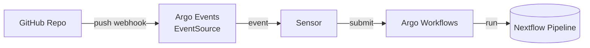

# 🧰 Administrator Guide — Managing Argo Events and Nextflow Integration

This document describes how administrators configure the Argo environment so that GitHub repositories can automatically trigger **Nextflow workflows**.

---

## 🧠 Architecture Overview



**Components:**
- **Argo CD** — manages deployment of charts and manifests.
- **Argo Events** — listens for GitHub events and triggers Sensors.
- **Argo Workflows** — executes Nextflow pipelines.
- **EventSource + Sensor** — glue logic between GitHub and Workflows.

---

## ⚙️ Environment Variables

Before installing via the Makefile or Helm:

```bash
export GITHUB_PAT=<github_personal_access_token>
export ARGOCD_SECRET_KEY=$(openssl rand -hex 32)
export ARGO_HOSTNAME=<public-dns-or-domain>
```

---

## 🧩 Installation via Makefile

```bash
make deploy
```

This wraps the Helm upgrade/install command for the `argo-stack` chart and sets the secrets and ingress hosts.

---

## 🔐 GitHub Token Secret

Create or verify the token secret:

```bash
kubectl -n argo-events create secret generic github-secret --from-literal=token=$GITHUB_PAT
```

---

## 🪣 Workflow Configuration

Sensors trigger WorkflowTemplates such as:

```yaml
spec:
  dependencies:
    - name: push
      eventSourceName: github
      eventName: repo-push
  triggers:
    - template:
        argoWorkflow:
          source:
            resource:
              metadata:
                generateName: nextflow-hello-
                namespace: wf-poc
              spec:
                entrypoint: main
                workflowTemplateRef:
                  name: nextflow-hello-template
```

Ensure that the referenced `WorkflowTemplate` exists in `wf-poc` or `argo`.

---

## 🔏 RBAC Configuration

Sensors need permission to submit workflows to the target namespace.

```yaml
apiVersion: rbac.authorization.k8s.io/v1
kind: Role
metadata:
  name: argo-events-workflow-submit
  namespace: argo
rules:
  - apiGroups: ["argoproj.io"]
    resources: ["workflows", "workflowtemplates"]
    verbs: ["get", "list", "watch", "create"]
---
apiVersion: rbac.authorization.k8s.io/v1
kind: RoleBinding
metadata:
  name: argo-events-workflow-submit
  namespace: argo
subjects:
  - kind: ServiceAccount
    name: argo-events-sa
    namespace: argo-events
roleRef:
  apiGroup: rbac.authorization.k8s.io
  kind: Role
  name: argo-events-workflow-submit
```

---

## 🌐 Network and Ports

| Port | Service | Purpose |
|------|----------|----------|
| 8080 / 443 | Argo CD server | Web UI |
| 2746 | Argo Workflows server | Workflow UI |
| 12000 | GitHub EventSource | Webhook endpoint |
| 80 / 443 | NGINX ingress | External entrypoint |

---

## 🔍 Troubleshooting

### EventSource says “no need to create webhooks”
→ Either `apiToken` is missing or `webhook.url` is empty.

### Ingress validation errors
→ Ensure either `rules` or `defaultBackend` is present.

### Webhook not firing
- Verify GitHub PAT scopes.
- Check EventSource logs:
  ```bash
  kubectl -n argo-events logs -l eventsource-name=github
  ```

### Workflows not created
- Check Sensor logs:
  ```bash
  kubectl -n argo-events logs -l sensor-name=run-nextflow-on-push
  ```
- Verify RBAC and WorkflowTemplate existence.

---

## 🧭 Post-Install Access

```bash
kubectl -n argocd port-forward svc/argocd-server 8080:443 &
kubectl -n argo port-forward svc/argo-workflows-server 2746:2746 &
```

- **Argo CD UI:** http://localhost:8080  
- **Argo Workflows UI:** http://localhost:2746

---

## 🧹 Uninstall

```bash
kind delete cluster;
```

Removes all Argo resources and namespaces.

---

## ✅ Summary

| Component | Purpose | Namespace |
|------------|----------|------------|
| **Argo CD** | GitOps + chart management | `argocd` |
| **Argo Events** | GitHub event listener | `argo-events` |
| **Argo Workflows** | Workflow execution engine | `argo` |
| **Nextflow templates** | Reusable workflow definitions | `wf-poc` or `argo` |

---

This configuration enables a Git-driven automation pipeline where each push event runs a reproducible Nextflow workflow in the Argo environment.
