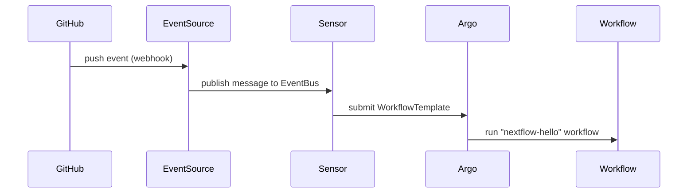

# 🔄 GitHub → Argo Workflows Bridge (via Argo Events)

This guide explains how to configure your GitHub repository so that every push automatically triggers an **Argo Workflow** in your Kubernetes cluster.  
It uses the **Argo Events Bridge** (installed by the `argo-stack` Helm chart) with a **GitHub Personal Access Token (PAT)** for automatic webhook management.

---

## 🧩 Overview



The Argo Events controller listens for GitHub push events, verifies them with your PAT, and automatically creates or updates the webhook in your repository.

---

## ⚙️ Prerequisites

- A Kubernetes cluster with:
  - **Argo Workflows**
  - **Argo Events**
  - **Argo CD** (optional, for GitOps sync)
- Helm v3+
- Cluster namespaces:
  - `argo-workflows` (for workflows)
  - `argo-events` (for event sources)
- Access to a GitHub repository where you can manage webhooks.

---

## 🔐 Step 1 — Create a Fine-Grained Personal Access Token

1. Go to [GitHub → Settings → Developer Settings → Personal Access Tokens](https://github.com/settings/tokens).
2. Click **Generate new token (fine-grained)**.
3. Choose the repository Argo Events should monitor.
4. Under **Repository permissions**, enable:
   - **Contents:** Read-only  
   - **Metadata:** Read-only  
   - **Webhooks:** Read and write  
5. Copy the generated token (`github_pat_…`).  
   You’ll only see it once — store it securely.

---

## 🧰 Step 2 — Create the Kubernetes Secret

Create a Secret in the `argo-events` namespace that stores your token:

```bash
kubectl create namespace argo-events --dry-run=client -o yaml | kubectl apply -f -

kubectl -n argo-events create secret generic github-secret   --from-literal=token=<your_github_pat>
```

You can verify it with:

```bash
kubectl get secret github-secret -n argo-events
```

---

## 🧾 Step 3 — Update Helm Values

Edit your `helm/argo-stack/values.yaml`:

```yaml
events:
  enabled: true
  namespace: argo-events
  github:
    enabled: true
    owner: <your-github-username-or-org>
    repository: <your-repo-name>
    events: ["push"]
    secret:
      create: false          # use existing secret
      name: github-secret
      tokenKey: token
  sensor:
    enabled: true
    name: run-nextflow-on-push
    workflowNamespace: argo
    workflowTemplateRef: nextflow-hello-template
```

Optional: if your cluster is behind an ingress, expose the EventSource webhook:

```yaml
events:
  github:
    webhook:
      ingress:
        enabled: true
        className: nginx
        hosts:
          - argo-events.example.com
```

---

## 🚀 Step 4 — Deploy or Sync

If using Argo CD:

```bash
argocd app sync argo-stack
```

Or via Helm:

```bash
helm upgrade --install argo-stack helm/argo-stack   -n argo --create-namespace   -f helm/argo-stack/values.yaml
```

Verify pods:

```bash
kubectl get pods -n argo-events
kubectl get pods -n argo
```

You should see components like:
```
eventsource-github-…
sensor-run-nextflow-on-push-…
workflow-controller-…
```

---

## 🧪 Step 5 — Test the Integration

1. Push a change to your repository:
   ```bash
   git commit -am "Trigger workflow"
   git push
   ```

2. Watch Argo Workflows:
   ```bash
   kubectl get wf -n argo
   ```

3. Or open the UI:
   ```bash
   kubectl -n argo port-forward svc/argo-workflows-server 2746:2746
   open http://localhost:2746
   ```

You should see a new Workflow such as `nextflow-hello-abcd` appear automatically.

---

## 🧩 Troubleshooting

| Issue | Likely Cause | Fix |
|-------|---------------|-----|
| `no matches for kind EventSource` | CRDs not installed | Ensure Argo Events CRDs are installed via `helm dependency build` or `kubectl apply -f argo-events/crds/` |
| Workflow not triggered | Missing webhook or wrong token | Check GitHub → Settings → Webhooks → “Recent Deliveries” |
| `401 Unauthorized` | PAT invalid or expired | Regenerate token and re-create secret |
| Sensor not starting | Namespace or resource name mismatch | Ensure `.Values.events.namespace` matches actual namespace (`argo-events`) |

---

## ✅ Result

With this configuration:
- Argo Events automatically manages your GitHub webhook.  
- Every **push** event in your repository triggers an Argo Workflow run.  
- The workflow execution and logs are visible in the Argo Workflows UI.  

You now have a fully automated **GitHub → Argo Workflows** pipeline.

