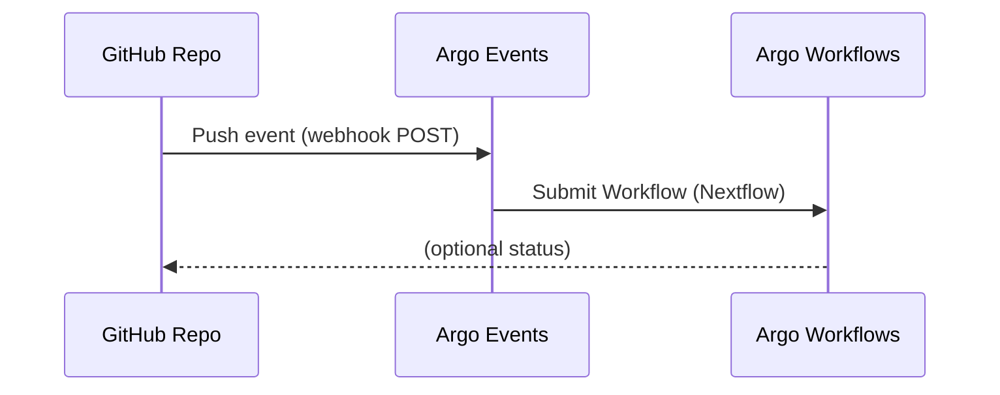

# 👩‍🔬 User Guide — Running Nextflow Workflows from GitHub

This guide explains how to connect your **GitHub repository** to the Argo environment so that every **push** automatically runs a **Nextflow workflow** on the compute cluster.

---

## 🧠 What Happens

1. You push code to GitHub.
2. A GitHub **webhook** notifies the Argo platform.
3. Argo launches a **Nextflow workflow**.
4. You view logs, results, and history through the **Argo Workflows UI**.



---

## 🧩 Step 1 — Prepare Your GitHub Repository

Ensure your repository contains:
- A `main.nf` or equivalent Nextflow script.
- Any configuration files (`nextflow.config`, `params.json`, etc.).
- (Optional) a small test dataset.

---

## 🔑 Step 2 — Create a Personal Access Token (PAT)

Argo uses this token to create a webhook automatically.

1. Go to **GitHub → Settings → Developer settings → Personal access tokens**
2. Choose **Fine-grained token** (recommended).
3. Select your repository and grant:
   - **Webhooks: Read/Write**
   - **Contents: Read**
   - **Metadata: Read**
4. Copy the generated token (it starts with `github_pat_...`).

Send this token to your Argo admin (securely), or store it locally if you’ll register the webhook manually.

---

## 🌐 Step 3 — Connect Your Repo to the Argo Platform

If your admin has automated onboarding, they’ll request:
- Your **GitHub repo URL**
- Your **GitHub username or org name**
- Your **token**

They will register the webhook endpoint (for example `https://argo-events.example.com/events`).

If manual setup is needed, go to your **GitHub repo → Settings → Webhooks → Add webhook** and enter:

| Field | Value |
|-------|--------|
| **Payload URL** | `https://<argo-hostname>/events` |
| **Content type** | `application/json` |
| **Secret** | *(value provided by admin, if used)* |
| **Events** | Just the **push** event |

Click **Add webhook** and verify you see a green ✅ next to it.

---

## 🚀 Step 4 — Push to Trigger a Workflow

Make a commit in your repo and push it:

```bash
git commit --allow-empty -m "Trigger Nextflow workflow"
git push
```

Argo will automatically start a new run using your latest commit.

---

## 🧭 Step 5 — Viewing Your Workflow

### Option A — Web UI
Visit:

```
http://<argo-workflows-host>:2746
```

You’ll see your workflow under the **Workflows** list.
Click the workflow name to view its DAG and live logs.

### Option B — Command Line
```bash
argo -n argo list
argo -n argo get @latest
```

To stream logs:
```bash
argo -n argo logs @latest
```

---

## 📦 Step 6 — Retrieving Results

Each workflow runs inside the cluster and writes outputs to object storage.

Typical outputs:
- `s3://<your-bucket>/<workflow-name>/results/`
- or a project-specific bucket managed by your admin.

You can find the bucket path in the workflow metadata:
```bash
argo -n argo get @latest -o yaml | grep -A2 artifactRepositoryRef
```

If your workflow includes a results collection step, it will post a summary to the Workflows UI under **Artifacts**.

---

## 🪵 Step 7 — Inspecting Logs and History

- **Argo Workflows UI → Workflow → Logs tab**  
  View stdout/stderr for each task.

- **CLI:**
  ```bash
  argo -n argo logs @latest --follow
  ```

- **Audit history:**  
  ```bash
  argo -n argo list
  ```

Each workflow corresponds to one Git commit (shown as `git_revision` in parameters).

---

## 🧹 Step 8 — Disconnect or Pause Automation

If you want to stop automatic triggering:
1. Delete the webhook from your GitHub repo (**Settings → Webhooks → Delete**)
2. Notify your admin if you want to disable event listening for your repo.

---

## ✅ Quick Recap

| Step | Action | Result |
|------|--------|--------|
| 1 | Prepare your repo | Contains Nextflow pipeline |
| 2 | Create a PAT | Grants webhook access |
| 3 | Connect to Argo | Webhook registered |
| 4 | Push a commit | Workflow triggered |
| 5 | View in UI or CLI | Workflow visible |
| 6 | Download results | From S3 or artifacts tab |

Your Nextflow workflows are now fully automated — every `git push` runs the pipeline and records the results for reproducibility.
