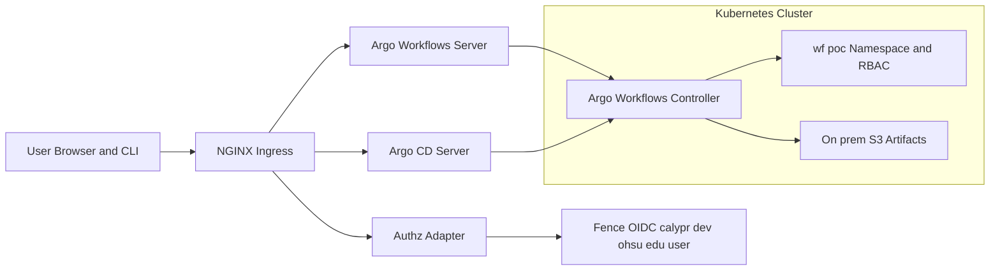

# Argo + Argo CD + authz-adapter (Umbrella Helm + Installer)

## 🧪 Experimental - this is likely to change

This bundle gives you two ways to deploy:
1) **Helm chart** (`helm/argo-stack/`) – an umbrella chart that installs **Argo Workflows**, **Argo CD**, your **authz-adapter**, tenant **RBAC**, and (optionally) an **Argo CD Application** pointing to `https://github.com/bwalsh/nextflow-hello-project.git`.
2) **Bash installer** (`install_argo_stack.sh`) – one-shot apply with an optional **teardown**.

A small **authz-adapter** service checks user entitlements by calling `https://calypr-dev.ohsu.edu/user/user` and returns allow/deny with headers that NGINX Ingress (or other proxies) can use for per-request authorization.

---

## High-Level Architecture



---

## Quick Start (Helm)

```bash
# 0) Prereqs
helm repo add argo https://argoproj.github.io/argo-helm
helm repo update

# 1) Set values (on-prem S3)
cat > my-values.yaml <<YAML
namespaces:
  argo: argo
  argocd: argocd
  tenant: wf-poc
  security: security

s3:
  enabled: true
  hostname: "minio.storage.local"   # on-prem S3 host
  bucket: "argo-artifacts"
  region: "us-west-2"
  insecure: true                    # allow self-signed/HTTP
  pathStyle: true
  accessKey: "XXXX"
  secretKey: "YYYY"

authzAdapter:
  image: "ghcr.io/yourorg/authz-adapter:latest"
  fenceBase: "https://calypr-dev.ohsu.edu/user"

argoWorkflows:
  enabled: true
  serverAuthMode: "server"          # or "sso"

argoCD:
  enabled: true

argocdApplication:
  enabled: true
  repoURL: "https://github.com/bwalsh/nextflow-hello-project.git"
  targetRevision: "main"
  path: "."
YAML

# 2) Install
helm upgrade --install argo-stack ./helm/argo-stack -n argocd --create-namespace -f my-values.yaml

# 3) Port-forward (POC)
kubectl -n argo port-forward svc/argo-workflows-server 2746:2746
kubectl -n argocd port-forward svc/argocd-server 8080:80
```

> If you already have namespaces, set `--namespace` to where Argo CD lives (default `argocd`). The chart creates Namespaces defined under `namespaces.*` for convenience.

---

## Quick Start (Installer Script)

```bash
# Install (with on-prem S3)
export ARTIFACT_S3_HOSTNAME=minio.storage.local
export ARTIFACT_BUCKET=argo-artifacts
export ARTIFACT_REGION=us-west-2
export ARTIFACT_INSECURE=true
export ARTIFACT_PATH_STYLE=true
export AWS_ACCESS_KEY_ID=XXXX
export AWS_SECRET_ACCESS_KEY=YYYY
export AUTHZ_ADAPTER_IMAGE=ghcr.io/yourorg/authz-adapter:latest
./install_argo_stack.sh
```

### Teardown
```bash
./install_argo_stack.sh --teardown
# or
./install_argo_stack.sh -t
```

This tears down Deployments, Services, ConfigMaps we installed, and uninstalls Helm releases for **Argo Workflows** and **Argo CD**.

---

## NGINX Ingress enforcement (optional)

Add these annotations to your **Argo UIs** Ingress objects to enforce per-request auth via the adapter:

```yaml
nginx.ingress.kubernetes.io/auth-url: "http://authz-adapter.security.svc.cluster.local:8080/check"
nginx.ingress.kubernetes.io/auth-method: "GET"
nginx.ingress.kubernetes.io/auth-snippet: |
  proxy_set_header Authorization $http_authorization;
  proxy_set_header X-Original-URI $request_uri;
  proxy_set_header X-Original-Method $request_method;
nginx.ingress.kubernetes.io/auth-response-headers: "X-Auth-Request-User,X-Auth-Request-Email,X-Auth-Request-Groups"
```

---

## Notes

- **OIDC SSO**: For production, wire Argo CD and Argo Workflows to your issuer (`https://calypr-dev.ohsu.edu/user`) so each app validates tokens directly.
- **RBAC**: Workflows authorization ultimately uses **Kubernetes RBAC** in workflow namespaces. The adapter helps protect UIs; K8s RBAC protects resource actions.
- **Argo CD Application**: The example Application points to `https://github.com/bwalsh/nextflow-hello-project.git`. Ensure that repo path has K8s manifests or a `kustomization.yaml`; otherwise the app will sync but with no resources.
