# 🚀 Calypr GitOps

<div align="center">

[](LICENSE)
[](https://helm.sh/)
[](https://kubernetes.io/)
[](https://argoproj.github.io/argo-workflows/)
[](https://argo-cd.readthedocs.io/)

*A complete, production-ready Kubernetes GitOps and workflow automation stack with enterprise-grade authorization*

[🚀 Quick Start](QUICKSTART.md) • [Features](#-features) • [Architecture](#-architecture) • [Contributing](#-contributing)

</div>

## 🧪 Experimental Notice

> **⚠️ This project is experimental and subject to change.** Use in production environments at your own discretion.

---

## Use cases
See [User Guide](docs/user-guide.md)

---

## 🌟 Overview

This repository provides a **complete Kubernetes-native GitOps and workflow automation platform** that combines:

- **🤖 Self-Service Onboarding** - Custom CRDs for easy tenant and repository registration
  - **⚙️ Automated GitHub Integration** - Self-service GitHub App onboarding with webhook management
  - **🪣 Data buckets** - Per-repository isolated data storage
  - **🪵 Artifact Management** - S3-compatible storage for workflow artifacts (logs, outputs, etc.)
  - **🔄 Argo Workflows** - Kubernetes-native workflow engine
  - **📦 Argo CD** - Declarative GitOps continuous delivery
- **🔐 Authorization Adapter** - Enterprise-grade RBAC with OIDC integration
- **🚪 NGINX Ingress** - Secure external access with per-request authorization
- **🆕 Vault Integration** - Centralized secret management with HashiCorp Vault and External Secrets Operator
---

## ✨ Features


### 🔧 Core Components
- **🤖 Self-Service Onboarding** - GitHub App-based repository registration via `RepoRegistration` CRD
- **Argo Workflows** (v0.41.7) - Container-native workflow execution
- **Argo CD** (v7.6.12) - GitOps continuous delivery
- **Custom AuthZ Adapter** - Flask-based authorization service
- **GitHub Status Proxy** - Self-service GitHub App integration for commit statuses
- **Multi-tenant RBAC** - Namespace isolation and role-based access

### 🔒 Security Features
- **OIDC Integration** - Seamless authentication with Fence/Gen3
- **Per-request Authorization** - Real-time access control
- **Service Account Management** - Automated RBAC configuration
- **Secure Artifact Storage** - S3-compatible with encryption support
- **Vault Integration** - HashiCorp Vault + External Secrets Operator for centralized secret management

### 🚀 Self-Service Features
- **RepoRegistration CRD** - Self-service onboarding for GitHub repositories with automated webhook setup
- **Per-Repository S3 Buckets** - Dedicated artifact and data storage with tenant isolation
- **Automated Secret Management** - Vault-backed credentials via External Secrets Operator
- **Fine-Grained Access Control** - Per-repository admin and read-only user management

### 🌐 Infrastructure
- **NGINX Ingress Ready** - Production-grade external access
- **Namespace Isolation** - Clean multi-tenant architecture
- **Health Monitoring** - Built-in health checks and observability
- **One-click Teardown** - Clean uninstall capability

---

## 🏗 Architecture

```mermaid
graph TB
    subgraph "External"
        U[👤 Git<br/>Browser & CLI]
        GH[📦 Git Repository]
        FENCE[🔐 Fence OIDC<br/>calypr-dev.ohsu.edu]
    end

    subgraph "Kubernetes Cluster"
        subgraph "Ingress Layer"
            NG[🌐 NGINX Ingress<br/>SSL Termination]
        end
        
        subgraph "Security Namespace"
            AD[🛡️ AuthZ Adapter<br/>Flask Service]
        end
        
        subgraph "ArgoCD Namespace"
            ACD[📦 Argo CD Server<br/>GitOps Controller]
        end
        
        subgraph "Argo Namespace"
            AWS[🔄 Argo Workflows<br/>Server & UI]
            AWC[⚙️ Workflow Controller<br/>Job Execution]
        end
        
        subgraph "Tenant Namespace (wf-poc)"
            WF[📋 Workflows<br/>Running Jobs]
            SA[👥 Service Accounts<br/>RBAC Roles]
        end
        
        subgraph "Storage"
            S3[🗄️ S3 Compatible<br/>Artifact Repository]
        end
    end

    %% User flows
    U -->|HTTPS Requests| NG
    NG -->|Auth Check| AD
    AD -->|Validate Token| FENCE
    
    %% Service routing
    NG -->|Authorized Traffic| ACD
    NG -->|Authorized Traffic| AWS
    
    %% Internal workflows
    ACD -->|Deploy Workflows| AWC
    AWS -->|Submit Jobs| AWC
    AWC -->|Execute| WF
    AWC -->|Store Artifacts| S3
    ACD -->|Sync from Git| GH

    %% Styling
    classDef external fill:#e1f5fe
    classDef security fill:#f3e5f5
    classDef argo fill:#e8f5e8
    classDef storage fill:#fff3e0
    
    class U,GH,FENCE external
    class AD,NG security
    class ACD,AWS,AWC,WF,SA argo
    class S3 storage
```




## Quickstart
1. Verify your tooling before touching Kubernetes:
   ```sh
   ./scripts/check_tools.sh
   ```
2. Prepare required environment variables and validate them with the Makefile helpers:
   ```sh
   make check-vars
   ```
   When you are ready to roll out, use the `deploy` target to run the full initialization pipeline.
3. Iterate on the chart and publish your latest changes straight to the cluster with:
   ```sh
   make argo-stack ports
   ```

## Additional resources
- [QUICKSTART.md](QUICKSTART.md) for a longer walkthrough.
- [Makefile](Makefile) for all available targets.
- [docs/development.md](docs/development.md) for detailed local development guide.

---

## 🤝 Contributing

We welcome contributions! Please see our [Contributing Guide](CONTRIBUTING.md) for details.

### 📋 Reporting Issues

Please use our [issue tracker](https://github.com/calypr/argo-helm/issues) with:

- **🐛 Bug reports:** Include logs, configuration, and reproduction steps
- **✨ Feature requests:** Describe the use case and expected behavior  
- **📚 Documentation:** Suggestions for improving this README

## 📝 License

This project is licensed under the Apache License 2.0 - see the [LICENSE](LICENSE) file for details.

---

## 🙏 Acknowledgments

- [Argo Project](https://argoproj.github.io/) for the excellent workflow and GitOps tools
- [Gen3](https://gen3.org/) for the Fence OIDC integration patterns
- [OHSU](https://www.ohsu.edu/) for supporting this open-source initiative

---

<div align="center">

**⭐ Star this repo if it helped you!**

[Report Bug](https://github.com/calypr/argo-helm/issues/new?labels=bug) •
[Request Feature](https://github.com/calypr/argo-helm/issues/new?labels=enhancement) •
[View Documentation](https://github.com/calypr/argo-helm/wiki)

</div>
