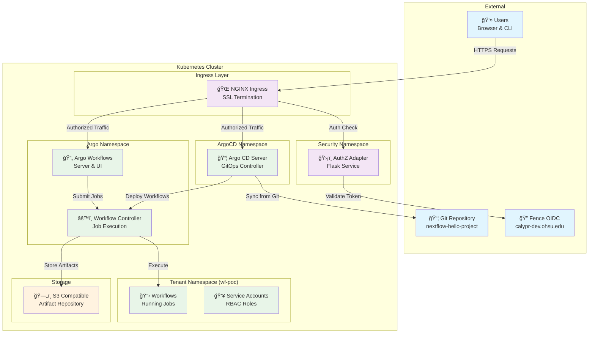

# 🚀 Argo Stack with Authorization Adapter

<div align="center">

[](LICENSE)
[](https://helm.sh/)
[](https://kubernetes.io/)
[](https://argoproj.github.io/argo-workflows/)
[](https://argo-cd.readthedocs.io/)

*A complete, production-ready Kubernetes GitOps and workflow automation stack with enterprise-grade authorization*

[🚀 Quick Start](QUICKSTART.md) • [Features](#-features) • [Architecture](#-architecture) • [Documentation](#-documentation) • [Contributing](#-contributing)

</div>

## 🧪 Experimental Notice

> **⚠️ This project is experimental and subject to change.** Use in production environments at your own discretion.

---

## 📋 Table of Contents

- [Overview](#-overview)
- [Features](#-features)
- [Architecture](#-architecture)
- [Prerequisites](#-prerequisites)
- [Quick Start](#-quick-start)
  - [Helm Deployment](#helm-deployment)
  - [Script-based Installation](#script-based-installation)
- [Configuration](#-configuration)
- [Security & Authorization](#-security--authorization)
- [Monitoring & Troubleshooting](#-monitoring--troubleshooting)
- [Advanced Usage](#-advanced-usage)
- [Contributing](#-contributing)

---

## 🌟 Overview

This repository provides a **complete Kubernetes-native GitOps and workflow automation platform** that combines:

- **🔄 Argo Workflows** - Kubernetes-native workflow engine
- **📦 Argo CD** - Declarative GitOps continuous delivery
- **🔐 Authorization Adapter** - Enterprise-grade RBAC with OIDC integration
- **🚪 NGINX Ingress** - Secure external access with per-request authorization
- **📊 Artifact Management** - S3-compatible storage for workflow artifacts

### Two Deployment Options

| Method | Use Case | Complexity | Customization |
|--------|----------|------------|---------------|
| **🎯 Helm Chart** | Production deployments | Medium | High |
| **⚡ Bash Installer** | Quick testing/demos | Low | Limited |

---

## ✨ Features

### Use cases
See [README-use-cases.md](./README-use-cases.md)

### 🔧 Core Components
- **Argo Workflows** (v0.41.7) - Container-native workflow execution
- **Argo CD** (v7.6.12) - GitOps continuous delivery
- **Custom AuthZ Adapter** - Flask-based authorization service
- **Multi-tenant RBAC** - Namespace isolation and role-based access

### 🔒 Security Features
- **OIDC Integration** - Seamless authentication with Fence/Gen3
- **Per-request Authorization** - Real-time access control
- **Service Account Management** - Automated RBAC configuration
- **Secure Artifact Storage** - S3-compatible with encryption support
- **🆕 Vault Integration** - HashiCorp Vault + External Secrets Operator for centralized secret management

### 🌐 Infrastructure
- **NGINX Ingress Ready** - Production-grade external access
- **Namespace Isolation** - Clean multi-tenant architecture
- **Health Monitoring** - Built-in health checks and observability
- **One-click Teardown** - Clean uninstall capability

---

## 🏗 Architecture



### 🔄 Request Flow

1. **User Authentication** - OIDC token validation via Fence
2. **Authorization Check** - Custom adapter validates permissions
3. **Request Routing** - NGINX forwards to appropriate services
4. **Workflow Execution** - Argo components handle job lifecycle
5. **Artifact Storage** - S3-compatible backend for persistence

---

## 🔧 Prerequisites

### Infrastructure Requirements

| Component | Version | Notes |
|-----------|---------|-------|
| **Kubernetes** | ≥ v1.20 | Tested with v1.24+ |
| **Helm** | ≥ v3.0 | Package manager |
| **kubectl** | Latest | K8s CLI tool |
| **NGINX Ingress** | ≥ v1.0 | *Optional for external access* |

### Resource Requirements

| Component | CPU | Memory | Storage |
|-----------|-----|--------|---------|
| **Argo Workflows** | 200m | 512Mi | 10Gi |
| **Argo CD** | 100m | 256Mi | 5Gi |
| **AuthZ Adapter** | 50m | 128Mi | - |
| **Total Minimum** | 350m | 896Mi | 15Gi |

### External Dependencies

- **S3-Compatible Storage** (MinIO, AWS S3, etc.)
- **OIDC Provider** (Fence, Auth0, etc.)
- **DNS** (for ingress hostnames)

---

## 🚀 Quick Start

Choose your deployment method based on your needs:

| Method | Use Case | Setup Time |
|--------|----------|------------|
| **Local Development** | Testing with in-cluster MinIO | 5 minutes |
| **Helm Deployment** | Production/Custom | 15 minutes |

### 🏠 Local Development (Recommended for Testing)

For local testing with automatic MinIO deployment:

```bash
# Set required environment variables
export GITHUB_PAT=<your-github-token>
export ARGOCD_SECRET_KEY=$(openssl rand -hex 32)
export ARGO_HOSTNAME=<your-hostname>

# Deploy everything (Kind cluster + MinIO + Argo Stack)
make deploy

# Access UIs (ports are automatically forwarded)
# Argo Workflows: http://localhost:2746
# Argo CD:        http://localhost:8080

# Access MinIO Console (optional)
kubectl port-forward svc/minio -n minio-system 9001:9001
# MinIO Console:  http://localhost:9001 (minioadmin/minioadmin)
```

See [docs/development.md](docs/development.md) for detailed local development guide.

---

### Helm Deployment

#### 1️⃣ Setup Prerequisites

```bash
# Add Argo Helm repository
helm repo add argo https://argoproj.github.io/argo-helm
helm repo update

# Verify Kubernetes access
kubectl cluster-info
```

#### 2️⃣ Configure Values

Create your configuration file:

```bash
cat > my-values.yaml <<YAML
# 🏗️ Namespace Configuration
namespaces:
  argo: argo                    # Argo Workflows namespace
  argocd: argocd               # Argo CD namespace  
  tenant: wf-poc               # Workflow execution namespace
  security: security           # AuthZ adapter namespace

# 🗄️ S3 Artifact Storage
s3:
  enabled: true
  hostname: "minio.storage.local"    # Your S3 endpoint
  bucket: "argo-artifacts"
  region: "us-west-2"
  insecure: true                     # Set false for HTTPS
  pathStyle: true                    # MinIO compatibility
  accessKey: "your-access-key"       # S3 credentials
  secretKey: "your-secret-key"

# 🔐 Authorization Adapter
authzAdapter:
  image: "ghcr.io/yourorg/authz-adapter:latest"
  fenceBase: "https://calypr-dev.ohsu.edu/user"
  replicas: 2                        # HA deployment
  resources:
    requests:
      cpu: 50m
      memory: 128Mi
    limits:
      cpu: 200m
      memory: 256Mi

# 🔄 Argo Workflows Configuration
argoWorkflows:
  enabled: true
  serverAuthMode: "server"           # Options: server, sso, client
  
# 📦 Argo CD Configuration  
argoCD:
  enabled: true
  
# 🎯 Argo CD Applications - Configure Your Repositories
# ⚠️  IMPORTANT: The chart does NOT include default repositories.
#     You MUST provide your own repository URLs at deployment time.
#
# Deploy one or more applications using the applications array.
# Each application can optionally have its own S3 bucket for artifacts.
applications:
  - name: my-workflow-app
    project: default
    repoURL: "https://github.com/YOUR_ORG/YOUR_REPO.git"  # ⚠️  Replace with your repo
    targetRevision: "main"
    path: "."
    destination:
      namespace: wf-poc
    syncPolicy:
      automated:
        prune: true
        selfHeal: true
    # 🪣 Per-repository artifact storage (optional)
    # artifacts:
    #   bucket: my-app-artifacts
    #   keyPrefix: workflows/
    #   endpoint: https://s3.us-west-2.amazonaws.com
    #   region: us-west-2
    #   credentialsSecret: my-app-s3-creds

# ⚠️ DEPRECATED: Single application configuration (use 'applications' array above)
# argocdApplication:
#   enabled: false
YAML
```

**📚 Configuration Resources:**
- For complete examples, see `examples/per-repo-artifacts-values.yaml`
- For local development with MinIO, use `make deploy` (see [docs/development.md](docs/development.md))
- For testing without applications, use an empty array: `applications: []`

**Per-Repository Artifact Storage:**
Each application can have its own S3 bucket for workflow outputs, enabling tenant isolation and traceability. If not specified, applications use the global S3 configuration above. See [docs/admin-guide.md](docs/admin-guide.md) for credential management options (IRSA, Workload Identity, ExternalSecrets).

#### 3️⃣ Deploy the Stack

```bash
# Install with custom values
helm upgrade --install argo-stack ./helm/argo-stack \
  --namespace argocd \
  --create-namespace \
  --values my-values.yaml \
  --wait \
  --timeout 10m

# Verify deployment
kubectl get pods -n argocd
kubectl get pods -n argo
kubectl get pods -n security
```

#### 4️⃣ Access the UIs

```bash
# Port forward for local access
kubectl -n argo port-forward svc/argo-workflows-server 2746:2746 &
kubectl -n argocd port-forward svc/argocd-server 8080:80 &

# Open in browser
echo "🔄 Argo Workflows: http://localhost:2746"
echo "📦 Argo CD: http://localhost:8080"

# Get ArgoCD initial password
kubectl -n argocd get secret argocd-initial-admin-secret \
  -o jsonpath="{.data.password}" | base64 -d && echo
```

### Script-based Installation

#### 1️⃣ Set Environment Variables

```bash
# 🗄️ S3 Configuration
export ARTIFACT_S3_HOSTNAME=minio.storage.local
export ARTIFACT_BUCKET=argo-artifacts
export ARTIFACT_REGION=us-west-2
export ARTIFACT_INSECURE=true
export ARTIFACT_PATH_STYLE=true
export AWS_ACCESS_KEY_ID=your-access-key
export AWS_SECRET_ACCESS_KEY=your-secret-key

# 🔐 AuthZ Configuration
export AUTHZ_ADAPTER_IMAGE=ghcr.io/yourorg/authz-adapter:latest
export FENCE_BASE=https://calypr-dev.ohsu.edu/user

# 🏗️ Optional: Custom Namespaces
export WF_NS=wf-poc
export ARGO_NS=argo
export ARGOCD_NS=argocd
export SEC_NS=security
```

#### 2️⃣ Deploy

```bash
# Make script executable
chmod +x install_argo_stack.sh

# Install the stack
./install_argo_stack.sh

# Verify installation
kubectl get namespaces | grep -E "(argo|security|wf-poc)"
```

#### 3️⃣ Teardown (if needed)

```bash
# Complete cleanup
./install_argo_stack.sh --teardown

# Or use short form
./install_argo_stack.sh -t
```

---

## ⚙️ Configuration

### 🔐 Authorization Adapter Configuration

The authorization adapter supports flexible configuration:

```yaml
authzAdapter:
  # Container configuration
  image: "ghcr.io/yourorg/authz-adapter:latest"
  tag: "v1.0.0"
  pullPolicy: "IfNotPresent"
  
  # Service configuration
  service:
    type: ClusterIP
    port: 8080
    
  # Fence/OIDC integration
  fenceBase: "https://your-oidc-provider.com"
  serviceToken: "optional-service-token"
  httpTimeout: "5.0"
  
  # Resource allocation
  resources:
    requests:
      cpu: 50m
      memory: 128Mi
    limits:
      cpu: 200m  
      memory: 256Mi
      
  # High availability
  replicas: 2
  
  # Health checks
  livenessProbe:
    enabled: true
    path: /healthz
  readinessProbe:
    enabled: true
    path: /healthz
```

---

## 🔒 Security & Authorization

### 🎯 Authorization Model

The authorization adapter implements a **role-based access control** system:

| Role | Permissions | Use Case |
|------|-------------|----------|
| **argo-viewer** | Read-only access | Monitoring, auditing |
| **argo-runner** | Submit & manage workflows | Developers, CI/CD |
| **argo-admin** | Full administrative access | Platform administrators |

### 🔐 NGINX Ingress Integration

Enable per-request authorization by adding these annotations to your Ingress resources:

```yaml
apiVersion: networking.k8s.io/v1
kind: Ingress
metadata:
  name: argo-workflows-ingress
  annotations:
    # 🔐 Enable authorization
    nginx.ingress.kubernetes.io/auth-url: "http://authz-adapter.security.svc.cluster.local:8080/check"
    nginx.ingress.kubernetes.io/auth-method: "GET"
    
    # 📤 Forward user context
    nginx.ingress.kubernetes.io/auth-snippet: |
      proxy_set_header Authorization $http_authorization;
      proxy_set_header X-Original-URI $request_uri;
      proxy_set_header X-Original-Method $request_method;
      
    # 📥 Response headers
    nginx.ingress.kubernetes.io/auth-response-headers: "X-Auth-Request-User,X-Auth-Request-Email,X-Auth-Request-Groups"
    
    # 🚫 Error handling
    nginx.ingress.kubernetes.io/auth-signin: "https://your-login-page.com/login"
    
spec:
  rules:
  - host: workflows.example.com
    http:
      paths:
      - path: /
        pathType: Prefix
        backend:
          service:
            name: argo-workflows-server
            port:
              number: 2746
```

### 🔑 OIDC Integration

For production deployments, configure direct OIDC integration:

```yaml
# Argo CD OIDC
argoCD:
  server:
    config:
      oidc.config: |
        name: OIDC
        issuer: https://calypr-dev.ohsu.edu/user
        clientId: argo-cd
        clientSecret: $oidc.clientSecret
        requestedScopes: ["openid", "profile", "email", "groups"]
        requestedIDTokenClaims: {"groups": {"essential": true}}

# Argo Workflows OIDC        
argoWorkflows:
  server:
    sso:
      issuer: https://calypr-dev.ohsu.edu/user
      clientId:
        name: argo-workflows-sso
        key: client-id
      clientSecret:
        name: argo-workflows-sso  
        key: client-secret
      redirectUrl: https://workflows.example.com/oauth2/callback
      scopes:
        - openid
        - profile
        - email
        - groups
```

### 🔐 Secret Management with Vault

The chart supports **HashiCorp Vault** integration via **External Secrets Operator (ESO)** for centralized secret management:

**Benefits:**
- ✅ No plaintext secrets in Git or Helm values
- ✅ Automatic secret rotation without redeployment
- ✅ Centralized audit logging in Vault
- ✅ Multi-tenant secret isolation with Vault policies

**Quick Setup:**

```yaml
externalSecrets:
  enabled: true
  installOperator: true  # Set to false if ESO already installed
  
  vault:
    enabled: true
    address: "https://vault.example.com"
    
    auth:
      method: "kubernetes"  # or "approle"
      role: "argo-stack"
      serviceAccountName: "eso-vault-auth"
    
    kv:
      engineVersion: 2
      defaultPathPrefix: "kv/argo"
  
  secrets:
    argocd:
      adminPasswordPath: "argocd/admin#password"
      serverSecretKeyPath: "argocd/server#secretKey"
    workflows:
      artifactAccessKeyPath: "workflows/artifacts#accessKey"
      artifactSecretKeyPath: "workflows/artifacts#secretKey"
    github:
      tokenPath: "events/github#token"
```

**Seed Vault with secrets:**

```bash
# For local development - install Vault, MinIO, and ESO
make vault-dev vault-seed
make minio-dev minio-create-bucket
make eso-install

# For production
vault kv put kv/argo/argocd/admin password="SecurePassword123!"
vault kv put kv/argo/workflows/artifacts accessKey="..." secretKey="..."
vault kv put kv/argo/events/github token="ghp_..."
```

📖 **Full Guide:** See [docs/secrets-with-vault.md](docs/secrets-with-vault.md) for detailed configuration, rotation workflows, and best practices.

📁 **Examples:** Check [examples/vault/](examples/vault/) for sample configurations with different auth methods.

---

## 🔧 Self-Service Repository Onboarding

The **RepoRegistration** custom resource provides a declarative way to onboard Git repositories with automated configuration for ArgoCD, Argo Events, S3 storage, and secrets management.

### Quick Start

Define your repository configuration in a single YAML file:

```yaml
apiVersion: platform.calypr.io/v1alpha1
kind: RepoRegistration
metadata:
  name: my-nextflow-project
  namespace: wf-poc
spec:
  repoUrl: https://github.com/myorg/my-nextflow-project.git
  tenant: myorg
  workflowTemplateRef: nextflow-repo-runner
  
  # S3 artifact storage
  artifactBucket:
    hostname: https://s3.us-west-2.amazonaws.com
    bucket: my-project-artifacts
    region: us-west-2
    externalSecretPath: argo/apps/my-project/s3/artifacts
  
  # GitHub credentials
  githubSecretName: github-secret-my-project
  githubSecretPath: argo/apps/my-project/github
  
  # Access control
  adminUsers:
    - admin@myorg.com
  readUsers:
    - viewer@myorg.com
```

### What Gets Created

For each `RepoRegistration`, the platform automatically creates:

- ✅ **ArgoCD Application** for continuous deployment
- ✅ **Argo Events GitHub webhook** for CI/CD triggers
- ✅ **ExternalSecrets** for S3 and GitHub credentials from Vault
- ✅ **Artifact Repository ConfigMap** for workflow outputs
- ✅ **Access control** aligned with Fence/Arborist

### Usage Methods

**Method 1:** Using Helm values (deployment-time):
```bash
helm upgrade --install argo-stack ./helm/argo-stack \
  --values examples/repo-registrations-values.yaml
```

**Method 2:** Using CRDs (runtime with controller):
```bash
kubectl apply -f examples/repo-registrations-example.yaml
```

📖 **Full Guide:** See [docs/repo-registration-guide.md](docs/repo-registration-guide.md) for complete documentation and examples.

📁 **Examples:** 
- [repo-registrations-example.yaml](examples/repo-registrations-example.yaml) - Sample CRs
- [repo-registrations-values.yaml](examples/repo-registrations-values.yaml) - Helm values approach

---

## 📊 Monitoring & Troubleshooting

### 🔍 Health Checks

```bash
# Check all component health
kubectl get pods -n argocd
kubectl get pods -n argo  
kubectl get pods -n security
kubectl get pods -n wf-poc

# AuthZ adapter health
kubectl -n security port-forward svc/authz-adapter 8080:8080 &
curl http://localhost:8080/healthz

# Argo Workflows health
kubectl -n argo get workflows

# Argo CD health  
kubectl -n argocd get applications

# Logs
stern --all-namespaces 'argo.*' --since 1h | grep error
```

### 📝 Logging

```bash
# AuthZ adapter logs
kubectl -n security logs -l app=authz-adapter -f

# Argo Workflows controller logs
kubectl -n argo logs -l app.kubernetes.io/name=argo-workflows-workflow-controller -f

# Argo CD logs
kubectl -n argocd logs -l app.kubernetes.io/name=argocd-server -f
```

### 🐛 Common Issues

<details>
<summary><strong>🔴 AuthZ Adapter Returns 401</strong></summary>

**Symptoms:** NGINX returns 401 Unauthorized

**Causes & Solutions:**
- **Invalid OIDC token:** Check token format and expiration
- **Fence endpoint unreachable:** Verify `FENCE_BASE` URL and network access
- **Missing service token:** Set `FENCE_SERVICE_TOKEN` if required

```bash
# Debug token validation
kubectl -n security exec -it deployment/authz-adapter -- \
  curl -H "Authorization: Bearer YOUR_TOKEN" \
  http://localhost:8080/check -v
```
</details>

<details>
<summary><strong>🔴 Workflows Fail to Submit</strong></summary>

**Symptoms:** "Forbidden" errors when submitting workflows

**Causes & Solutions:**
- **RBAC misconfiguration:** Check service account permissions
- **Namespace access:** Verify workflow namespace exists and is configured
- **Resource quotas:** Check if resource limits are exceeded

```bash
# Check RBAC
kubectl -n wf-poc get rolebindings
kubectl auth can-i create workflows --as=system:serviceaccount:wf-poc:default -n wf-poc

# Check quotas
kubectl -n wf-poc describe quota
```
</details>

<details>
<summary><strong>🔴 S3 Artifact Upload Fails</strong></summary>

**Symptoms:** Workflows complete but artifacts not stored

**Causes & Solutions:**
- **Incorrect S3 configuration:** Verify endpoint, credentials, bucket
- **Network connectivity:** Check if pods can reach S3 endpoint
- **Bucket permissions:** Ensure write access to specified bucket

```bash
# Test S3 connectivity from workflow pod
kubectl -n wf-poc run test-s3 --image=amazon/aws-cli:latest \
  --env="AWS_ACCESS_KEY_ID=$ACCESS_KEY" \
  --env="AWS_SECRET_ACCESS_KEY=$SECRET_KEY" \
  --command -- aws s3 ls s3://your-bucket --endpoint-url=http://your-s3-endpoint
```
</details>

---

## 🎯 Advanced Usage

### 📦 Multi-Application Deployment

The chart supports deploying multiple Argo CD Applications using the `applications` array. This is useful for managing multiple repositories or projects from a single Helm deployment.

#### Example: Deploying Multiple Applications

```yaml
applications:
  - name: nextflow-hello-project
    project: default
    repoURL: https://github.com/bwalsh/nextflow-hello-project.git
    targetRevision: main
    path: "."
    destination:
      namespace: wf-poc
    syncPolicy:
      automated:
        prune: true
        selfHeal: true

  - name: nextflow-hello-project-2
    project: default
    repoURL: https://github.com/bwalsh/nextflow-hello-project-2.git
    targetRevision: main
    path: "."
    destination:
      namespace: wf-poc
    syncPolicy:
      automated:
        prune: false
        selfHeal: true
```

#### Migration from Deprecated `argocdApplication`

The single-application `argocdApplication` configuration is **deprecated** and will be removed in a future release. Please migrate to the `applications` array syntax.

**Migration Steps:**

1. **Old Configuration (Deprecated):**
```yaml
argocdApplication:
  enabled: true
  name: nextflow-hello
  project: default
  repoURL: "https://github.com/bwalsh/nextflow-hello-project.git"
  targetRevision: "main"
  path: "."
```

2. **New Configuration (Recommended):**
```yaml
applications:
  - name: nextflow-hello
    project: default
    repoURL: "https://github.com/bwalsh/nextflow-hello-project.git"
    targetRevision: "main"
    path: "."
    destination:
      namespace: wf-poc  # Specify target namespace
    syncPolicy:
      automated:
        prune: false
        selfHeal: true
```

3. **Disable the deprecated configuration:**
```yaml
argocdApplication:
  enabled: false  # Turn off deprecated single application
```

**Benefits of the new syntax:**
- ✅ Deploy multiple applications from a single chart
- ✅ More explicit destination configuration
- ✅ Better alignment with Argo CD's multi-tenancy model
- ✅ Easier to manage complex deployments

### 🔧 Custom Authorization Logic

Extend the authorization adapter with custom business logic:

```python
# authz-adapter/app.py

def decide_groups(doc, verb=None, group=None, version=None, resource=None, namespace=None):
    """
    Custom authorization logic based on your requirements
    """
    groups = []
    
    if not doc.get("active"):
        return groups
    
    # Custom logic: Grant admin access to specific users
    if doc.get("email") in ["admin@example.com", "devops@example.com"]:
        groups.append("argo-admin")
        groups.append("argo-runner")
        groups.append("argo-viewer")
        return groups
    
    # Custom logic: Department-based access
    authz = doc.get("authz", {})
    departments = doc.get("departments", [])
    
    if "engineering" in departments:
        if any(item.get("method") in ("create", "*") 
               for item in authz.get("/workflows/submit", [])):
            groups.append("argo-runner")
            
    if "operations" in departments:
        groups.append("argo-viewer")
        
    return groups
```

### 🚀 Multi-Environment Setup

Deploy multiple stacks for different environments:

```bash
# Development environment
helm upgrade --install argo-stack-dev ./helm/argo-stack \
  --namespace argocd-dev \
  --values values-dev.yaml

# Staging environment  
helm upgrade --install argo-stack-staging ./helm/argo-stack \
  --namespace argocd-staging \
  --values values-staging.yaml
  
# Production environment
helm upgrade --install argo-stack-prod ./helm/argo-stack \
  --namespace argocd-prod \
  --values values-prod.yaml
```

---

## 🤝 Contributing

We welcome contributions! Please see our [Contributing Guide](CONTRIBUTING.md) for details.

### 🏗️ Development Setup

```bash
# Clone the repository
git clone https://github.com/calypr/argo-helm.git
cd argo-helm

# Install development dependencies
pip install -r authz-adapter/requirements-dev.txt

# Run tests
cd authz-adapter
python -m pytest tests/

# Build adapter image
docker build -t authz-adapter:dev .
```

### 📋 Reporting Issues

Please use our [issue tracker](https://github.com/calypr/argo-helm/issues) with:

- **🐛 Bug reports:** Include logs, configuration, and reproduction steps
- **✨ Feature requests:** Describe the use case and expected behavior  
- **📚 Documentation:** Suggestions for improving this README

### 🎯 Roadmap

- [ ] **Multi-cluster support** - Deploy across multiple Kubernetes clusters
- [ ] **Advanced RBAC** - Fine-grained permissions and audit logging
- [ ] **Webhook integration** - External workflow triggers
- [ ] **Observability** - Enhanced monitoring and alerting
- [ ] **Backup/Restore** - Automated disaster recovery

---

## 📝 License

This project is licensed under the Apache License 2.0 - see the [LICENSE](LICENSE) file for details.

---

## 🙏 Acknowledgments

- [Argo Project](https://argoproj.github.io/) for the excellent workflow and GitOps tools
- [Gen3](https://gen3.org/) for the Fence OIDC integration patterns
- [OHSU](https://www.ohsu.edu/) for supporting this open-source initiative

---

<div align="center">

**⭐ Star this repo if it helped you!**

[Report Bug](https://github.com/calypr/argo-helm/issues/new?labels=bug) •
[Request Feature](https://github.com/calypr/argo-helm/issues/new?labels=enhancement) •
[View Documentation](https://github.com/calypr/argo-helm/wiki)

</div>
