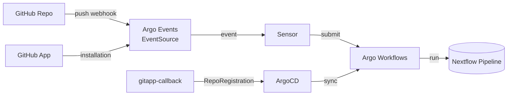

[Home](index.md) > Development and Engineering Notes

# 🧰 Administrator Guide — Managing Argo Stack and GitHub App Integration

This document describes how administrators configure the Argo environment so that GitHub repositories can automatically trigger **Nextflow workflows** via the GitHub App integration.

---

## 🧠 Architecture Overview



**Components:**
- **GitHub App** — OAuth-based application for secure repository access and webhook delivery
- **gitapp-callback** — web service that receives GitHub App installation events and generates `RepoRegistration` manifests
- **Argo CD** — manages deployment of charts and manifests
- **Argo Events** — listens for GitHub webhooks and triggers Sensors
- **Argo Workflows** — executes Nextflow pipelines
- **External Secrets Operator (ESO)** — syncs credentials from Vault to Kubernetes secrets
- **Vault** — centralized secrets management for S3, GitHub, and other credentials

---

## 📋 Environment Variables Reference

The Makefile and deployment process require the following environment variables. Set these before running installation targets.

### Core Configuration

| Variable | Required | Purpose | Example |
|----------|----------|---------|---------|
| `ARGO_HOSTNAME` | ✅ Yes | Domain name for Argo services (ingress host) | `argo.example.com` |
| `ARGOCD_SECRET_KEY` | ✅ Yes | 32-byte hex string for ArgoCD server encryption | `$(openssl rand -hex 32)` |

### S3 / MinIO Configuration

| Variable | Default | Purpose | Notes |
|----------|---------|---------|-------|
| `S3_ENABLED` | `true` | Enable S3 artifact storage | Set to `false` to disable S3 |
| `S3_ACCESS_KEY_ID` | `minioadmin` | S3 access key | Use strong credentials in production |
| `S3_SECRET_ACCESS_KEY` | `minioadmin` | S3 secret key | Use strong credentials in production |
| `S3_BUCKET` | `argo-artifacts` | Default artifact bucket | Bucket must exist in S3 |
| `S3_REGION` | `us-east-1` | S3 region | Adjust for your deployment |
| `S3_HOSTNAME` | `minio.minio-system.svc.cluster.local:9000` | S3 endpoint (MinIO or AWS) | Include port for MinIO |

### GitHub App Configuration

| Variable | Required | Purpose | Example |
|----------|----------|---------|---------|
| `GITHUBHAPP_APP_ID` | ✅ Yes | GitHub App ID | `123456` |
| `GITHUBHAPP_CLIENT_ID` | ✅ Yes | GitHub App OAuth Client ID | `Iv1.abcd1234...` |
| `GITHUBHAPP_INSTALLATION_ID` | ✅ Yes | GitHub App Installation ID (per organization) | `987654` |
| `GITHUBHAPP_PRIVATE_KEY_FILE_PATH` | ✅ Yes | Path to GitHub App private key (PEM format) | `/path/to/private-key.pem` |
| `GITHUBHAPP_PRIVATE_KEY_SECRET_NAME` | ✅ Yes | Name of Kubernetes secret for private key | `github-app-private-key` |
| `GITHUBHAPP_PRIVATE_KEY_VAULT_PATH` | ✅ Yes | Vault KV path for GitHub App private key | `kv/argo/argocd/github-app` |

### Optional Configuration

| Variable | Default | Purpose |
|----------|---------|---------|
| `TLS_SECRET_NAME` | `calypr-demo-tls` | Name of TLS secret for HTTPS |
| `PUBLIC_IP` | (empty) | External IP for ingress (leave empty for kind) |
| `LANDING_PAGE_IMAGE_TAG` | `v3` | Landing page Docker image tag |
| `PROXY_IMAGE` | `github-status-proxy` | GitHub Status Proxy image name |
| `PROXY_TAG` | `latest` | GitHub Status Proxy image tag |
| `VAULT_TOKEN` | `root` | Vault root token for dev environment |

---

## 🔐 Pre-Installation Checklist

### 1. Create GitHub App

Follow [GitHub's documentation](https://docs.github.com/en/apps/creating-github-apps) to create a new GitHub App:

- **Name:** e.g., `Argo Automation`
- **Homepage URL:** `https://<ARGO_HOSTNAME>`
- **Webhook URL:** `https://<ARGO_HOSTNAME>/events`
- **Permissions:**
  - `Contents:` read
  - `Statuses:` read & write
  - `Pull Requests:` read & write
- **Events to subscribe to:**
  - `push`
  - `workflow_run`
  - `pull_request`

After creation, you will receive:
- **App ID** → `GITHUBHAPP_APP_ID`
- **Client ID** → `GITHUBHAPP_CLIENT_ID`
- **Private Key** (PEM file) → `GITHUBHAPP_PRIVATE_KEY_FILE_PATH`

### 2. Install GitHub App on Organization

Navigate to your GitHub organization and install the created app. During installation, capture:
- **Installation ID** → `GITHUBHAPP_INSTALLATION_ID`

### 3. Generate Required Secrets

```bash
# Generate ArgoCD server secret key (32-byte hex)
export ARGOCD_SECRET_KEY=$(openssl rand -hex 32)

# Set your domain
export ARGO_HOSTNAME=argo.example.com

# Set S3 credentials (or use defaults for MinIO)
export S3_ACCESS_KEY_ID=minioadmin
export S3_SECRET_ACCESS_KEY=minioadmin
export S3_BUCKET=argo-artifacts
export S3_REGION=us-east-1
export S3_HOSTNAME=minio.minio-system.svc.cluster.local:9000

# Set GitHub App variables
export GITHUBHAPP_APP_ID=123456
export GITHUBHAPP_CLIENT_ID=Iv1.abcd1234...
export GITHUBHAPP_INSTALLATION_ID=987654
export GITHUBHAPP_PRIVATE_KEY_FILE_PATH=/path/to/private-key.pem
export GITHUBHAPP_PRIVATE_KEY_SECRET_NAME=github-app-private-key
export GITHUBHAPP_PRIVATE_KEY_VAULT_PATH=kv/argo/argocd/github-app
```

---

## 🧩 Installation via Makefile

### Full Deployment

```bash
# Deploy entire Argo stack with Vault, External Secrets, MinIO, and Helm charts
make deploy
```

This target orchestrates:
1. `init` — initialize cluster, Vault, External Secrets Operator, MinIO
2. `docker-install` — build and load Docker images
3. `argo-stack` — deploy Argo CD, Argo Workflows, Argo Events, and controllers
4. `ports` — configure TLS and ingress

### Individual Targets

For debugging or step-by-step installation:

```bash
# Create kind cluster
make kind

# Raise system limits
make bump-limits

# Install Vault (dev mode)
make vault-dev

# Seed Vault with test secrets
make vault-seed

# Install External Secrets Operator
make eso-install

# Install MinIO
make minio

# Deploy just the Argo stack
make argo-stack

# View ArgoCD password
make password

# Login to ArgoCD CLI
make login
```

---

## 🔑 Vault Configuration

### Vault Dev Server

The `make vault-dev` target deploys a development Vault server:

```bash
make vault-dev
```

Access Vault UI:
```bash
kubectl port-forward -n vault svc/vault 8200:8200
# Visit http://localhost:8200 in browser
# Login with token: root
```

### Seeding Vault with Secrets

```bash
make vault-seed
```

This populates Vault with:
- **ArgoCD credentials** → `kv/argo/argocd/`
- **Workflow secrets** → `kv/argo/workflows/`
- **GitHub App private key** → `kv/argo/argocd/github-app`
- **Per-app S3 credentials** → `kv/argo/apps/<tenant>/<app>/s3/`

### Viewing Secrets

```bash
# List all secrets under kv/argo
make vault-list

# Retrieve a specific secret
make vault-get VPATH=kv/argo/argocd/admin

# Access Vault shell
make vault-shell
```

---

## 🔐 GitHub App Private Key Management

### Store Private Key in Vault

```bash
# Seed the private key into Vault during initialization
export GITHUBHAPP_PRIVATE_KEY_FILE_PATH=/path/to/github-app-private-key.pem
make vault-seed-github-app

# Verify it was stored
kubectl exec -n vault vault-0 -- vault kv get kv/argo/argocd/github-app
```

### Create Kubernetes Secret

The `make argo-stack` target automatically creates the Kubernetes secret:

```bash
# This is done automatically, but you can verify:
kubectl get secret -n argocd github-app-private-key -o yaml
```

---

## 📊 Per-Repository Artifact Configuration

### Spec: RepoRegistration-Driven Secrets and Manifests

1. **Input Source**
   - `gitapp-callback` web app receives GitHub App installation callback
   - App emits validated `RepoRegistration` manifests plus captured `installation_id`
   - Payloads include tenant metadata, bucket definitions, admin/read users, and public flag

2. **Secret Materialization**
   - Controller extracts `artifactBucket` / `dataBucket` `externalSecretPath` values
   - For each path, it writes provided credentials into Vault KV (`kv/<path>`)
   - Secrets are versioned per project; overwrites append Vault metadata for auditing

3. **Manifest Repository**
   - Rendered `RepoRegistration` YAML (one file per namespace/project) is committed to private Git repo
   - Example: `git@github.com:org/argo-repo-registration-manifests.git`
   - Files follow `registrations/<namespace>/<name>.yaml`
   - Commits include automation signature and reference to originating GitHub installation

4. **Promotion Flow**
   - Manifest repo is the source of truth for the controller
   - `make argo-stack` pulls it via ArgoCD
   - ArgoCD syncs RepoRegistration CRs into cluster
   - External Secrets Operator syncs Vault secrets into Kubernetes secrets

### Example RepoRegistration

```yaml
apiVersion: platform.calypr.io/v1alpha1
kind: RepoRegistration
metadata:
  name: my-nextflow-project
  namespace: wf-poc
spec:
  repoUrl: https://github.com/myorg/my-nextflow-project.git
  defaultBranch: main
  installationId: 123456
  tenant: myorg-team

  artifactBucket:
    hostname: minio.minio-system.svc.cluster.local:9000
    bucket: argo-artifacts
    region: us-east-1
    insecure: true
    pathStyle: true
    keyPrefix: my-nextflow-project-workflows/
    externalSecretPath: argo/apps/my-nextflow-project/s3/artifacts

  dataBucket:
    hostname: minio.minio-system.svc.cluster.local:9000
    bucket: argo-data
    region: us-east-1
    insecure: true
    pathStyle: true
    keyPrefix: my-nextflow-project-data/
    externalSecretPath: argo/apps/my-nextflow-project/s3/data

  adminUsers:
    - alice@example.com
    - bob@example.com

  readUsers:
    - viewer@example.com

  isPublic: false
```

---

## 🪣 Workflow Configuration

Sensors trigger WorkflowTemplates:

```yaml
spec:
  dependencies:
    - name: push
      eventSourceName: github
      eventName: repo-push
  triggers:
    - template:
        argoWorkflow:
          source:
            resource:
              metadata:
                generateName: nextflow-hello-
                namespace: wf-poc
              spec:
                entrypoint: main
                workflowTemplateRef:
                  name: nextflow-hello-template
```

Ensure referenced `WorkflowTemplate` exists in the target namespace.

---

## 🔏 RBAC Configuration

Argo Events service accounts need permissions to submit workflows:

```yaml
apiVersion: rbac.authorization.k8s.io/v1
kind: Role
metadata:
  name: argo-events-workflow-submit
  namespace: argo
rules:
  - apiGroups: ["argoproj.io"]
    resources: ["workflows", "workflowtemplates"]
    verbs: ["get", "list", "watch", "create"]
---
apiVersion: rbac.authorization.k8s.io/v1
kind: RoleBinding
metadata:
  name: argo-events-workflow-submit
  namespace: argo
subjects:
  - kind: ServiceAccount
    name: argo-events-sa
    namespace: argo-events
roleRef:
  apiGroup: rbac.authorization.k8s.io
  kind: Role
  name: argo-events-workflow-submit
```

---

## 🌐 Network and Ports

| Port | Service | Purpose |
|------|---------|---------|
| 8080 / 443 | Argo CD server | Web UI |
| 2746 | Argo Workflows server | Workflow UI |
| 12000 | GitHub EventSource | Webhook endpoint |
| 80 / 443 | NGINX ingress | External entrypoint |
| 8200 | Vault server | Secrets API |
| 9000 | MinIO | S3 API |

---

## 🔍 Troubleshooting

### Check Environment Variables

Verify all required variables are set:
```bash
make check-vars
```

This validates:
- S3 configuration (if enabled)
- GitHub App credentials (App ID, Client ID, Private Key path)
- ArgoCD secret key
- Argo hostname
- Installation ID

### GitHub App Installation Issues

**Problem:** `GITHUBHAPP_INSTALLATION_ID` undefined  
**Solution:**
1. Install GitHub App on your organization
2. Capture installation ID from the callback URL
3. Export `GITHUBHAPP_INSTALLATION_ID=<id>`

**Problem:** Private key file not found  
**Solution:**
1. Download private key from GitHub App settings
2. Set `GITHUBHAPP_PRIVATE_KEY_FILE_PATH` to absolute path
3. Verify file exists: `test -f "${GITHUBHAPP_PRIVATE_KEY_FILE_PATH}"`

### Vault Issues

**Problem:** `make vault-seed` fails  
**Solution:**
```bash
# Check Vault pod is running
kubectl get pods -n vault

# Check logs
kubectl logs -n vault vault-0

# Verify Vault is initialized
make vault-status

# Re-seed if needed
make vault-cleanup
make vault-dev
make vault-seed
```

### External Secrets Operator Issues

**Problem:** ExternalSecret stuck in "pending" state  
**Solution:**
```bash
# Check ESO pod logs
kubectl logs -n external-secrets-system -l app.kubernetes.io/name=external-secrets -f

# Verify SecretStore exists
kubectl get secretstore -n argocd

# Check if Vault is reachable from cluster
kubectl exec -n external-secrets-system <eso-pod> -- curl -k https://vault.vault.svc.cluster.local:8200/v1/sys/health
```

### Argo Events Webhook Issues

**Problem:** EventSource says "no need to create webhooks"  
**Solution:**
- Verify GitHub App private key is in Vault
- Check EventSource logs: `kubectl logs -n argo-events -l eventsource-name=github`
- Ensure `webhook.url` matches `ARGO_HOSTNAME`

**Problem:** Webhook not firing  
**Solution:**
```bash
# Check EventSource status
kubectl describe eventsource github -n argo-events

# View recent pod logs
kubectl logs -n argo-events -l eventsource-name=github --tail=100 -f

# Verify GitHub webhook deliveries
# Navigate to: GitHub Repo → Settings → Webhooks → Recent Deliveries
```

### ArgoCD Application Sync Issues

**Problem:** RepoRegistration not synced  
**Solution:**
```bash
# Check ArgoCD Application status
kubectl describe application my-nextflow-project -n argocd

# View Application logs
kubectl logs -n argocd -l app.kubernetes.io/name=argocd-application-controller -f

# Check RepoRegistration controller logs
kubectl logs -n argocd -l app=repo-registration-controller -f
```

### Common Issues and Solutions

| Issue | Cause | Solution |
|-------|-------|----------|
| `check-vars` fails | Missing environment variables | Export all required vars (see table above) |
| RepoRegistration shows `Failed` | Invalid `installationId` | Verify installation ID from GitHub callback |
| ExternalSecret not syncing | Vault path doesn't exist | Run `make vault-seed` to populate secrets |
| Application not synced | Missing S3 or GitHub credentials | Ensure ExternalSecrets have synced (`kubectl get secret`) |
| Workflow can't access artifacts | S3 bucket misconfigured | Verify hostname, bucket, region in RepoRegistration |
| Ingress validation errors | `ARGO_HOSTNAME` not set | Export `ARGO_HOSTNAME` before running `make argo-stack` |

---

## 🧭 Post-Install Access

```bash
# Port forward to ArgoCD
kubectl -n argocd port-forward svc/argocd-server 8080:443 &

# Port forward to Argo Workflows
kubectl -n argo-workflows port-forward svc/argo-workflows-server 2746:2746 &

# Port forward to Vault
kubectl -n vault port-forward svc/vault 8200:8200 &
```

- **Argo CD UI:** https://localhost:8080  
- **Argo Workflows UI:** http://localhost:2746  
- **Vault UI:** http://localhost:8200 (token: root)

### Get ArgoCD Password

```bash
make password
```

### Login to ArgoCD CLI

```bash
make login
```

---

## 🧹 Uninstall and Cleanup

### Clean Individual Components

```bash
# Remove Argo stack
make clean

# Remove MinIO
make minio-cleanup

# Remove Vault
make vault-cleanup

# Remove External Secrets Operator
make eso-cleanup

# Delete kind cluster
make kind
```

### Full Cleanup

```bash
kind delete cluster
```

---

## ✅ Summary

| Component | Purpose | Namespace | Variable |
|-----------|---------|-----------|----------|
| **GitHub App** | OAuth app for repo access & webhooks | N/A | `GITHUBHAPP_*` |
| **Vault** | Centralized secrets management | `vault` | `VAULT_TOKEN` |
| **External Secrets Operator** | Syncs Vault secrets to K8s | `external-secrets-system` | N/A |
| **Argo CD** | GitOps & manifest management | `argocd` | `ARGOCD_SECRET_KEY` |
| **Argo Events** | GitHub event listener | `argo-events` | `ARGO_HOSTNAME` |
| **Argo Workflows** | Workflow execution engine | `argo-workflows` | `S3_*` |
| **MinIO** | S3-compatible artifact storage | `minio-system` | `S3_*` |
| **RepoRegistration Controller** | Auto-registers repositories | `argocd` | N/A |

This configuration enables a Git-driven automation pipeline where GitHub App events automatically trigger Nextflow workflows in the Argo environment with centralized secret management via Vault and External Secrets Operator.

---

## 📖 Related Documentation

- [GitHub App Setup Guide](https://docs.github.com/en/apps/creating-github-apps)
- [Argo Workflows Documentation](https://argoproj.github.io/argo-workflows/)
- [Argo CD Documentation](https://argo-cd.readthedocs.io/)
- [Argo Events Documentation](https://argoproj.github.io/argo-events/)
- [External Secrets Operator](https://external-secrets.io/)
- [HashiCorp Vault Documentation](https://www.vaultproject.io/docs)
