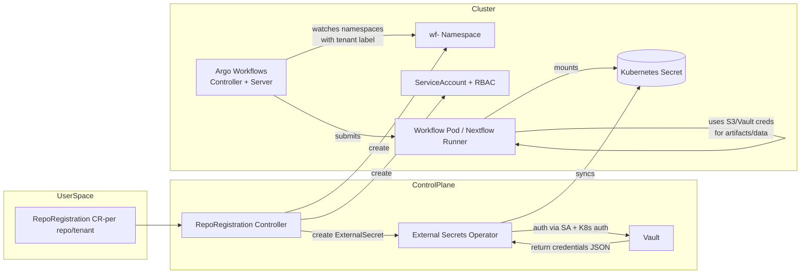

Here’s the regenerated ADR with full text **and** an inline Mermaid diagram you can drop straight into `docs/adr/NN-namespace-strategy-for-multi-tenant-argo-workflows.md`.

````markdown
# ADR: Namespace Strategy for Multi-Tenant Argo Workflows

**ADR ID:** NN  
**Title:** Namespace Strategy for Multi-Tenant Argo Workflows  
**Status:** Proposed  
**Date:** 2025-11-20  
**Authors:** Platform Architecture Team  

---

## 1. Context

The Calypr workflow platform supports **self-service onboarding of Git repositories** using a `RepoRegistration` Custom Resource (CRD). Each repository is treated as a “tenant” and may receive:

- ArgoCD Applications  
- Argo Events webhook integration  
- Argo Workflows execution  
- Vault-backed secrets via External Secrets Operator (ESO)  
- S3 artifact and data storage configuration  
- GitHub App integration for PR status and webhooks  
- Optional Gen3/Fence + Arborist authorization  

As the number of repositories grows, **multi-tenancy isolation** becomes critical. We must define whether workflow execution happens:

1. In a **single namespace** shared by all tenants, or  
2. In **one namespace per tenant**, with resources provisioned automatically by the RepoRegistration controller.

This decision directly impacts:

- Security boundaries and blast radius  
- RBAC and fine-grained access control  
- Vault/Kubernetes auth and ESO secret isolation  
- Per-repo S3 credentials and data segregation  
- Resource quotas and cost accounting  
- Workflow visibility in the Argo UI  
- Lifecycle management & cleanup  
- Controller complexity and cluster footprint  

This ADR evaluates both options and recommends a cluster-wide namespace strategy.

---

## 2. Problem Statement

We need a namespace isolation model that supports:

- Multi-tenant GitOps onboarding of GitHub repositories  
- Per-repo Vault secret paths and Vault policies  
- Per-repo ExternalSecrets that sync into Kubernetes Secrets  
- Restricted workflow visibility for different labs/projects  
- Per-repo access control tied into Gen3/Fence + Arborist  
- Cost and compute-unit attribution (e.g., OHSU ACC model)  
- Clean lifecycle operations when a project ends (offboarding)  
- Strong security boundaries between labs, projects, and pipelines  

The namespace model must align with:

- Argo Workflows controller deployment model  
- Vault’s Kubernetes auth mechanism  
- External Secrets Operator’s `serviceAccountRef` model  
- Existing GitOps patterns via ArgoCD and Argo Events  

---

## 3. Options Considered

### Option A — All workflows execute in a single namespace

Example:

```text
argo-workflows
````

* One namespace contains workflow CRs, pods, ConfigMaps, Secrets, etc.
* All tenants share this namespace.
* Argo Workflows controller runs in, and watches, this namespace only.

### Option B — Each GitHub repository (tenant) executes workflows in its own namespace

Examples:

```text
wf-nextflow-hello
wf-nextflow-hello-2
wf-lab123-singlecell
wf-bmeg-variant-caller
```

* Each repo/tenant has a dedicated “workflow namespace.”
* Argo Workflows controller watches multiple namespaces (via namespace list or label selector).
* RepoRegistration controller is responsible for creating and reconciling these namespaces and their resources.

---

## 4. Evaluation of Tradeoffs

### 4.1 Security & RBAC

**Single namespace**

* Pros:

  * Simple to configure: one set of Roles and RoleBindings.
  * Easy to deploy and reason about operationally.
* Cons:

  * Weak isolation: a misconfigured Role/ServiceAccount can see or modify workflows and secrets from other tenants.
  * Harder to prove that one tenant cannot access another tenant’s data.
  * Blast radius of a compromised workflow pod is larger.

**Per-tenant namespace**

* Pros:

  * Strong, natural isolation boundary: tenants only see resources in their own namespace.
  * Easier to write focused RoleBindings: “this group can only operate in `wf-tenant-x`.”
  * Compromised pod is largely contained to a single namespace.
* Cons:

  * More RBAC objects (Role/RoleBinding per namespace).
  * Namespace lifecycle must be automated to avoid drift.

**Conclusion:**
If we care about cross-lab / cross-project isolation (we do), **per-tenant namespace is preferable**.

---

### 4.2 Vault + ESO Integration

Vault Kubernetes auth works best when each tenant has:

* A distinct Kubernetes ServiceAccount.
* A Vault auth role bound to that ServiceAccount + namespace.
* A Vault policy scoped to a tenant-specific KV path.

**Single namespace**

* All ExternalSecrets live in the same namespace and often share the same SA.
* It’s easy to accidentally let one tenant’s ESO config read another tenant’s secrets.
* Per-tenant scoping is possible but fragile, relying heavily on naming conventions.

**Per-tenant namespace**

* Each repo can have:

  * Its own workflow SA and possibly its own ESO SA.
  * A Vault role like `auth/kubernetes/role/<tenant>`.
  * A Vault policy scoped to `kv/argo/apps/<tenant>/*`.

* This matches ESO’s `serviceAccountRef` pattern and keeps Vault policies clean.

**Conclusion:**
For Vault + ESO, **tenant namespaces map directly onto Vault roles and policies**, making authorization more robust and understandable.

---

### 4.3 Resource Quotas, Cost & Noisy Neighbors

**Single namespace**

* You can create a `ResourceQuota` and `LimitRange`, but all tenants share it.
* One heavy pipeline (e.g., large Nextflow run) can starve others.
* Mapping usage back to a lab or grant requires additional labels and external accounting.

**Per-tenant namespace**

* Each namespace can have its own:

  * `ResourceQuota` (CPU, memory, GPUs, pods).
  * `LimitRange` (per-pod defaults and caps).

* This aligns with per-lab or per-project budgets and cost attribution.

**Conclusion:**
Per-tenant namespaces make **billing, quotas, and fairness much easier**.

---

### 4.4 Workflow Visibility and UX

**Single namespace**

* Unless carefully locked down with RBAC and Argo Workflows’ own authorization features, users may see all workflows.
* Harder to present a clean “project-level” view to a given researcher.

**Per-tenant namespace**

* Users can be granted rights only in namespaces associated with their projects.
* Argo Server and UI can filter by namespace, so researchers naturally see “their” workflows.

**Conclusion:**
Per-tenant namespace leads to a cleaner mental model: “Everything for my project lives in `wf-my-project`.”

---

### 4.5 Operational Complexity

**Single namespace**

* Very simple:

  * One `workflow-controller` Deployment.
  * One namespace to manage.
* No namespace lifecycle concerns.

**Per-tenant namespace, single controller**

* Recommended pattern:

  * Keep a single `workflow-controller` deployment (e.g. in `argo-workflows`).
  * Configure it to watch all workflow namespaces (e.g. via label selector).
* Complexity shifts into:

  * Namespace creation and cleanup.
  * Creating per-tenant RoleBindings, SAs, ExternalSecrets.

With a RepoRegistration controller/operator, this complexity is *automatable*, not manual.

**Conclusion:**
Operational complexity increases somewhat but is manageable and justifies the gained isolation.

---

### 4.6 Lifecycle & Cleanup

**Single namespace**

* Offboarding a repo requires:

  * Deleting WorkflowTemplates, Workflows, Secrets, ConfigMaps, etc., by label.
  * Risk leaving behind “orphaned” objects.

**Per-tenant namespace**

* Offboarding is simply:

  * Delete the namespace: Kubernetes cleans up all child resources.
* Simpler, less error-prone.

**Conclusion:**
Per-tenant namespace gives a **very clean lifecycle model**.

---

### 4.7 Alignment with Fence + Arborist

Fence and Arborist often tie **policy** to **project or resource namespaces**. If we treat:

```text
namespace ≈ project ≈ repo ≈ tenant
```

then:

* Arborist policies grant rights to specific namespaces.
* Fence-authenticated identities map to Arborist policies that gate access to specific workflow namespaces and UIs.

**Conclusion:**
Per-tenant namespaces line up well with Gen3/Fence/Arborist’s multi-tenant authorization patterns.

---

## 5. Decision

We will adopt a **per-tenant (per-repository) namespace model** for workflow execution.

Each `RepoRegistration` will cause the controller to:

1. **Create / manage a namespace** named using a convention, e.g.:

   ```text
   wf-<repo-slug>
   ```

   with labels such as:

   ```yaml
   metadata:
     labels:
       calypr.io/workflow-tenant: "true"
       calypr.io/repo: "<org>/<repo>"
   ```

2. **Create or reconcile tenant-scoped resources** in that namespace, including:

   * ServiceAccount(s) for workflows (and optionally for ESO if not shared).
   * Role + RoleBinding scoped to that namespace.
   * ExternalSecrets for:

     * S3 credentials (artifact/data buckets).
     * GitHub credentials / webhook secrets (if needed in that namespace).
   * Per-tenant ResourceQuota and LimitRange (as policy evolves).

3. **Configure Vault + ESO** so that:

   * Vault `auth/kubernetes/role/<tenant>` is bound to:

     * `bound_service_account_names=eso-vault-auth` (or equivalent).
     * `bound_service_account_namespaces=wf-<tenant>`.
   * Vault policies grant read-only access to:

     * `kv/argo/apps/<tenant>/*` or similar tenant-specific prefix.

4. **Keep Argo Workflows controller centralized:**

   * Run `workflow-controller` in `argo-workflows` namespace.
   * Configure it to watch workflow namespaces selected by label, e.g.:

     ```yaml
     workflow-controller:
       workflowNamespaces:
         labelSelector:
           matchLabels:
             calypr.io/workflow-tenant: "true"
     ```

---

## 6. Inline Mermaid Diagram

The following diagram summarizes the high-level flow:



---

## 7. Consequences

### 7.1 Positive

* **Security:** Tenants are isolated at the namespace level; blast radius of compromise is reduced.
* **Secrets:** Vault + ESO integration follows a clean per-tenant pattern.
* **Quotas & Cost:** Per-tenant ResourceQuota and LimitRange become easy to apply.
* **Lifecycle:** Deleting a namespace cleanly removes all tenant resources.
* **Authz Integration:** Aligns with Gen3/Fence/Arborist and per-project policies.
* **UX:** Argo UI can present a clear project-specific view by namespace.

### 7.2 Negative

* **More namespaces:** Increased number of namespaces in the cluster, though still manageable.
* **More RBAC objects:** Roles/RoleBindings & SAs per tenant.
* **Automation requirement:** Requires a functioning RepoRegistration controller and well-tested reconciliation logic.

---

## 8. Migration Considerations

A rough migration plan from a single shared namespace to per-tenant namespaces:

1. **Inventory current workloads:**

   * List existing Argo Workflows, WorkflowTemplates, Secrets, ConfigMaps, and which repos they belong to.

2. **Define naming convention:**

   * Choose namespace names, e.g., `wf-<org>-<repo>` slug.

3. **Back up and move secrets to Vault:**

   * For each repo, move S3 credentials and GitHub tokens into Vault under tenant-specific paths.
   * Create Vault policies and roles (`auth/kubernetes/role/<tenant>`).

4. **Introduce RepoRegistration and controller:**

   * Deploy the CRD and a controller that can:

     * Create namespaces.
     * Create SAs, RBAC, ExternalSecrets.
     * Generate per-tenant configuration.

5. **Migrate workflows:**

   * Update ArgoCD Applications / WorkflowTemplates to deploy into the new namespaces.
   * Validate that ESO syncs secrets correctly and workflows run successfully.

6. **Decommission shared namespace:**

   * Once tenants are migrated, reduce usage of the shared namespace and eventually remove workflow execution from it.

---

## 9. Implementation Notes

### 9.1 Example Namespace Manifest

```yaml
apiVersion: v1
kind: Namespace
metadata:
  name: wf-nextflow-hello
  labels:
    calypr.io/workflow-tenant: "true"
    calypr.io/repo: "bwalsh/nextflow-hello-project"
```

### 9.2 Example Vault Role

```bash
vault write auth/kubernetes/role/wf-nextflow-hello \
  bound_service_account_names=eso-vault-auth \
  bound_service_account_namespaces=wf-nextflow-hello \
  policies=argo-stack \
  ttl=1h
```

### 9.3 Example ExternalSecret

```yaml
apiVersion: external-secrets.io/v1
kind: ExternalSecret
metadata:
  name: s3-credentials
  namespace: wf-nextflow-hello
spec:
  refreshInterval: 1h
  secretStoreRef:
    name: argo-stack-vault
    kind: ClusterSecretStore
  target:
    name: s3-credentials
    creationPolicy: Owner
  data:
    - secretKey: AWS_ACCESS_KEY_ID
      remoteRef:
        key: argo/apps/nextflow-hello/s3
        property: accessKey
    - secretKey: AWS_SECRET_ACCESS_KEY
      remoteRef:
        key: argo/apps/nextflow-hello/s3
        property: secretKey
```

---

## 10. Future Extensions

* Per-tenant audit logging and monitoring dashboards.
* Automated namespace GC when RepoRegistration is deleted.
* Extensions to support additional workflow engines (Airflow, WDL/Cromwell, Snakemake) using the same namespace pattern.
* Integration with billing systems to map namespace usage to lab/project/grant.
* Optional “soft multi-tenancy” mode where a small number of trusted repos share a namespace.

---

## 11. Final Recommendation

Adopt **per-tenant namespaces** for workflow execution, with lifecycle and configuration orchestrated by the `RepoRegistration` controller.

Keep Argo Workflows controller centralized, configured to watch tenant namespaces by label. Leverage Vault + ESO with per-tenant roles and policies, and align all of this with Gen3/Fence/Arborist authorization and ACC cost accounting.

This approach provides a solid foundation for secure, auditable, and scalable multi-tenant workloads in the Calypr platform.
