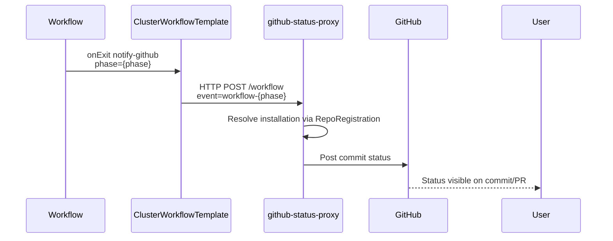

# ADR 0003: Workflow → GitHub Status Integration via ClusterWorkflowTemplate

## Status
Accepted

## Context
Argo Workflows run in multiple namespaces and need a centralized way to 
emit workflow lifecycle events to GitHub using tenant-specific GitHub App 
credentials stored via RepoRegistration.

## Decision
Use a `ClusterWorkflowTemplate` to define a shared notification template.
Workflows reference this via `onExit` handlers.

Notification events:
- workflow-pending
- workflow-succeeded
- workflow-failed

## Diagram



## Consequences
- Centralizes workflow→GitHub logic
- Prevents per-namespace duplication
- Integrates with existing RepoRegistration and GitHub App setup


```yaml
apiVersion: argoproj.io/v1alpha1
kind: ClusterWorkflowTemplate
metadata:
  name: github-status-notify
spec:
  templates:
    - name: notify-github-status
      http:
        url: http://github-status-proxy.argocd.svc.cluster.local/workflow
        method: POST
        body: |
          {
            "kind": "workflow",
            "event": "workflow-{{workflow.status.phase}}",
            "workflowName": "{{workflow.name}}",
            "namespace": "{{workflow.namespace}}",
            "phase": "{{workflow.status.phase}}",
            "labels": {{toJson workflow.labels}},
            "annotations": {{toJson workflow.annotations}},
            "status": {{toJson workflow.status}},
            "target_url": "https://<ARGO_WORKFLOWS_BASE_URL>/workflows/{{workflow.namespace}}/{{workflow.name}}"
          }

```

**Implementation Note:** Initially, we attempted to use a ClusterWorkflowTemplate referenced via `templateRef` with `clusterScope: true`. However, this approach failed because Argo Workflows validates all template references at workflow submission time, including variables like `{{workflow.status.phase}}` which don't exist until the workflow runs. Even though the template references the status directly in the HTTP body, the validation happens too early.

**Actual Implementation:** The solution is to **inline the HTTP template directly in the exit handler** instead of using `templateRef`. This defers variable resolution until the exit handler executes (after workflow completion), when `workflow.status` is available. See `helm/argo-stack/templates/workflows/per-tenant-workflowtemplates.yaml` for the working implementation.

References:
- [Argo Workflows Exit Handlers](https://argo-workflows.readthedocs.io/en/latest/walk-through/exit-handlers/) - Documents that exit handlers can use any template type
- [Argo Workflows HTTP Template](https://argo-workflows.readthedocs.io/en/latest/http-template/) - Shows HTTP templates can access workflow global variables
- [Argo Workflows Variables](https://argo-workflows.readthedocs.io/en/latest/variables/) - Explains variable resolution in different contexts

```go
// WorkflowEvent describes the JSON payload sent by Argo Workflows notifications.
// It matches the templates we discussed earlier.
type WorkflowEvent struct {
	Kind        string            `json:"kind"`        // "workflow"
	Event       string            `json:"event"`       // "workflow-pending" | "workflow-succeeded" | "workflow-failed"
	Workflow    string            `json:"workflowName"`
	Namespace   string            `json:"namespace"`
	Phase       string            `json:"phase"`
	StartedAt   string            `json:"startedAt,omitempty"`
	FinishedAt  string            `json:"finishedAt,omitempty"`
	Labels      map[string]string `json:"labels"`
	Annotations map[string]string `json:"annotations"`
	// Status is intentionally left as raw JSON so we don't need a full struct.
	Status any `json:"status"`
}
```

## Alternatives Considered


A few important points to line up:

---

## 1. Kubernetes reality: ConfigMaps are namespace-scoped

A `ConfigMap` lives in a single namespace:

* A pod in `wf-tenant-a` **cannot mount** or `envFrom` a `ConfigMap` in `argo`.
* There is no “global” `workflow-notifications-cm` that other namespaces can magically reference by name.

So if your pattern relies on **pods** reading `workflow-notifications-cm`, you’re limited to:

* **One shared namespace** for all workflows (single “argo” ns), or
* **One CM per namespace**, created from a common source (Helm / ArgoCD).

---

## 2. Argo Workflows itself doesn’t have a built-in “notifications ConfigMap”

Unlike Argo CD / Argo Rollouts, Argo Workflows today doesn’t have:

* A special `workflow-notifications-cm` name that the controller watches, or
* A `workflows.argoproj.io/notifications` feature documented like `notifications.argoproj.io` in Argo CD.

The official docs for “Workflow notifications” basically say:

* Use **exitHandlers** per workflow or via **default workflow spec**.
* Or watch Workflow events with something like Argo Events / EventRouter and fan those out to Slack, webhooks, etc. ([Argo Workflows][1])

So there’s no native concept of:

> “Let workflows in any namespace refer to a single `workflow-notifications-cm` over there.”

---

## 3. Practical patterns to get what you want

You still *can* centralize behavior – just not by cross-namespace ConfigMap reference. Common patterns:

### Option A – One Argo Workflows namespace (simplest)

If you’re okay collapsing workflows into a single namespace:

* Run `workflow-controller` in e.g. `argo`.
* All `Workflow` / `CronWorkflow` live in `argo`.
* Your “notifications config” (whether CM + HTTP template, or just a ClusterWorkflowTemplate) lives in `argo`.
* Every workflow uses the same **exit handler** / **template** to call `github-status-proxy`.

Then you truly have “one source of truth” and no cross-ns config problems.

---
Option B – Multi-ns workflows, centralize via ClusterWorkflowTemplate

If you want each tenant in its own namespace (which you do 🙂), the clean way to share logic is:

> 🏆 🏆 🏆 That's what we did above with `ClusterWorkflowTemplate`. 👆 👆 👆

---
### Option C – Replicate a shared CM per namespace (GitOps)

If you really like the **“notifications CM”** pattern:

* Keep a single *authoritative* YAML for `workflow-notifications-cm` in Git.
* Use Argo CD / Helm to **deploy that same CM into each workflow namespace** (e.g. `wf-tenant-a`, `wf-tenant-b`, …).
* Your exit handlers or templates in each namespace read from the local CM.

You still don’t *refer* cross-namespace, but the contents are identical and managed from one place.


## References

- [Argo Workflows: ClusterWorkflowTemplate](https://argo-workflows.readthedocs.io/en/latest/cluster-workflow-templates/)
- [Argo Workflows: HTTP Template](https://argo-workflows.readthedocs.io/en/latest/http-template/)
- [Argo Workflows: Workflow Lifecycle Hooks](https://argo-workflows.readthedocs.io/en/latest/lifecyclehook/)
- [GitHub Issue #128](https://github.com/calypr/argo-helm/issues/128)
- [ADR 0001: GitHub Status Proxy](0001-github-status-proxy-for-multi-tenant-github-apps.md)
- ["Workflow Notifications - Argo Workflows - The workflow engine for Kubernetes"](https://argo-workflows.readthedocs.io/en/latest/workflow-notifications/) 

