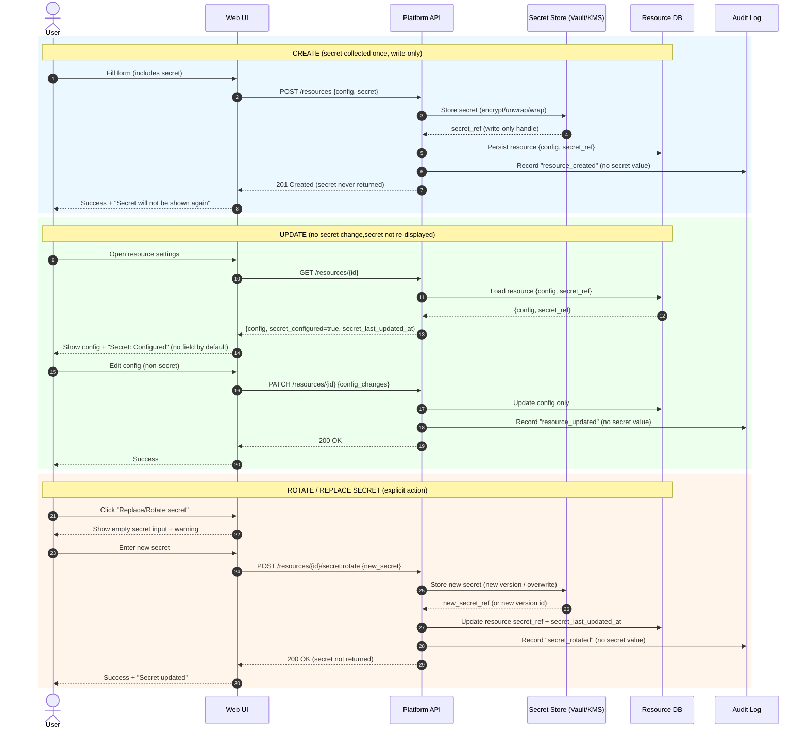

# ADR-00X: UI Handling of Secrets on CREATE and UPDATE

**Status:** Accepted
**Date:** 2025-01-XX
**Decision Makers:** Platform, Security, UX
**Context:** Web UI, API-backed resources, GitOps-managed systems

---

## Context

The platform requires users to provide **secrets** (e.g., API keys, client secrets, tokens) through a user interface during resource creation (**CREATE**) and later management (**UPDATE**).

Secrets are highly sensitive and must be handled in a way that:

* Minimizes exposure
* Prevents accidental disclosure
* Avoids unintended secret rotation
* Aligns with industry-standard security and UX practices

This ADR defines how secrets are collected, stored, and managed via the UI.

---

## Problem Statement

How should secrets entered during **CREATE** be handled during **UPDATE**?

Specifically:

* Should secrets be re-displayed (masked or otherwise)?
* Should users be required to re-enter secrets during UPDATE?
* How should secret rotation be performed safely and intentionally?

---

## Decision

### 1. Secrets Are Write-Only from the UI

Once submitted, secrets:

* **MUST NOT be re-displayed** in the UI
* **MUST NOT be pre-filled** on UPDATE
* **MUST NOT be retrievable** via the UI or API

The UI treats secrets as **write-only values**.

---

### 2. CREATE Behavior

On CREATE:

* Users explicitly enter the secret
* The UI may provide:

  * Client-side validation (length, format)
  * Optional “show/hide while typing”
* After submission:

  * The plaintext secret is immediately discarded
  * Only a secure backend representation is retained (e.g., Vault, KMS-encrypted storage)

**Optional UX enhancement:**

* One-time confirmation message:
  *“This secret will not be shown again. Please store it securely.”*

---

### 3. UPDATE Behavior (Default)

On UPDATE:

* Secrets are **not shown**
* Secret input fields are **not rendered**
* The UI displays non-sensitive metadata only, such as:

  * “Secret: Configured”
  * “Last updated: <timestamp>”

**No re-entry is required** unless the user explicitly chooses to change the secret.

---

### 4. Secret Rotation / Replacement

Secret changes are performed via an **explicit user action**, such as:

* “Replace secret”
* “Rotate credentials”

When invoked:

* A new, empty secret input field is displayed
* The user must re-enter the full secret from scratch
* Submitting the form replaces the existing stored secret

This action is intentional, auditable, and irreversible.

---
## Sequence Diagrams

---

## Alternatives Considered

### A. Re-display masked secrets on UPDATE

**Rejected**

* Implies secrets are retrievable
* Creates false confidence
* Encourages unsafe behavior (screenshots, copying)

---

### B. Always require secret re-entry on UPDATE

**Rejected**

* Increases friction
* Causes accidental secret rotation
* Leads to outages and misconfiguration

---

### C. Empty secret field on UPDATE with “leave blank to keep existing”

**Partially acceptable, but not preferred**

* Increases risk of accidental replacement
* Ambiguous UX semantics
* Allowed only in low-risk internal tooling

---

## Rationale

This decision aligns with:

* Principle of least exposure
* Zero-trust UI assumptions
* Industry standards (cloud providers, payment platforms, developer tooling)

Security considerations:

* UI surfaces are high-risk (logs, extensions, screenshots)
* Secrets should be non-recoverable once stored
* Rotation must be deliberate, not incidental

UX considerations:

* Reduces accidental outages
* Sets clear user expectations
* Improves trust through explicit, predictable behavior

---

## Consequences

### Positive

* Reduced secret leakage risk
* Clear separation between configuration and rotation
* Safer UPDATE workflows
* Easier security audits

### Trade-offs

* Users cannot “recover” lost secrets
* Requires clear UX copy and documentation
* Slightly more UI complexity (explicit rotate action)

---

## Implementation Notes

* Backend APIs must treat secret fields as **write-only**
* Update handlers must distinguish between:

  * “no secret change”
  * “explicit secret replacement”
* Audit logs should record:

  * Secret creation
  * Secret replacement
  * Actor and timestamp (but never the value)

---

## UX Copy Guidelines (Normative)

Recommended language:

* “For security reasons, this secret is not visible after creation.”
* “To change the secret, replace it below.”
* “Secrets are write-only and cannot be recovered.”

Avoid:

* Masked secret placeholders
* Copyable secret values
* Inline secret editing without intent

---

## Related Decisions

🚧 TODO: Create other ADRs as needed and link here.

* ADR-00Y: Secure Secret Storage (Vault / KMS)
* ADR-00Z: Audit Logging for Credential Changes

---

---
Below is the **conventional UX + security guidance** most teams converge on for handling secrets in a UI, especially when secrets are collected at **CREATE** time and later managed via **UPDATE**.

---

## Core Principle

**Secrets are write-only from the UI’s perspective.**
Once collected, they should **never be re-displayed**—not even masked—on subsequent views or edits.

This applies to:

* API keys
* Client secrets
* Passwords
* Private keys
* Tokens
* Webhook signing secrets

---

## On CREATE

**What’s conventional:**

* User enters the secret explicitly.
* The UI may:

  * Validate format (length, prefix, checksum)
  * Offer “show / hide while typing”
* After submit:

  * The plaintext secret is immediately discarded by the UI
  * Only a securely stored representation remains (vault, KMS-wrapped value, etc.)

**Optional UX enhancements (safe):**

* One-time “copy this now” confirmation screen
* Explicit warning: *“This secret will not be shown again.”*

---

## On UPDATE

### 🔐 Are secrets re-displayed?

**No. Never.**

Conventional wisdom is:

* Secrets are **not re-displayed**
* Secrets are **not pre-filled**
* Secrets are **not retrievable**

Even masked placeholders like `••••••••` are generally discouraged unless they are **clearly synthetic** (i.e., not implying reversibility).

---

### 🔁 Do secrets need to be re-entered?

**Only if the user is changing them.**

There are two accepted patterns:

---

## Pattern 1: Explicit “Rotate / Replace Secret” (Best Practice)

**UI behavior:**

* On UPDATE, the secret field is **absent**
* Instead, show:

  * “Secret: Configured”
  * “Last updated: <timestamp>”
* Provide a deliberate action:

  * “Replace secret”
  * “Rotate credentials”

**If user chooses to replace:**

* Reveal an empty secret input
* Require full re-entry
* Overwrite stored secret

**Why this is preferred:**

* Prevents accidental secret invalidation
* Makes rotation intentional
* Communicates immutability clearly

This is the pattern used by:

* GitHub
* AWS
* GCP
* Stripe
* HashiCorp Vault UIs

---

## Pattern 2: Optional Re-entry on Save (Acceptable, but Riskier)

**UI behavior:**

* Secret field appears empty on UPDATE
* Label clearly indicates:

  * “Leave blank to keep existing secret”
* Backend logic:

  * Empty → no change
  * Non-empty → replace

**Risks:**

* Users accidentally paste whitespace or wrong value
* Ambiguous save semantics
* Easier to misconfigure

This pattern is common in internal tools but less favored in security-sensitive systems.

---

## 🚫 Anti-Patterns (Avoid These)

| Anti-Pattern                        | Why It’s Bad                  |
| ----------------------------------- | ----------------------------- |
| Re-displaying secret (even masked)  | Implies reversibility         |
| Pre-filling secret field            | High risk of leakage          |
| Auto-reusing secret on edit         | Breaks zero-trust assumptions |
| “Edit secret inline” without intent | Easy to accidentally rotate   |
| Copyable secret after creation      | Violates least exposure       |

---

## UX Language That Works Well

Use **explicit, confidence-building copy**:

* “For security reasons, this secret is not visible after creation.”
* “To change the secret, replace it below.”
* “Leaving this field empty will keep the existing secret.”
* “Secrets are write-only and cannot be recovered.”

This reduces support tickets and increases trust.

---

## Security Rationale (Why This Is the Norm)

1. **UI is a high-risk surface**

   * Screenshots, browser extensions, logs, shoulder-surfing
2. **Secrets should be non-recoverable**

   * If you can show it, you can leak it
3. **Principle of least exposure**

   * No value in showing a secret after initial confirmation
4. **Rotation should be intentional**

   * Accidental rotation causes outages

---

## Bottom Line

**Conventional wisdom is clear and consistent:**

* **Secrets are collected only at CREATE or explicit ROTATE**
* **Secrets are never re-displayed on UPDATE**
* **Secrets are re-entered from scratch only if the user chooses to change them**
* **Default UPDATE does not require re-entry**
