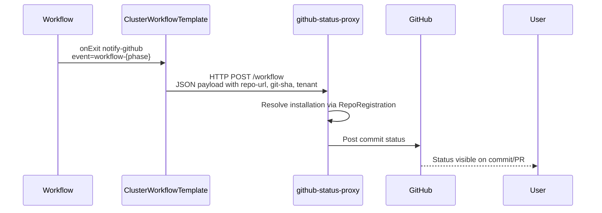

# ADR: Workflow → GitHub Status Integration via ClusterWorkflowTemplate

## Status
Accepted

## Context
Argo Workflows run in multiple namespaces and need a centralized way to 
emit workflow lifecycle events to GitHub using tenant-specific GitHub App 
credentials stored via RepoRegistration.

## Decision
Use a `ClusterWorkflowTemplate` to define a shared notification template.
Workflows reference this via `onExit` handlers.

Notification events:
- workflow-pending
- workflow-succeeded
- workflow-failed

## Diagram



## Consequences
- Centralizes workflow→GitHub logic
- Prevents per-namespace duplication
- Integrates with existing RepoRegistration and GitHub App setup


```yaml
apiVersion: argoproj.io/v1alpha1
kind: ClusterWorkflowTemplate
metadata:
  name: github-status-notify
spec:
  templates:
    - name: notify-github-status
      inputs:
        parameters:
          - name: event
      http:
        url: http://github-status-proxy.argocd.svc.cluster.local/workflow
        method: POST
        body: |
          {
            "kind": "workflow",
            "event": "{{inputs.parameters.event}}",
            "workflowName": "{{workflow.name}}",
            "namespace": "{{workflow.namespace}}",
            "phase": "{{workflow.status.phase}}",
            "labels": {{toJson workflow.labels}},
            "annotations": {{toJson workflow.annotations}},
            "status": {{ toJson .workflow.status }},
            "startedAt": "{{.workflow.status.startedAt}}",
            "finishedAt": "{{.workflow.status.finishedAt}}"
          }

```

```go
// WorkflowEvent describes the JSON payload sent by Argo Workflows notifications.
// It matches the templates we discussed earlier.
type WorkflowEvent struct {
	Kind        string            `json:"kind"`        // "workflow"
	Event       string            `json:"event"`       // "workflow-pending" | "workflow-succeeded" | "workflow-failed"
	Workflow    string            `json:"workflowName"`
	Namespace   string            `json:"namespace"`
	Phase       string            `json:"phase"`
	StartedAt   string            `json:"startedAt,omitempty"`
	FinishedAt  string            `json:"finishedAt,omitempty"`
	Labels      map[string]string `json:"labels"`
	Annotations map[string]string `json:"annotations"`
	// Status is intentionally left as raw JSON so we don't need a full struct.
	Status any `json:"status"`
}
```
