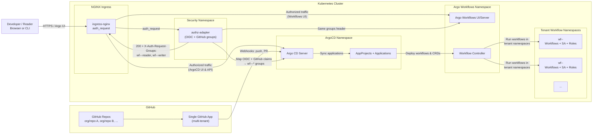

# argo-git-app-overlay

A small overlay chart that wires a **single GitHub App** into a **multi-tenant ArgoCD + Argo Workflows stack**, using:

- `values.repoRepositories[]` as the tenant catalog
- A consistent group/role naming convention: `wf-<org>-<repo>-<role>`
- `X-Auth-Request-Groups` headers from the `authz-adapter` to drive:
  - Argo CD RBAC (AppProject roles + global roles)
  - Kubernetes RBAC in workflow namespaces
  - Argo Workflows UI access

> **Tenant = one GitHub repo.**  
> A single GitHub App is installed into multiple repositories and becomes the common identity / automation layer.

---

## Architecture


---

## 1. Unified access control matrix

Assumptions (tunable to your naming):

* Each GitHub repo `org/repo` gets two tenant groups:

  * `ghapp:org/repo:readers`
  * `ghapp:org/repo:writers`
* One global admin group:

  * `ghapp:argo-admins`
* NGINX/authz-adapter injects:

  * `X-Auth-Request-User`
  * `X-Auth-Request-Email`
  * `X-Auth-Request-Groups: ghapp:org/repo:readers,ghapp:org/repo:writers,...`
* Tenant workflow namespace: `wf-org-repo`
* Argo CD AppProject: `proj-org-repo`, hosted by your `argo-stack` chart. ([GitHub][1])

### Matrix

| Identity (X-Auth-Request-Groups)   | Human meaning                       | Argo CD RBAC role(s)                            | Argo CD scope                        | Kubernetes RBAC                                     | K8s scope                          |
| ---------------------------------- | ----------------------------------- | ----------------------------------------------- | ------------------------------------ | --------------------------------------------------- | ---------------------------------- |
| `ghapp:argo-admins`                | Platform / superuser admins         | `role:admin` (global, via `argocd-rbac-cm`)     | All projects, all apps, all clusters | `cluster-admin` (or strong cluster role)            | Cluster-wide                       |
| `ghapp:org/repo:writers`           | Repo tenant “writers” / maintainers | `proj:proj-org-repo:admin` (AppProject role)    | Only `proj-org-repo` applications    | `wf-org-repo-admin` Role + RoleBinding to group     | Namespace `wf-org-repo`            |
| `ghapp:org/repo:readers`           | Repo tenant “readers” / observers   | `proj:proj-org-repo:readonly` (AppProject role) | Only `proj-org-repo` applications    | `wf-org-repo-readonly` Role + RoleBinding to group  | Namespace `wf-org-repo`            |
| (optional) `ghapp:argocd-readonly` | Platform-wide read-only             | `role:readonly` (global)                        | All projects, read-only              | `cluster-readonly` ClusterRole + ClusterRoleBinding | Cluster-wide (get/list/watch only) |

Result:

* **Readers/writers see only their own Argo CD project & app(s)** because their roles are scoped to `proj-org-repo`.
* **Readers/writers see only their workflows** because their K8s Roles are bound only in `wf-org-repo`, and Argo Workflows RBAC uses the same group claims. ([Proactive Insights][2])
* **Admins** can see and change everything.

---

## 2. Example RBAC config for a single tenant

Let’s use a concrete example repo:

* GitHub repo: `calypr/nextflow-hello`
* Tenant workflow namespace: `wf-nextflow-hello`
* Argo CD project: `nextflow-hello`
* Groups:

  * `ghapp:calypr/nextflow-hello:readers`
  * `ghapp:calypr/nextflow-hello:writers`
  * `ghapp:argo-admins`

### 2.1 Argo CD global RBAC (argocd-rbac-cm)

This handles the **cluster-wide admin & default policy**. Pattern taken from typical Argo CD RBAC examples. ([Argo CD][3])

```yaml
apiVersion: v1
kind: ConfigMap
metadata:
  name: argocd-rbac-cm
  namespace: argocd
data:
  policy.default: role:readonly
  policy.csv: |
    # Global ArgoCD admins
    g, ghapp:argo-admins, role:admin

    # Optional: global read-only
    g, ghapp:argocd-readonly, role:readonly
```

> Everything tenant-specific will be handled via **AppProject roles**, not here.

---

### 2.2 Argo CD AppProject (per repo / tenant)

Each repo gets its own `AppProject`. You already have per-repo application wiring in the chart; this fits that model. ([GitHub][1])

```yaml
apiVersion: argoproj.io/v1alpha1
kind: AppProject
metadata:
  name: nextflow-hello
  namespace: argocd
spec:
  description: "Tenant project for calypr/nextflow-hello"
  sourceRepos:
    - https://github.com/calypr/nextflow-hello.git
  destinations:
    - server: https://kubernetes.default.svc
      namespace: wf-nextflow-hello

  # Limit cross-namespace & cluster resources (tighten as needed)
  clusterResourceWhitelist:
    - group: ""
      kind: Namespace
    - group: rbac.authorization.k8s.io
      kind: Role
    - group: rbac.authorization.k8s.io
      kind: RoleBinding

  roles:
    # Writers: manage apps in this project
    - name: admin
      description: "Writers for nextflow-hello"
      policies:
        - p, proj:nextflow-hello:admin, applications, *, nextflow-hello/*, allow
        - p, proj:nextflow-hello:admin, repositories, get, *, allow
      groups:
        - ghapp:calypr/nextflow-hello:writers

    # Readers: read-only access to apps in this project
    - name: readonly
      description: "Readers for nextflow-hello"
      policies:
        - p, proj:nextflow-hello:readonly, applications, get, nextflow-hello/*, allow
        - p, proj:nextflow-hello:readonly, applications, sync, nextflow-hello/*, deny
      groups:
        - ghapp:calypr/nextflow-hello:readers
```

With this:

* **Writers** (GitHub App writers group) can:

  * Create/edit/sync Argo CD apps in this project.
* **Readers** can:

  * View apps & health, but cannot sync or modify.

---

### 2.3 Argo CD Application example

The Application itself just points to the tenant namespace. You already have an `applications` array in values; this is basically what your chart generates. ([GitHub][1])

```yaml
apiVersion: argoproj.io/v1alpha1
kind: Application
metadata:
  name: nextflow-hello
  namespace: argocd
spec:
  project: nextflow-hello
  source:
    repoURL: https://github.com/calypr/nextflow-hello.git
    targetRevision: main
    path: .
  destination:
    server: https://kubernetes.default.svc
    namespace: wf-nextflow-hello
  syncPolicy:
    automated:
      prune: true
      selfHeal: true
```

---

### 2.4 Argo Workflows RBAC + K8s Roles

**Goal:** same GitHub groups used for:

* who can **see** workflows in the Argo Workflows UI
* who can **run/manage** them
* who can **see pods/logs** at the Kubernetes level

#### 2.4.1 Namespace-scoped Roles

```yaml
# Admin / writer role in wf-nextflow-hello
apiVersion: rbac.authorization.k8s.io/v1
kind: Role
metadata:
  name: wf-nextflow-hello-admin
  namespace: wf-nextflow-hello
rules:
  - apiGroups: ["argoproj.io"]
    resources: ["workflows", "workflowtemplates", "cronworkflows"]
    verbs: ["*"]
  - apiGroups: [""]
    resources: ["pods", "pods/log", "events", "configmaps"]
    verbs: ["get", "list", "watch"]
  - apiGroups: [""]
    resources: ["secrets", "persistentvolumeclaims"]
    verbs: ["get", "list", "create", "update", "delete"]

---
# Read-only role in wf-nextflow-hello
apiVersion: rbac.authorization.k8s.io/v1
kind: Role
metadata:
  name: wf-nextflow-hello-readonly
  namespace: wf-nextflow-hello
rules:
  - apiGroups: ["argoproj.io"]
    resources: ["workflows", "workflowtemplates", "cronworkflows"]
    verbs: ["get", "list", "watch"]
  - apiGroups: [""]
    resources: ["pods", "pods/log", "events", "configmaps"]
    verbs: ["get", "list", "watch"]
```

#### 2.4.2 RoleBindings to GitHub App groups

```yaml
# Writers → admin role
apiVersion: rbac.authorization.k8s.io/v1
kind: RoleBinding
metadata:
  name: wf-nextflow-hello-admin-binding
  namespace: wf-nextflow-hello
subjects:
  - kind: Group
    name: ghapp:calypr/nextflow-hello:writers
    apiGroup: rbac.authorization.k8s.io
roleRef:
  kind: Role
  name: wf-nextflow-hello-admin
  apiGroup: rbac.authorization.k8s.io

---
# Readers → readonly role
apiVersion: rbac.authorization.k8s.io/v1
kind: RoleBinding
metadata:
  name: wf-nextflow-hello-readonly-binding
  namespace: wf-nextflow-hello
subjects:
  - kind: Group
    name: ghapp:calypr/nextflow-hello:readers
    apiGroup: rbac.authorization.k8s.io
roleRef:
  kind: Role
  name: wf-nextflow-hello-readonly
  apiGroup: rbac.authorization.k8s.io
```

#### 2.4.3 Argo Workflows UI RBAC (group expressions)

Argo Workflows can also enforce RBAC based on groups in the ID token (or headers via SSO integration). Typical pattern: ([Proactive Insights][2])

```yaml
apiVersion: apps/v1
kind: Deployment
metadata:
  name: argo-workflows-server
  namespace: argo
spec:
  template:
    metadata:
      annotations:
        # Only users in these groups can access this Argo Workflows instance
        workflows.argoproj.io/rbac-rule: >
          'ghapp:calypr/nextflow-hello:writers' in groups
          || 'ghapp:calypr/nextflow-hello:readers' in groups
        workflows.argoproj.io/rbac-rule-precedence: "1"
    spec:
      # ...
```

You can tighten that further if you ever run one Argo server per tenant namespace.

---

## 3. Debugging guide: verifying `X-Auth-Request-Groups` end-to-end

You want a **systematic “outside → inside” checklist**:

### Step 0 – Known good group membership

* Verify in your **IdP / GitHub App integration** that the user belongs to:

  * `ghapp:calypr/nextflow-hello:readers` or `:writers`
* If the authz-adapter talks to Fence/Gen3, confirm the group shows up in the token / userinfo response first (using `jq` on the JWT, or the Fence `/user/` endpoints).

---

### Step 1 – NGINX / authz-adapter header injection

1. **Confirm Ingress annotations**

   Check that your Argo CD and Argo Workflows ingresses are using `auth_request` and passing headers:

   ```bash
   kubectl get ingress -n argocd argocd-server -o yaml
   ```

   Look for annotations like:

   ```yaml
   nginx.ingress.kubernetes.io/auth-url: "http://authz-adapter.security.svc.cluster.local/auth"
   nginx.ingress.kubernetes.io/auth-response-headers: "X-Auth-Request-User, X-Auth-Request-Email, X-Auth-Request-Groups"
   ```

2. **Echo headers via a debug backend**

   Temporarily route a dedicated path `/debug/headers` to a simple echo service in the same ingress:

   ```yaml
   apiVersion: v1
   kind: Pod
   metadata:
     name: header-echo
     namespace: argocd
   spec:
     containers:
       - name: header-echo
         image: mendhak/http-https-echo
         ports:
           - containerPort: 80
   ---
   apiVersion: v1
   kind: Service
   metadata:
     name: header-echo
     namespace: argocd
   spec:
     selector:
       app: header-echo
     ports:
       - port: 80
         targetPort: 80
   ```

   Add a path rule in the ingress to send `/debug/headers` to `header-echo`. Then hit:

   ```bash
   curl -k -H "Host: <your-host>" https://<your-host>/debug/headers
   ```

   You should see something like:

   ```text
   X-Auth-Request-User: alice@example.org
   X-Auth-Request-Groups: ghapp:calypr/nextflow-hello:writers,ghapp:argo-admins
   ```

   If you **don’t** see groups here, the bug is either in the authz-adapter or IdP side.

---

### Step 2 – Argo CD sees the groups

1. **Login through the proxied URL** (UI or CLI using `--header` if necessary). ([Argo CD][4])

2. Run:

   ```bash
   argocd account get-user-info
   ```

   You should see:

   ```text
   LoggedIn: true
   Username: alice@example.org
   Groups: ghapp:calypr/nextflow-hello:writers,ghapp:argo-admins
   ```

   * If groups are **missing here** but present at the ingress debug step:

     * Check Dex / OIDC config in `argocd-cm` to ensure the `groups` claim (or `X-Auth-Request-Groups`) is mapped through.
     * If using an auth proxy connector, confirm `groupHeader: X-Auth-Request-Groups`. ([GitHub][5])

3. Validate Argo CD RBAC evaluation:

   ```bash
   argocd account can-i sync applications 'nextflow-hello/*'
   argocd account can-i get applications 'nextflow-hello/*'
   ```

   * For a `writers` user: `sync` should be allowed.
   * For a `readers` user: `sync` should be denied; `get` allowed.

---

### Step 3 – Kubernetes RBAC (workflows / pods)

1. Use **Subject Access Review** locally:

   ```bash
   kubectl auth can-i list workflows.argoproj.io \
     --as=alice@example.org \
     --as-group=ghapp:calypr/nextflow-hello:writers \
     -n wf-nextflow-hello
   ```

   * Expect `yes` for writers / readers (list workflows).
   * Expect `no` for users without the group.

2. If you see `no` for a group that should work:

   * Inspect the RoleBindings:

     ```bash
     kubectl get rolebinding -n wf-nextflow-hello -o yaml | grep -A5 RoleBinding
     ```

   * Confirm the `subjects[].name` matches exactly the `group` string coming from `argocd account get-user-info`.

---

### Step 4 – Argo Workflows UI RBAC

1. Attempt to hit the Argo Workflows UI as each type of user.
2. If a user can log in but sees “no workflows”:

   * Check Argo Workflows server annotations `workflows.argoproj.io/rbac-rule*`.
   * Confirm `groups` claim actually contains your `ghapp:*` group names.
   * If using Dex, ensure Workflows is configured with `scopes: [openid, profile, email, groups]` and that it trusts the same issuer as Argo CD. ([Proactive Insights][2])

---

[1]: https://github.com/calypr/argo-helm/tree/feature/git-app-work "GitHub - calypr/argo-helm at feature/git-app-work"
[2]: https://hossted.com/knowledge-base/case-studies/devops/application-development/resolving-rbac-and-sso-issues-in-argo-workflows-with-azure-ad-and-dex/?utm_source=chatgpt.com "Resolving RBAC and SSO Issues in Argo Workflows with ..."
[3]: https://argo-cd.readthedocs.io/en/stable/operator-manual/rbac/?utm_source=chatgpt.com "RBAC Configuration - Declarative GitOps CD for Kubernetes"
[4]: https://argo-cd.readthedocs.io/en/release-2.0/operator-manual/ingress/?utm_source=chatgpt.com "Ingress Configuration - Declarative GitOps CD for Kubernetes"
[5]: https://github.com/argoproj/argo-cd/issues/21089?utm_source=chatgpt.com "ArgoCD behind an auth proxy · Issue #21089"
