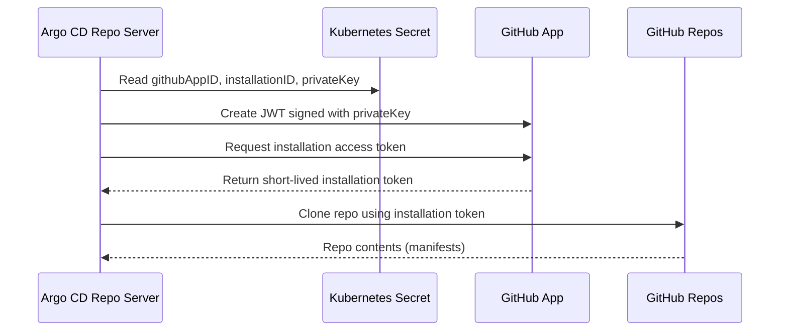

[Home](index.md) > Admin Guides

# 🔐 GitHub App Authentication for Argo CD

This guide explains how to configure Argo CD to authenticate with GitHub repositories using a **GitHub App** instead of Personal Access Tokens (PATs) or SSH keys. GitHub Apps provide more secure, auditable, and manageable access control.

---

## 📋 Overview

### Why Use GitHub Apps?

| Feature | PAT/SSH | GitHub App |
|---------|---------|------------|
| Token Lifetime | Long-lived (requires manual rotation) | Short-lived (1 hour, auto-refreshed by Argo CD) |
| Access Scope | User-wide or all repos | Per-repository installation |
| Auditability | Limited | Full audit log in GitHub |
| Permission Model | Coarse-grained | Fine-grained, least-privilege |
| Multi-tenant Support | Complex (one PAT per tenant) | Simple (one App, multiple installations) |
| Revocation | Manual | Instant via GitHub UI |

### Architecture



---

## ⚙️ Prerequisites

- A GitHub account with permission to create GitHub Apps in your organization
- Access to the Kubernetes cluster where Argo CD is deployed
- Helm v3+
- (Optional) HashiCorp Vault for secure private key storage

---

## 🚀 Step 1: Create a GitHub App

1. Go to your GitHub organization's settings:
   - **Settings** → **Developer settings** → **GitHub Apps** → **New GitHub App**

2. Configure the App with these settings:

   | Setting | Value |
   |---------|-------|
   | **GitHub App name** | `ArgoCD-<your-org>` (must be unique) |
   | **Homepage URL** | Your Argo CD URL or organization URL |
   | **Webhook** | Disable (uncheck "Active") unless needed for notifications |

3. Set **Repository permissions** (minimum required):

   | Permission | Access Level | Purpose |
   |------------|--------------|---------|
   | **Contents** | Read-only | Clone repository contents |
   | **Metadata** | Read-only | Access repository metadata |

4. For **Argo CD Notifications** (optional), add:

   | Permission | Access Level | Purpose |
   |------------|--------------|---------|
   | **Commit statuses** | Read & write | Post sync status to commits |
   | **Deployments** | Read & write | Create deployment records |
   | **Pull requests** | Read & write | Post PR comments |

5. Set **Where can this GitHub App be installed?**:
   - Select **Only on this account** for organization-only access
   - Select **Any account** if you need to install on multiple organizations

6. Click **Create GitHub App**

---

## 🔑 Step 2: Generate and Download the Private Key

1. After creating the App, scroll to **Private keys**
2. Click **Generate a private key**
3. Save the downloaded `.pem` file securely
4. Note the **App ID** shown at the top of the page

---

## 📦 Step 3: Install the GitHub App on Repositories

1. Go to your GitHub App's settings page
2. Click **Install App** in the left sidebar
3. Select the organization or account
4. Choose installation scope:
   - **All repositories** - Access to all current and future repos
   - **Only select repositories** - Access to specific repos only
5. Click **Install**
6. Note the **Installation ID** from the URL:
   - URL format: `https://github.com/settings/installations/<installation-id>`

---

## 🔧 Step 4: Configure Helm Values

### Option A: Using External Secrets (Vault)

If you're using HashiCorp Vault with External Secrets Operator:

```yaml
# values.yaml

# Store the private key in Vault first:
# vault kv put kv/argo/argocd/github-app privateKey=@/path/to/private-key.pem

githubApp:
  enabled: true
  appId: "123456"                              # Your GitHub App ID
  installationId: "12345678"                   # Your Installation ID
  privateKeySecretName: argocd-github-app-key  # Secret name (auto-created)
  privateKeyVaultPath: "argo/argocd/github-app#privateKey"
  repoCredsUrl: "https://github.com/your-org"  # Access all repos in org

notifications:
  enabled: true
  github:
    enabled: true
    useGithubApp: true  # Use the same GitHub App for notifications
  triggers:
    onSyncSucceeded: true
    onSyncFailed: true
```

### Option B: Manual Secret Creation

If not using Vault, create the secret manually:

```bash
# Create the private key secret
kubectl create secret generic argocd-github-app-key \
  --namespace argocd \
  --from-file=privateKey=/path/to/private-key.pem
```

Then configure values.yaml:

```yaml
githubApp:
  enabled: true
  appId: "123456"
  installationId: "12345678"
  privateKeySecretName: argocd-github-app-key
  repoCredsUrl: "https://github.com/your-org"
  # Omit privateKeyVaultPath when not using Vault
```

---

## 🚢 Step 5: Deploy

Deploy or upgrade the Helm chart:

```bash
helm upgrade --install argo-stack helm/argo-stack \
  -n argocd --create-namespace \
  -f values.yaml
```

---

## ✅ Step 6: Verify Configuration

### Check the repo-creds Secret

```bash
kubectl get secret github-app-repo-creds-with-key -n argocd -o yaml
```

### Test Repository Connection

```bash
# Port-forward to Argo CD server
kubectl port-forward svc/argocd-server -n argocd 8080:443

# Use argocd CLI to list repos
argocd repo list
```

### Create a Test Application

```yaml
apiVersion: argoproj.io/v1alpha1
kind: Application
metadata:
  name: test-github-app
  namespace: argocd
spec:
  project: default
  source:
    repoURL: https://github.com/your-org/your-repo.git
    targetRevision: HEAD
    path: manifests
  destination:
    server: https://kubernetes.default.svc
    namespace: default
```

The Application should sync successfully using GitHub App authentication.

---

## 🔔 Enabling Notifications

When notifications are enabled, Argo CD will post deployment status updates to GitHub.

### Add Notification Subscriptions to Applications

For each Application you want to receive notifications, add these annotations:

```yaml
apiVersion: argoproj.io/v1alpha1
kind: Application
metadata:
  name: my-app
  namespace: argocd
  annotations:
    # Subscribe to sync status notifications
    notifications.argoproj.io/subscribe.on-sync-succeeded.github: ""
    notifications.argoproj.io/subscribe.on-sync-failed.github: ""
spec:
  # ... application spec
```

### Auto-Subscribe RepoRegistrations

If using the RepoRegistration pattern, enable auto-subscription in values.yaml:

```yaml
notifications:
  defaultSubscriptions:
    autoSubscribe: true
```

This automatically adds notification subscriptions to Applications created from repoRegistrations.

---

## 🔄 Migration from PAT/SSH to GitHub App

### Step-by-Step Migration

1. **Create the GitHub App** following the steps above

2. **Install the App** on the same repositories your PAT has access to

3. **Add repo-creds** via Helm (the GitHub App credentials)

4. **Test with a new Application** pointing to a repo to verify GitHub App works

5. **Migrate existing Applications** one at a time:
   - Applications using repo-creds will automatically use GitHub App if the URL matches
   - For Applications with explicit credentials, update them to remove explicit creds

6. **Remove old PAT secrets** once all Applications are migrated:
   ```bash
   kubectl delete secret github-pat-secret -n argocd
   ```

### Rollback Plan

If issues occur, you can quickly revert:

```yaml
githubApp:
  enabled: false  # Disable GitHub App

# Recreate PAT secret manually
```

---

## 🧩 Troubleshooting

| Issue | Possible Cause | Solution |
|-------|---------------|----------|
| `permission denied` | App not installed on repo | Install the GitHub App on the target repository |
| `installation token invalid` | Wrong Installation ID | Verify the Installation ID in GitHub settings |
| `could not refresh installation token` | Invalid private key | Regenerate the private key and update the secret |
| `app not found` | Wrong App ID | Verify the App ID in GitHub App settings |
| `403 Forbidden` | Missing repository permissions | Add Contents: Read permission to the GitHub App |
| `secret not found` | ExternalSecret not synced | Check ESO logs and SecretStore status |

### Check ExternalSecret Status

```bash
kubectl get externalsecret argocd-github-app-key -n argocd -o yaml
```

### Check Argo CD Logs

```bash
kubectl logs -n argocd deployment/argocd-repo-server --tail=100 | grep -i github
```

---

## 🔐 Security Best Practices

1. **Limit repository scope**: Only install the GitHub App on repositories that need Argo CD access

2. **Use least-privilege permissions**: Only grant the minimum required permissions (Contents: Read, Metadata: Read)

3. **Store private key securely**: Use Vault or another secrets manager rather than storing in plain ConfigMaps

4. **Rotate private key periodically**: Generate a new private key and update the secret

5. **Monitor access**: Review GitHub App installation logs regularly

6. **Use separate Apps per environment**: Consider separate GitHub Apps for dev/staging/production

---

## 📚 Related Documentation

- [Argo CD Repository Credentials](https://argo-cd.readthedocs.io/en/stable/user-guide/private-repositories/)
- [GitHub Apps Documentation](https://docs.github.com/en/apps)
- [Argo CD Notifications](https://argo-cd.readthedocs.io/en/stable/operator-manual/notifications/)
- [External Secrets Operator](https://external-secrets.io/)

---

## 🧪 Acceptance Tests

To verify your GitHub App setup is working correctly:

### Test 1: Repo Connection

```gherkin
Given the GitHub App Secret is applied in the argocd namespace
And argocd-repo-server has restarted
When I list repositories via the Argo CD API
Then I should see the repo status marked as "Connection successful"
```

### Test 2: Private Repo Access

```gherkin
Given a private GitHub repository with the GitHub App installed
And an Argo CD Application referencing that repo
When Argo CD performs a sync
Then the manifests should fetch successfully
And no authentication errors should appear in argocd-repo-server logs
```

### Test 3: Org-Wide Access via Repo Creds

```gherkin
Given a repo-creds secret with url "https://github.com/my-org"
When I add an Argo CD Application pointing to "https://github.com/my-org/some-repo"
Then Argo CD should authenticate via the GitHub App
And Application sync should succeed
```

### Test 4: Notifications

```gherkin
Given notifications are enabled
And an Application is annotated to subscribe to on-sync-succeeded
When the Application syncs successfully
Then a commit status should appear on GitHub with state "success"
```
