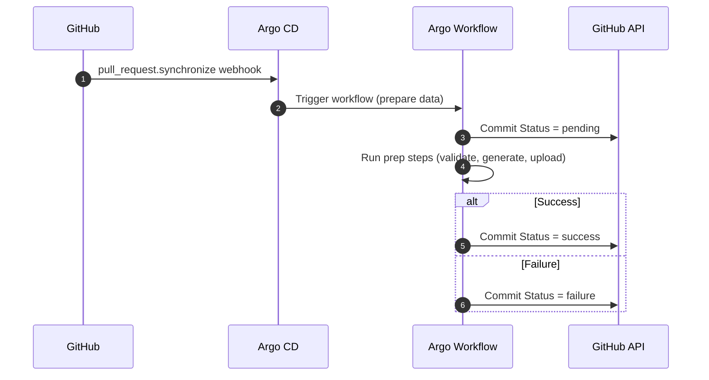
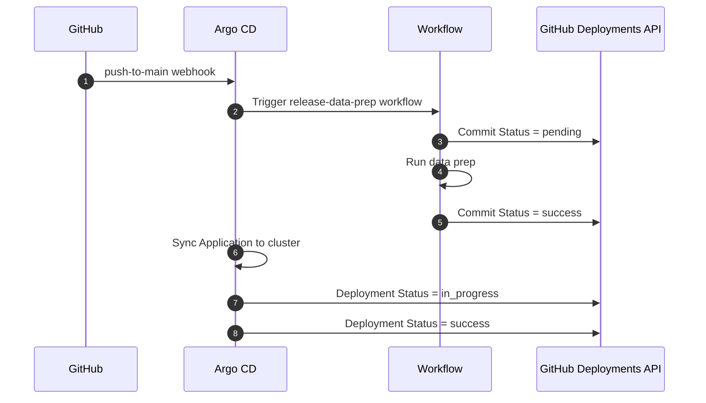

# ADR: GitOps Status Matrix for GitHub and Argo CD

- **ADR ID:** 00X-gitops-status-matrix
- **Status:** Proposed
- **Date:** 2025-12-01
- **Owner:** GitOps / Platform Team

---

## 1. Context

In our environment, a **workflow must run to prepare data for a release** before we consider a change “deployable.”  
We use:

- GitHub as the system of record for application and configuration code  
- Argo CD as the GitOps controller for Kubernetes  
- Argo Workflows (or equivalent) to prepare and validate release data inside the cluster  
- A GitHub App for authenticated status updates  

Today, there is no consistent pattern that:

1. Maps **GitHub events** (push to `main`, new commits on a PR) to  
2. **GitHub status signals** (Commit Status, Deployment Status)

…in a way that reflects workflow execution, Argo CD sync health, and user-facing status in GitHub.

This ADR defines that mapping and the responsibilities of the Argo CD–managed workflow.

---

## 2. Decision

We define a **GitOps status matrix** connecting:

- GitHub events  
- Argo CD triggers  
- Workflows  
- GitHub Status signals  

Rules adopted:

1. **A workflow must run** for both PRs and `main` before changes are deployable.  
2. **The workflow updates GitHub status**, not Argo CD directly.  
3. Argo CD manages and triggers the workflow, ensuring all workflow definitions and runtime are in sync.  
4. GitHub status must clearly express workflow execution state and environment deployment readiness.  

---

## 3. Architecture Overview

### 3.1 Status Matrix

| GitHub Event →<br>GitHub Status ↓ | `push` to `main` | `pull_request` with `action=synchronize` |
|-----------------------------------|------------------|-------------------------------------------|
| **Commit Status** (Statuses API) | **“Release Data Prep / Main”**<br><br>1. Commit pushed to `main`.<br>2. Argo CD sees new revision and syncs the workflow definition.<br>3. Trigger workflow.<br>4. Workflow updates commit status (`pending` → `success` or `failure`). | **“Release Data Prep / PR”**<br><br>1. New commits added to PR branch.<br>2. Trigger workflow for PR head SHA.<br>3. Workflow sets commit status with context `release-data-prep`. |
| **GitHub Deployment Status** (Deployments API) | **“Deploy to staging / production”**<br><br>1. Workflow success for `main`.<br>2. Argo CD Application is Synced & Healthy.<br>3. Workflow or Argo Notification updates Deployment Status. | **“Preview Environment” (optional)**<br><br>1. Preview namespace created.<br>2. Workflow success or failure updates GitHub Deployment Status (environment = `preview/pr-123`). |

---

## 4. Workflow Responsibilities and Steps

### 4.1 High-Level Flow

1. Argo CD syncs Application containing WorkflowTemplates/CronWorkflows.  
2. A Sync hook or Argo Events Sensor triggers a workflow run.  
3. Workflow prepares data, validates artifacts, and produces derived outputs.  
4. Workflow updates GitHub Commit Status.  
5. Workflow optionally updates Deployment Status.  
6. Argo CD exposes cluster health, but GitHub is the primary UX indicator.

---

## 4.2 Detailed Workflow Actions

### Step 0 — Obtain Installation Access Token

Workflow obtains a short-lived GitHub installation token:

1. Create JWT from GitHub App private key.  
2. Call:  
   `POST /app/installations/{installation_id}/access_tokens`  
3. Save token as `GITHUB_TOKEN`.

---

### Step 1 — Set Commit Status to `pending`

API call:

```
POST /repos/{owner}/{repo}/statuses/{sha}
```

Payload:

```json
{
  "state": "pending",
  "context": "release-data-prep",
  "description": "Preparing release data in Argo Workflow",
  "target_url": "https://argocd.example.org/applications/your-app?workflow_run_id=XYZ"
}
```

---

### Step 2 — Execute Data Preparation Tasks

Common operations:

- Validate metadata  
- Run ETL pipelines  
- Generate derived manifests  
- Upload artifacts to S3/MinIO  
- Register outputs in metadata/index systems  

Failures must propagate to step status.

---

### Step 3 — Set Commit Status to `success` or `failure`

Success payload:

```json
{
  "state": "success",
  "context": "release-data-prep",
  "description": "Release data prepared and validated",
  "target_url": "https://argocd.example.org/applications/your-app?workflow_run_id=XYZ"
}
```

Failure payload:

```json
{
  "state": "failure",
  "context": "release-data-prep",
  "description": "Release data prep failed; see workflow logs",
  "target_url": "https://argocd.example.org/applications/your-app?workflow_run_id=XYZ"
}
```

---

### Step 4 — Update GitHub Deployment Status

#### 4.1 Create Deployment

```
POST /repos/{owner}/{repo}/deployments
```

Payload:

```json
{
  "ref": "GIT_COMMIT_SHA",
  "environment": "staging",
  "description": "Argo CD environment deployment",
  "auto_merge": false
}
```

#### 4.2 Update Deployment Status

```
POST /repos/{owner}/{repo}/deployments/{id}/statuses
```

Payload:

```json
{
  "state": "success",
  "log_url": "https://argocd.example.org/applications/my-app",
  "environment_url": "https://my-service.example.org",
  "description": "Deployment completed successfully"
}
```

---

## 5. Mermaid Diagrams

### 5.1 PR Synchronize → Workflow → Commit Status



---

### 5.2 Push to Main → Workflow → Deployment Status



---

## 6. How Argo CD Participates

Argo CD:

- Syncs workflow definitions  
- Triggers workflows via hooks/events  
- Ensures desired state applied to cluster  
- Does **not** call GitHub directly, but the workflow does  
- Surfaces cluster health for visibility  

---

## 7. Consequences

### 7.1 Positive

- Clear mapping from GitHub → workflows → GitHub signals.  
- PR authors understand release readiness immediately.  
- Deployment history visible under GitHub “Environments.”  

### 7.2 Negative

- Requires secure GitHub App secret handling.  
- Workflow-side token issuance complexity.  
- If workflow status update step fails, GitHub status may appear stale.

---

## 8. Alternatives Considered

1. GitHub Actions performing data prep alone  
2. Only reporting Deployment Status  
3. Pushing workflow results into Git history  

---

## 9. Open Questions / Next Steps

- Should PR comments summarize validation results?  
- Should preview environments be mandatory for all PRs?  
- Should we standardize commit status context names?  

---

## 10. Multi-Installation GitHub App Support

### 10.1 Overview

The platform supports multiple GitHub App installations, enabling notifications to be posted to repositories across different organizations or GitHub accounts. Each repository registration can specify its own `installationId`, and the system automatically generates isolated notification configurations for each unique installation.

### 10.2 How It Works

1. **Installation ID Collection**: The Helm chart iterates over all `repoRegistrations` and collects unique `installationId` values.

2. **Service Generation**: For each unique `installationId`, a separate notification service is created:
   - `service.github-12345678` for installation 12345678
   - `service.github-87654321` for installation 87654321
   - etc.

3. **Application Subscriptions**: Each ArgoCD Application automatically subscribes to the correct notification service based on its repository's `installationId`.

### 10.3 Configuration Example

```yaml
repoRegistrations:
  # Repository in Organization A
  - name: org-a-repo
    repoUrl: https://github.com/org-a/repo.git
    installationId: 12345678  # GitHub App installation for Org A
    # ... other config ...
  
  # Repository in Organization B
  - name: org-b-repo
    repoUrl: https://github.com/org-b/repo.git
    installationId: 87654321  # GitHub App installation for Org B
    # ... other config ...
  
  # Another repository in Organization A
  - name: org-a-another-repo
    repoUrl: https://github.com/org-a/another-repo.git
    installationId: 12345678  # Same installation as first repo
    # ... other config ...
```

Result: Two notification services are created (`service.github-12345678` and `service.github-87654321`), with applications automatically subscribing to the appropriate one.

### 10.4 Benefits

- **Multi-Organization Support**: Post notifications to repositories across different GitHub organizations
- **Isolated Credentials**: Each installation uses its own GitHub App credentials
- **Automatic Configuration**: No manual service configuration needed
- **Backward Compatibility**: Falls back to global configuration if no `installationId` is specified

### 10.5 Finding Your Installation ID

1. Navigate to your GitHub App settings page
2. Click "Install App" and select your installation
3. The installation ID appears in the URL: `/settings/installations/{installation_id}`

### 10.6 Implementation Details

See:
- `helm/argo-stack/templates/argocd/notifications-configmap.yaml` - Service generation logic
- `helm/argo-stack/templates/argocd/applications-from-repo-registrations.yaml` - Subscription logic
- `examples/repo-registrations-values.yaml` - Complete configuration examples  

