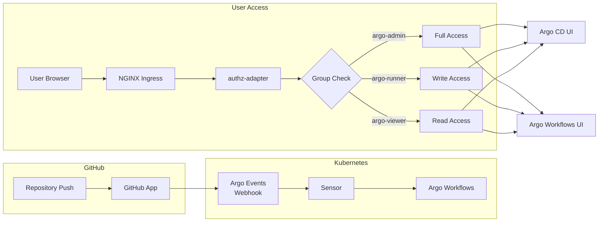

[Home](index.md) > User Guides

# Multi-Tenant Access Control Guide

This guide describes the access control model for multi-tenant Argo deployments using a unified GitHub App integration. It covers how authentication headers map to RBAC roles across Argo CD, Argo Workflows, and Kubernetes.

---

## Overview



---

## Unified Access Control Matrix

The following matrix shows how `X-Auth-Request-Groups` headers map to permissions across all components.

### Group Definitions

| Group | Description | Tenant Scope |
|-------|-------------|--------------|
| `argo-admin` | Platform administrators with superuser capabilities | Cluster-wide |
| `argo-runner` (writers) | Can manage workflows and modify applications | Per-repository |
| `argo-viewer` (readers) | Read-only access to applications and workflows | Per-repository |

### Argo CD RBAC Mapping

| Permission | `argo-admin` | `argo-runner` | `argo-viewer` |
|------------|:------------:|:-------------:|:-------------:|
| **Applications** |
| View applications | ✅ | ✅ (own repos) | ✅ (own repos) |
| Create applications | ✅ | ❌ | ❌ |
| Update applications | ✅ | ✅ (own repos) | ❌ |
| Delete applications | ✅ | ❌ | ❌ |
| Sync applications | ✅ | ✅ (own repos) | ❌ |
| **Projects** |
| View projects | ✅ | ✅ (own projects) | ✅ (own projects) |
| Create projects | ✅ | ❌ | ❌ |
| Update projects | ✅ | ❌ | ❌ |
| **Repositories** |
| View repositories | ✅ | ✅ (own repos) | ✅ (own repos) |
| Create repositories | ✅ | ❌ | ❌ |
| **Clusters** |
| View clusters | ✅ | ❌ | ❌ |
| Create clusters | ✅ | ❌ | ❌ |
| **Settings** |
| View settings | ✅ | ❌ | ❌ |
| Update settings | ✅ | ❌ | ❌ |

### Argo Workflows RBAC Mapping

| Permission | `argo-admin` | `argo-runner` | `argo-viewer` |
|------------|:------------:|:-------------:|:-------------:|
| **Workflows** |
| View workflows | ✅ | ✅ (own ns) | ✅ (own ns) |
| Submit workflows | ✅ | ✅ (own ns) | ❌ |
| Retry workflows | ✅ | ✅ (own ns) | ❌ |
| Stop workflows | ✅ | ✅ (own ns) | ❌ |
| Delete workflows | ✅ | ✅ (own ns) | ❌ |
| **WorkflowTemplates** |
| View templates | ✅ | ✅ (own ns) | ✅ (own ns) |
| Create templates | ✅ | ✅ (own ns) | ❌ |
| Update templates | ✅ | ✅ (own ns) | ❌ |
| Delete templates | ✅ | ✅ (own ns) | ❌ |
| **CronWorkflows** |
| View cron workflows | ✅ | ✅ (own ns) | ✅ (own ns) |
| Create cron workflows | ✅ | ✅ (own ns) | ❌ |
| Suspend cron workflows | ✅ | ✅ (own ns) | ❌ |
| **Logs & Artifacts** |
| View logs | ✅ | ✅ (own ns) | ✅ (own ns) |
| Download artifacts | ✅ | ✅ (own ns) | ✅ (own ns) |

### Kubernetes RBAC Mapping

| Permission | `argo-admin` | `argo-runner` | `argo-viewer` |
|------------|:------------:|:-------------:|:-------------:|
| **Tenant Namespace** |
| List pods | ✅ | ✅ (own ns) | ✅ (own ns) |
| View pod logs | ✅ | ✅ (own ns) | ✅ (own ns) |
| Create pods | ✅ | ✅ (own ns) | ❌ |
| Delete pods | ✅ | ✅ (own ns) | ❌ |
| **Secrets** |
| View secrets | ✅ | ❌ | ❌ |
| Create secrets | ✅ | ❌ | ❌ |
| **ConfigMaps** |
| View configmaps | ✅ | ✅ (own ns) | ✅ (own ns) |
| Create configmaps | ✅ | ✅ (own ns) | ❌ |
| **Service Accounts** |
| View service accounts | ✅ | ✅ (own ns) | ✅ (own ns) |
| Create service accounts | ✅ | ❌ | ❌ |

---

## Example RBAC Configurations

### Argo CD RBAC ConfigMap

Create the Argo CD RBAC policy in `argocd-rbac-cm`:

```yaml
apiVersion: v1
kind: ConfigMap
metadata:
  name: argocd-rbac-cm
  namespace: argocd
data:
  policy.default: role:readonly
  policy.csv: |
    # ============================================
    # Admin Group - Full cluster-wide access
    # ============================================
    p, role:admin, applications, *, */*, allow
    p, role:admin, clusters, *, *, allow
    p, role:admin, repositories, *, *, allow
    p, role:admin, projects, *, *, allow
    p, role:admin, accounts, *, *, allow
    p, role:admin, gpgkeys, *, *, allow
    p, role:admin, logs, *, *, allow
    p, role:admin, exec, *, *, allow
    
    g, argo-admin, role:admin
    
    # ============================================
    # Runner/Writer Group - Scoped write access
    # ============================================
    # Runners can sync and manage applications in their project
    p, role:runner, applications, get, */*, allow
    p, role:runner, applications, sync, */*, allow
    p, role:runner, applications, action/*, */*, allow
    p, role:runner, applications, update, */*, allow
    p, role:runner, logs, get, */*, allow
    p, role:runner, exec, create, */*, allow
    
    # Runners can view repositories and projects
    p, role:runner, repositories, get, *, allow
    p, role:runner, projects, get, *, allow
    
    g, argo-runner, role:runner
    
    # ============================================
    # Viewer/Reader Group - Read-only access
    # ============================================
    p, role:viewer, applications, get, */*, allow
    p, role:viewer, logs, get, */*, allow
    p, role:viewer, repositories, get, *, allow
    p, role:viewer, projects, get, *, allow
    
    g, argo-viewer, role:viewer
    
    # ============================================
    # Per-Repository Groups (Dynamic)
    # ============================================
    # For fine-grained per-repo access, use project-scoped policies
    # Example: repo-myorg-myrepo-writers can manage apps in myorg-myrepo project
    # p, role:repo-writer, applications, *, myorg-myrepo/*, allow
    # g, repo-myorg-myrepo-writers, role:repo-writer
  
  scopes: '[groups]'
```

### Argo CD Project per Repository

Create an AppProject for each repository to enable tenant isolation:

```yaml
apiVersion: argoproj.io/v1alpha1
kind: AppProject
metadata:
  name: tenant-myorg-myrepo
  namespace: argocd
  labels:
    tenant: myorg
    repository: myrepo
spec:
  description: "Project for myorg/myrepo repository"
  
  # Allowed source repositories
  sourceRepos:
    - 'https://github.com/myorg/myrepo.git'
  
  # Allowed destination namespaces
  destinations:
    - namespace: 'wf-myorg-myrepo'
      server: 'https://kubernetes.default.svc'
  
  # Allowed cluster resources (none for tenant isolation)
  clusterResourceWhitelist: []
  
  # Namespace-scoped resources allowed
  namespaceResourceWhitelist:
    - group: 'argoproj.io'
      kind: 'Workflow'
    - group: 'argoproj.io'
      kind: 'WorkflowTemplate'
    - group: 'argoproj.io'
      kind: 'CronWorkflow'
    - group: ''
      kind: 'ConfigMap'
    - group: ''
      kind: 'Secret'
  
  # Project-scoped RBAC roles
  roles:
    - name: writers
      description: "Can manage applications in this project"
      policies:
        - p, proj:tenant-myorg-myrepo:writers, applications, *, tenant-myorg-myrepo/*, allow
        - p, proj:tenant-myorg-myrepo:writers, logs, get, tenant-myorg-myrepo/*, allow
        - p, proj:tenant-myorg-myrepo:writers, exec, create, tenant-myorg-myrepo/*, allow
      groups:
        - repo-myorg-myrepo-writers
        - argo-admin
    
    - name: readers
      description: "Read-only access to applications in this project"
      policies:
        - p, proj:tenant-myorg-myrepo:readers, applications, get, tenant-myorg-myrepo/*, allow
        - p, proj:tenant-myorg-myrepo:readers, logs, get, tenant-myorg-myrepo/*, allow
      groups:
        - repo-myorg-myrepo-readers
        - repo-myorg-myrepo-writers
        - argo-admin
```

### Kubernetes RBAC for Tenant Namespace

#### Viewer Role (Readers)

```yaml
apiVersion: rbac.authorization.k8s.io/v1
kind: Role
metadata:
  name: tenant-viewer
  namespace: wf-myorg-myrepo
  labels:
    tenant: myorg
    repository: myrepo
rules:
  # View workflows and templates
  - apiGroups: ["argoproj.io"]
    resources:
      - workflows
      - workflowtemplates
      - cronworkflows
    verbs: ["get", "list", "watch"]
  
  # View pods and logs
  - apiGroups: [""]
    resources: ["pods", "pods/log"]
    verbs: ["get", "list", "watch"]
  
  # View configmaps (for artifact repositories)
  - apiGroups: [""]
    resources: ["configmaps"]
    verbs: ["get", "list"]
  
  # View events
  - apiGroups: [""]
    resources: ["events"]
    verbs: ["get", "list", "watch"]
---
apiVersion: rbac.authorization.k8s.io/v1
kind: RoleBinding
metadata:
  name: tenant-viewers
  namespace: wf-myorg-myrepo
roleRef:
  apiGroup: rbac.authorization.k8s.io
  kind: Role
  name: tenant-viewer
subjects:
  # Bind to viewer group
  - kind: Group
    name: repo-myorg-myrepo-readers
    apiGroup: rbac.authorization.k8s.io
  # Writers also get viewer permissions
  - kind: Group
    name: repo-myorg-myrepo-writers
    apiGroup: rbac.authorization.k8s.io
```

#### Runner Role (Writers)

```yaml
apiVersion: rbac.authorization.k8s.io/v1
kind: Role
metadata:
  name: tenant-runner
  namespace: wf-myorg-myrepo
  labels:
    tenant: myorg
    repository: myrepo
rules:
  # Full workflow management
  - apiGroups: ["argoproj.io"]
    resources:
      - workflows
      - workflowtemplates
      - cronworkflows
      - workflowtaskresults
      - workflowtasksets
    verbs: ["create", "get", "list", "watch", "update", "patch", "delete"]
  
  # Pod management for workflows
  - apiGroups: [""]
    resources: ["pods"]
    verbs: ["create", "get", "list", "watch", "delete", "patch"]
  
  - apiGroups: [""]
    resources: ["pods/log", "pods/exec"]
    verbs: ["get", "list", "watch", "create"]
  
  # ConfigMap management
  - apiGroups: [""]
    resources: ["configmaps"]
    verbs: ["get", "list", "watch", "create", "update", "patch"]
  
  # Secret read-only (for workflow execution)
  - apiGroups: [""]
    resources: ["secrets"]
    verbs: ["get", "list"]
  
  # Events
  - apiGroups: [""]
    resources: ["events"]
    verbs: ["get", "list", "watch", "create"]
---
apiVersion: rbac.authorization.k8s.io/v1
kind: RoleBinding
metadata:
  name: tenant-runners
  namespace: wf-myorg-myrepo
roleRef:
  apiGroup: rbac.authorization.k8s.io
  kind: Role
  name: tenant-runner
subjects:
  - kind: Group
    name: repo-myorg-myrepo-writers
    apiGroup: rbac.authorization.k8s.io
```

#### Admin ClusterRole

```yaml
apiVersion: rbac.authorization.k8s.io/v1
kind: ClusterRole
metadata:
  name: argo-platform-admin
rules:
  # Full Argo Workflows access
  - apiGroups: ["argoproj.io"]
    resources: ["*"]
    verbs: ["*"]
  
  # Full namespace management
  - apiGroups: [""]
    resources:
      - namespaces
      - pods
      - pods/log
      - pods/exec
      - secrets
      - configmaps
      - serviceaccounts
      - events
    verbs: ["*"]
  
  # RBAC management
  - apiGroups: ["rbac.authorization.k8s.io"]
    resources:
      - roles
      - rolebindings
      - clusterroles
      - clusterrolebindings
    verbs: ["*"]
---
apiVersion: rbac.authorization.k8s.io/v1
kind: ClusterRoleBinding
metadata:
  name: argo-platform-admins
roleRef:
  apiGroup: rbac.authorization.k8s.io
  kind: ClusterRole
  name: argo-platform-admin
subjects:
  - kind: Group
    name: argo-admin
    apiGroup: rbac.authorization.k8s.io
```

---

## GitHub App Workflow Integration

### Workflow Status Updates

When a GitHub repository push triggers a workflow:

1. **GitHub App receives webhook** → Argo Events EventSource
2. **Sensor creates Workflow** in tenant namespace
3. **Workflow completes** → GitHub App updates PR status

```yaml
# Example Sensor with GitHub status notification
apiVersion: argoproj.io/v1alpha1
kind: Sensor
metadata:
  name: github-push-sensor
  namespace: argo-events
spec:
  dependencies:
    - name: push
      eventSourceName: github-eventsource
      eventName: repo_push-myorg-myrepo
  triggers:
    - template:
        name: workflow-trigger
        argoWorkflow:
          operation: submit
          source:
            resource:
              apiVersion: argoproj.io/v1alpha1
              kind: Workflow
              metadata:
                generateName: myrepo-build-
                namespace: wf-myorg-myrepo
              spec:
                serviceAccountName: wf-runner
                entrypoint: main
                onExit: notify-github
                arguments:
                  parameters:
                    - name: repo
                      value: "myorg/myrepo"
                    - name: sha
                      # Extracted from event payload
                templates:
                  - name: main
                    steps:
                      - - name: build
                          template: build-step
                  
                  - name: notify-github
                    # Update GitHub commit status via GitHub App
                    container:
                      image: ghcr.io/your-org/github-status-updater:latest
                      env:
                        - name: GITHUB_APP_ID
                          valueFrom:
                            secretKeyRef:
                              name: github-app-credentials
                              key: appId
                        - name: GITHUB_APP_PRIVATE_KEY
                          valueFrom:
                            secretKeyRef:
                              name: github-app-credentials
                              key: privateKey
```

---

## Debugging Guide

### Verifying Group Headers End-to-End

#### Step 1: Check authz-adapter Response

Test the authz-adapter directly:

```bash
# Port-forward to authz-adapter
kubectl port-forward -n security svc/authz-adapter 8080:8080 &

# Test with a valid token
curl -v -H "Authorization: Bearer YOUR_TOKEN" http://localhost:8080/check

# Expected response headers:
# X-Auth-Request-User: user@example.com
# X-Auth-Request-Email: user@example.com
# X-Auth-Request-Groups: argo-runner,argo-viewer
# X-Allowed: true
```

#### Step 2: Check NGINX Auth Response Headers

Verify NGINX is receiving and forwarding headers:

```bash
# Enable debug logging in NGINX
kubectl -n ingress-nginx edit configmap ingress-nginx-controller

# Add:
data:
  error-log-level: debug

# Restart NGINX controller
kubectl -n ingress-nginx rollout restart deployment ingress-nginx-controller

# Check logs for auth_request
kubectl -n ingress-nginx logs -l app.kubernetes.io/name=ingress-nginx --tail=100 | grep -i auth
```

#### Step 3: Verify Headers in Argo CD

Check Argo CD receives the groups:

```bash
# Enable verbose logging in Argo CD server
kubectl -n argocd patch configmap argocd-cmd-params-cm --type merge -p '{"data":{"server.log.level":"debug"}}'

# Restart Argo CD server
kubectl -n argocd rollout restart deployment argocd-server

# View logs
kubectl -n argocd logs -l app.kubernetes.io/name=argocd-server --tail=100 | grep -i group
```

#### Step 4: Test RBAC Authorization

```bash
# Test as admin
curl -H "X-Auth-Request-Groups: argo-admin" \
     -H "X-Auth-Request-User: admin@example.com" \
     https://argocd.example.com/api/v1/applications

# Test as runner
curl -H "X-Auth-Request-Groups: argo-runner" \
     -H "X-Auth-Request-User: dev@example.com" \
     https://argocd.example.com/api/v1/applications

# Test as viewer
curl -H "X-Auth-Request-Groups: argo-viewer" \
     -H "X-Auth-Request-User: viewer@example.com" \
     https://argocd.example.com/api/v1/applications
```

#### Step 5: Debug with authz-adapter Debug Mode

Enable debug mode for testing:

```bash
# Set debug environment variables
kubectl -n security set env deployment/authz-adapter \
  DEBUG_EMAIL=test@example.com \
  DEBUG_GROUPS=argo-admin,argo-runner

# Test with debug override
curl "http://localhost:8080/check?debug_email=test@example.com&debug_groups=argo-admin,argo-runner"
```

#### Step 6: Verify Kubernetes RBAC

```bash
# Check if user can perform action
kubectl auth can-i create workflows \
  --namespace wf-myorg-myrepo \
  --as=user@example.com \
  --as-group=argo-runner

# List roles in tenant namespace
kubectl get roles,rolebindings -n wf-myorg-myrepo

# Describe role permissions
kubectl describe role tenant-runner -n wf-myorg-myrepo
```

### Common Issues and Solutions

| Symptom | Cause | Solution |
|---------|-------|----------|
| 401 Unauthorized at authz-adapter | Invalid/expired token | Refresh authentication token |
| 403 Forbidden in Argo CD | Missing group in RBAC policy | Add group to `argocd-rbac-cm` |
| No X-Auth-Request-Groups header | NGINX not forwarding headers | Check `auth-response-headers` annotation |
| Empty groups list | Fence/IdP not returning authz data | Verify IdP group claims configuration |
| Workflow submission denied | Missing K8s RBAC role | Add RoleBinding for user's group |
| Can view but not sync apps | Runner role missing sync permission | Update Argo CD RBAC policy |

### Debugging Checklist

- [ ] authz-adapter returns 200 with correct headers
- [ ] NGINX ingress has `auth-url` annotation configured
- [ ] NGINX ingress has `auth-response-headers` including `X-Auth-Request-Groups`
- [ ] Argo CD `argocd-rbac-cm` has policy for the group
- [ ] Argo CD `argocd-cm` has `scopes: '[groups]'` configured
- [ ] Kubernetes Role exists in tenant namespace
- [ ] Kubernetes RoleBinding binds group to Role
- [ ] User's token includes group claims from IdP

---

## Quick Reference

### Header Flow

```
User Request
    ↓
NGINX Ingress (auth_request)
    ↓
authz-adapter (/check)
    ↓
Returns: X-Auth-Request-Groups: argo-runner,argo-viewer
    ↓
NGINX forwards headers to upstream
    ↓
Argo CD / Argo Workflows reads X-Auth-Request-Groups
    ↓
Maps groups to RBAC roles
    ↓
Enforces permissions
```

### Group Naming Convention

| Pattern | Example | Scope |
|---------|---------|-------|
| `argo-admin` | `argo-admin` | Cluster-wide admin |
| `argo-runner` | `argo-runner` | Cluster-wide writer |
| `argo-viewer` | `argo-viewer` | Cluster-wide reader |
| `repo-{org}-{repo}-writers` | `repo-myorg-myrepo-writers` | Per-repo writer |
| `repo-{org}-{repo}-readers` | `repo-myorg-myrepo-readers` | Per-repo reader |
| `tenant-{name}` | `tenant-research` | Tenant group |

---

## See Also

- [GitHub App Setup Guide](github-app-setup.md) - GitHub App authentication configuration
- [Admin Guide](admin-guide.md) - Platform administration
- [Tenant Onboarding](tenant-onboarding.md) - Onboarding new repositories
- [Troubleshooting](troubleshooting.md) - Common issues and solutions
