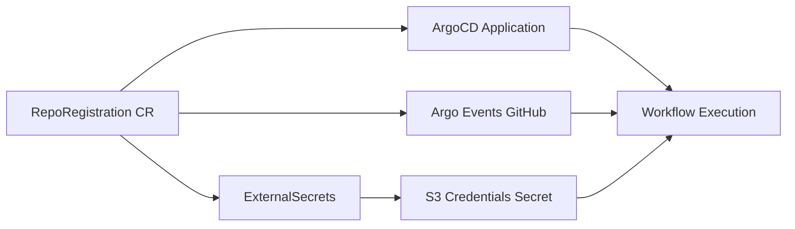

[Home](index.md) > User Guides

# 📝 RepoRegistration Guide — Self-Service Repository Onboarding

This guide explains how to use the **RepoRegistration** custom resource to onboard your Git repositories to the Argo platform with automated configuration for S3 storage, secrets, and access control.

---

## 🎯 Overview

The `RepoRegistration` custom resource provides a declarative way to register your GitHub repositories with the Argo platform. When you create a `RepoRegistration`, the platform automatically configures:

- **ArgoCD Application** for continuous deployment
- **Argo Events GitHub webhook** for CI/CD automation
- **S3 artifact and data bucket configuration**
- **Vault-backed secrets** via External Secrets Operator (ESO)
- **Access control** aligned with Fence/Arborist authorization



---

## 📋 Prerequisites

Before creating a `RepoRegistration`, ensure you have:

1. **GitHub Repository** with a Nextflow pipeline or workflows to onboard
2. **GitHub App Installation Flow** (for example, through the `gitapp-callback` service) that captures the GitHub App `installation_id` for the repository
3. **S3 Bucket Credentials** stored in Vault for artifact and/or data storage
4. **Namespace** where workflows will run (e.g., `wf-poc`)
5. **Vault Paths** configured for the S3 credentials you plan to reference

---

## 🚀 Quick Start

### 1. Create a RepoRegistration

See `gitapp-callback` service for a user-friendly way to create RepoRegistrations via GitHub App installation.
- **GitHub App Integration**: Handles post-installation callbacks with `installation_id` parameter
- **User-Friendly Form**: Clean, modern UI following calypr-public.ohsu.edu design patterns
- **Repository Configuration**: Collects all required RepoRegistration fields:
  - Default branch (defaults to `main`)
  - Data bucket (optional)
  - Artifact bucket (optional)
  - Admin users (required, comma-separated emails)
  - Read-only users (optional, comma-separated emails)
  - Installation ID (from GitHub callback)
- **Validation**: Email validation and required field checks
- **Modern UI**: Left navigation, rounded cards, slate-gray text, blue primary buttons

Controller deployments driven by the `Makefile` (`make template`, `make argo-stack`, etc.) also require the `GITHUBHAPP_INSTALLATION_ID` environment variable, so keep the captured GitHub App installation ID handy before running those targets.

### Mapping host storage to `/var/registrations`

The post-registration controller will maintain a sqlite database to house user inputs.
See `kind-config.yaml` with `extraMounts` for mapping hostPath or PVC into `/var/registrations`.

For experimentation, you can manually create a `RepoRegistration` YAML file. Below is an example configuration.
Create a file `my-repo-registration.yaml`:

```yaml
apiVersion: platform.calypr.io/v1alpha1
kind: RepoRegistration
metadata:
  name: my-nextflow-project
  namespace: wf-poc
spec:
  # Git repository URL
  repoUrl: https://github.com/myorg/my-nextflow-project.git
  defaultBranch: main
  installationId: 123456

  # Tenant identifier
  tenant: myorg-team

  # S3 bucket for workflow artifacts
  artifactBucket:
    hostname: minio.minio-system.svc.cluster.local:9000
    bucket: argo-artifacts
    region: us-east-1
    insecure: true
    pathStyle: true
    keyPrefix: my-nextflow-project-workflows/
    # Vault path for S3 credentials (relative to kv/)
    externalSecretPath: argo/apps/my-nextflow-project/s3/artifacts

  # S3 bucket for primary data (optional)
  dataBucket:
    hostname: minio.minio-system.svc.cluster.local:9000
    bucket: argo-data
    region: us-east-1
    insecure: true
    pathStyle: true
    keyPrefix: my-nextflow-project-data/
    externalSecretPath: argo/apps/my-nextflow-project/s3/data

  # Admin users (Fence-authenticated emails)
  adminUsers:
    - alice@example.com
    - bob@example.com

  # Read-only users (Fence-authenticated emails)
  readUsers:
    - viewer@example.com
    - analyst@example.com

  # Public visibility
  isPublic: false
```

### 2. Apply the RepoRegistration

```bash
kubectl apply -f my-repo-registration.yaml
```

See Makefile `make argo-stack` target for deploying the entire Argo stack including RepoRegistration controller.

### 3. Verify the Registration

```bash
# Check the RepoRegistration status
kubectl get reporegistration my-nextflow-project -n wf-poc -o yaml

# Verify ArgoCD Application was created
kubectl get application my-nextflow-project -n argocd

# Verify ExternalSecrets were created
kubectl get externalsecret -n wf-poc

# Verify secrets are synced
kubectl get secret s3-credentials-my-project -n wf-poc
```

---

## ⚙️ Controller Deployment Notes

### Ephemeral workspace via `emptyDir`

The RepoRegistration controller now provisions an `emptyDir` volume for its working directory so that generated manifests are isolated per pod restart without requiring a persistent volume claim.

### Mapping host storage to `/var/registrations`

If the controller must read or write registration bundles that already live on the node, configure the chart's `extraMounts` to project the desired hostPath or PVC into `/var/registrations`. This path is the default lookup location for pre-seeded repos.

### Helm ingress safety guard

Helm templates now enforce a nil check on `.Values.ingress`. Ensure the ingress block exists in `values.yaml` before enabling ingress-related resources to avoid rendering errors.

---

## 📖 Field Reference

### Required Fields

#### `spec.repoUrl`
- **Type:** `string`
- **Pattern:** Must match `^https://.+\.git$`
- **Description:** Git repository URL to onboard
- **Example:** `https://github.com/myorg/my-repo.git`

#### `spec.installationId`
- **Type:** `integer`
- **Minimum:** `1`
- **Description:** GitHub App installation ID associated with the onboarding event. Registrations fail validation when this value is absent.
- **Example:** `123456`

### Optional Fields

#### `spec.tenant`
- **Type:** `string`
- **Description:** Tenant identifier (program/project or org short code)
- **Example:** `genomics-team`, `cancer-research`

#### `spec.defaultBranch`
- **Type:** `string`
- **Default:** `main`
- **Description:** Default branch to track and use for workflows
- **Example:** `main`, `develop`, `production`

#### `spec.artifactBucket`
- **Type:** `object`
- **Description:** S3-compatible artifact bucket configuration for workflow outputs
- **Properties:**
  - `hostname`: S3 endpoint URL (e.g., `minio.minio-system.svc.cluster.local:9000`)
  - `bucket`: Bucket name for storing workflow artifacts
  - `region`: Object store region (e.g., `us-east-1`)
  - `insecure`: Use HTTP instead of HTTPS (boolean)
  - `pathStyle`: Force path-style requests (boolean)
  - `keyPrefix`: Prefix for all artifact keys (optional)
  - `externalSecretPath`: Vault KV v2 path for S3 credentials (e.g., `argo/apps/my-project/s3/artifacts`)

#### `spec.dataBucket`
- **Type:** `object`
- **Description:** S3-compatible data bucket configuration for primary data storage
- **Properties:** Same as `artifactBucket`

#### `spec.adminUsers`
- **Type:** `array` of `string` (email format)
- **Description:** Administrator user email addresses. These must correspond to Fence-authenticated and Arborist-authorized identities with admin-level access to workflows, logs, and configuration.
- **Example:**
  ```yaml
  adminUsers:
    - alice@example.com
    - bob@example.com
  ```

#### `spec.readUsers`
- **Type:** `array` of `string` (email format)
- **Description:** Read-only user email addresses. These correspond to Fence-authenticated, Arborist-authorized users with viewer access to workflow logs, metadata, and outputs.
- **Example:**
  ```yaml
  readUsers:
    - viewer@example.com
    - analyst@example.com
  ```

#### `spec.isPublic`
- **Type:** `boolean`
- **Default:** `false`
- **Description:** Public visibility flag. When `true`, workflows are viewable without login authentication.
- **Example:** `false`

---

## 🔐 Vault Secret Configuration

### GitHub App Installation ID

The controller authenticates to GitHub through the GitHub App that initiates onboarding. Capture the `installation_id` provided by the callback (the `gitapp-callback` service does this automatically) and set `spec.installationId` to that integer. Personal access tokens and manually managed GitHub secrets are no longer required for RepoRegistrations, and the Makefile targets enforce the same requirement via the `GITHUBHAPP_INSTALLATION_ID` environment variable.

### S3 Credentials

Before creating a `RepoRegistration`, ensure your S3 credentials are stored in Vault at the path specified in `externalSecretPath`.

Store your S3 credentials in Vault:

```bash
# Using Vault CLI
vault kv put kv/argo/apps/my-nextflow-project/s3/artifacts \
  AWS_ACCESS_KEY_ID=minioadmin \
  AWS_SECRET_ACCESS_KEY=minioadmin

# Or using Vault API
curl -X POST \
  -H "X-Vault-Token: $VAULT_TOKEN" \
  -d '{"data": {"AWS_ACCESS_KEY_ID": "minioadmin", "AWS_SECRET_ACCESS_KEY": "minioadmin"}}' \
  http://vault.example.com:8200/v1/kv/data/argo/apps/my-nextflow-project/s3/artifacts
```

The `externalSecretPath` in `artifactBucket` and `dataBucket` should point to the appropriate Vault KV v2 paths containing the S3 credentials. External Secrets Operator will automatically sync these to Kubernetes Secrets in your namespace.

---

## 📚 Real-World Examples

### Example 1: Simple Nextflow Project

```yaml
apiVersion: platform.calypr.io/v1alpha1
kind: RepoRegistration
metadata:
  name: nextflow-hello-project
  namespace: wf-poc
spec:
  repoUrl: https://github.com/bwalsh/nextflow-hello-project.git
  defaultBranch: main
  installationId: 456789
  tenant: myorg

  artifactBucket:
    hostname: minio.minio-system.svc.cluster.local:9000
    bucket: argo-artifacts
    region: us-east-1
    insecure: true
    pathStyle: true
    keyPrefix: nextflow-hello-workflows/
    externalSecretPath: argo/apps/bwalsh/nextflow-hello-project/s3/artifacts

  adminUsers:
    - pi@research.edu
    - lead-scientist@research.edu

  readUsers:
    - postdoc@research.edu
    - student@research.edu

  isPublic: false
```

### Example 2: Genomics Variant Calling Pipeline

```yaml
apiVersion: platform.calypr.io/v1alpha1
kind: RepoRegistration
metadata:
  name: genomics-variant-calling
  namespace: wf-poc
spec:
  repoUrl: https://github.com/genomics-lab/variant-calling-pipeline.git
  defaultBranch: main
  installationId: 789012
  tenant: genomics-lab

  artifactBucket:
    hostname: s3.us-west-2.amazonaws.com
    bucket: genomics-lab-artifacts
    region: us-west-2
    insecure: false
    pathStyle: false
    keyPrefix: variant-calling/
    externalSecretPath: argo/apps/genomics/s3/artifacts

  dataBucket:
    hostname: s3.us-west-2.amazonaws.com
    bucket: genomics-lab-data
    region: us-west-2
    insecure: false
    pathStyle: false
    keyPrefix: reference-genomes/
    externalSecretPath: argo/apps/genomics/s3/data

  adminUsers:
    - genomics-lead@organization.edu
    - senior-scientist@organization.edu

  readUsers:
    - researcher@organization.edu
    - data-analyst@organization.edu

  isPublic: false
```

### Example 3: Internal Development Workflows

```yaml
apiVersion: platform.calypr.io/v1alpha1
kind: RepoRegistration
metadata:
  name: local-dev-workflows
  namespace: wf-poc
spec:
  repoUrl: https://github.com/internal-org/dev-workflows.git
  defaultBranch: develop
  installationId: 246810
  tenant: internal-team

  artifactBucket:
    hostname: minio.minio-system.svc.cluster.local:9000
    bucket: argo-artifacts
    region: us-east-1
    insecure: true
    pathStyle: true
    externalSecretPath: argo/apps/internal-dev/s3/artifacts

  adminUsers:
    - devops-team@internal.org

  isPublic: false
```

### Example 4: Public Demo Project

```yaml
apiVersion: platform.calypr.io/v1alpha1
kind: RepoRegistration
metadata:
  name: public-demo-workflows
  namespace: wf-poc
spec:
  repoUrl: https://github.com/demo-org/public-workflows.git
  defaultBranch: main
  installationId: 135790
  tenant: demos

  artifactBucket:
    hostname: minio.minio-system.svc.cluster.local:9000
    bucket: argo-artifacts
    region: us-east-1
    insecure: true
    pathStyle: true
    externalSecretPath: argo/apps/demos/s3/artifacts

  adminUsers:
    - admin@demo.org

  isPublic: true
```

---

## 🔍 Troubleshooting

### Registration Status Check

```bash
# Get detailed status
kubectl get reporegistration -n wf-poc -o wide

# Describe a specific registration
kubectl describe reporegistration my-nextflow-project -n wf-poc

# Check controller logs
kubectl logs -n argocd -l app=repo-registration-controller -f
```

### ExternalSecret Issues

1. **Check ExternalSecret Status:**
   ```bash
   kubectl describe externalsecret s3-credentials-my-project -n wf-poc
   ```

2. **Verify Vault Path:**
   ```bash
   vault kv get kv/argo/apps/my-nextflow-project/s3/artifacts
   ```

3. **Check ESO Pod Logs:**
   ```bash
   kubectl logs -n external-secrets-system -l app.kubernetes.io/name=external-secrets
   ```

### ArgoCD Application Issues

```bash
# Check if Application was created
kubectl get application -n argocd

# Get Application details
kubectl describe application my-nextflow-project -n argocd

# Check ArgoCD server logs
kubectl logs -n argocd -l app.kubernetes.io/name=argocd-server
```

### GitHub Webhook Issues

```bash
# Verify Argo Events EventSource
kubectl get eventsource -n argo-events

# Check webhook deliveries in GitHub
# Navigate to repository Settings → Webhooks in GitHub UI
```

### Common Issues and Solutions

| Issue | Cause | Solution |
|-------|-------|----------|
| RepoRegistration shows `Failed` phase | Missing or invalid `installationId` | Capture `installation_id` from GitHub App callback and set in `spec.installationId` |
| ExternalSecret not syncing | Vault path doesn't exist | Verify S3 credentials exist at the Vault path specified in `externalSecretPath` |
| Application not synced | Missing S3 or GitHub credentials | Ensure ExternalSecret has synced successfully (`kubectl get secret`) |
| Workflow can't access artifacts | S3 bucket misconfigured | Verify `hostname`, `bucket`, `region`, and credentials in Vault |

---

## 📝 Next Steps

1. **Prepare Your Repository**: Ensure your repository contains Nextflow pipelines or workflow definitions
2. **Capture Installation ID**: Use the GitHub App callback or manual installation to get the `installation_id`
3. **Store S3 Credentials**: Place S3 credentials in Vault at appropriate paths
4. **Create RepoRegistration**: Apply your `RepoRegistration` YAML to the cluster
5. **Verify Setup**: Check that all resources are created and synced properly
6. **Run Workflows**: Use Argo Workflows or Argo Events to trigger your pipelines

---

## 📖 Related Documentation

- [Argo Workflows Documentation](https://argoproj.github.io/argo-workflows/)
- [Argo CD Documentation](https://argo-cd.readthedocs.io/)
- [Argo Events Documentation](https://argoproj.github.io/argo-events/)
- [External Secrets Operator](https://external-secrets.io/)
