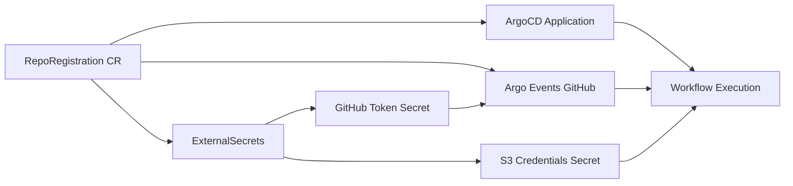

# 📝 RepoRegistration Guide — Self-Service Repository Onboarding

This guide explains how to use the **RepoRegistration** custom resource to onboard your Git repositories to the Argo platform with automated configuration for S3 storage, secrets, and access control.

---

## 🎯 Overview

The `RepoRegistration` custom resource provides a declarative way to register your GitHub repositories with the Argo platform. When you create a `RepoRegistration`, the platform automatically configures:

- **ArgoCD Application** for continuous deployment
- **Argo Events GitHub webhook** for CI/CD automation
- **S3 artifact and data bucket configuration**
- **Vault-backed secrets** via External Secrets Operator (ESO)
- **Access control** aligned with Fence/Arborist authorization



---

## 📋 Prerequisites

Before creating a `RepoRegistration`, ensure you have:

1. **GitHub Repository** with Nextflow pipeline or workflows
2. **GitHub Personal Access Token** (PAT) stored in Vault
3. **S3 Bucket Credentials** stored in Vault (for artifact and data storage)
4. **Namespace** where workflows will run (e.g., `wf-poc`)
5. **Vault Paths** configured for your secrets

---

## 🚀 Quick Start

### 1. Create a RepoRegistration

Create a file `my-repo-registration.yaml`:

```yaml
apiVersion: platform.calypr.io/v1alpha1
kind: RepoRegistration
metadata:
  name: my-nextflow-project
  namespace: wf-poc
spec:
  # Git repository URL
  repoUrl: https://github.com/myorg/my-nextflow-project.git
  defaultBranch: main
  
  # Tenant identifier
  tenant: myorg-team
  
  # WorkflowTemplate to use for running workflows
  workflowTemplateRef: nextflow-repo-runner
  
  # S3 bucket for workflow artifacts
  artifactBucket:
    hostname: https://s3.us-west-2.amazonaws.com
    bucket: my-project-artifacts
    region: us-west-2
    insecure: false
    pathStyle: false
    externalSecretPath: argo/apps/my-nextflow-project/s3/artifacts
  
  # S3 bucket for primary data
  dataBucket:
    hostname: https://s3.us-west-2.amazonaws.com
    bucket: my-project-data
    region: us-west-2
    insecure: false
    pathStyle: false
    externalSecretPath: argo/apps/my-nextflow-project/s3/data
  
  # GitHub secret reference
  githubSecretName: github-secret-my-project
  
  # Admin users (Fence-authenticated emails)
  adminUsers:
    - alice@example.com
    - bob@example.com
  
  # Read-only users (Fence-authenticated emails)
  readUsers:
    - viewer@example.com
    - analyst@example.com
  
  # Public visibility
  isPublic: false
```

### 2. Apply the RepoRegistration

```bash
kubectl apply -f my-repo-registration.yaml
```

### 3. Verify the Registration

```bash
# Check the RepoRegistration status
kubectl get reporegistration my-nextflow-project -n wf-poc -o yaml

# Verify ArgoCD Application was created
kubectl get application my-nextflow-project -n argocd

# Verify ExternalSecrets were created
kubectl get externalsecret -n wf-poc

# Verify secrets are synced
kubectl get secret github-secret-my-project -n wf-poc
kubectl get secret s3-credentials-my-project -n wf-poc
```

---

## 📖 Field Reference

### Required Fields

#### `spec.repoUrl`
- **Type:** `string`
- **Pattern:** Must match `^https://.+\.git$`
- **Description:** Git repository URL to onboard
- **Example:** `https://github.com/myorg/my-repo.git`

#### `spec.tenant`
- **Type:** `string`
- **Description:** Tenant identifier (program/project or org short code)
- **Example:** `genomics-team`, `cancer-research`

#### `spec.workflowTemplateRef`
- **Type:** `string`
- **Description:** Argo WorkflowTemplate name used to run this repo's workflows
- **Example:** `nextflow-repo-runner`, `nextflow-runner`

#### `spec.githubSecretName`
- **Type:** `string`
- **Description:** Name of the Kubernetes Secret containing GitHub credentials (PAT or GitHub App token, webhook secret)
- **Example:** `github-secret-my-project`

### Optional Fields

#### `spec.defaultBranch`
- **Type:** `string`
- **Default:** `main`
- **Description:** Default branch to track
- **Example:** `main`, `master`, `develop`

#### `spec.artifactBucket`
- **Type:** `object`
- **Description:** S3-compatible artifact bucket configuration for workflow outputs
- **Properties:**
  - `hostname` (string): S3 endpoint URL (e.g., `https://s3.us-west-2.amazonaws.com`, `https://minio.example.org:9000`)
  - `bucket` (string): Bucket name for storing workflow artifacts
  - `region` (string): Object store region
  - `insecure` (boolean): Use HTTP instead of HTTPS
  - `pathStyle` (boolean): Force path-style requests (`s3.amazonaws.com/bucket`)
  - `externalSecretPath` (string): Vault KV v2 path for S3 credentials (e.g., `argo/apps/my-repo/s3/artifacts`)

#### `spec.dataBucket`
- **Type:** `object`
- **Description:** S3-compatible data bucket configuration for primary data
- **Properties:** Same as `artifactBucket`

#### `spec.adminUsers`
- **Type:** `array` of `string` (email format)
- **Description:** Administrator user email addresses (must be Fence-authenticated and Arborist-authorized)
- **Example:** `["admin@example.com", "lead@example.com"]`

#### `spec.readUsers`
- **Type:** `array` of `string` (email format)
- **Description:** Read-only user email addresses (must be Fence-authenticated and Arborist-authorized)
- **Example:** `["viewer@example.com", "analyst@example.com"]`

#### `spec.isPublic`
- **Type:** `boolean`
- **Default:** `false`
- **Description:** If true, workflow UIs and metadata may be visible without Fence login

---

## 🔐 Vault Secret Configuration

Before creating a `RepoRegistration`, ensure your secrets are stored in Vault.

### GitHub Credentials

Store your GitHub Personal Access Token in Vault:

```bash
# Using Vault CLI
vault kv put kv/argo/apps/my-nextflow-project/github \
  token=github_pat_XXXXXXXXXX

# Or using Vault API
curl -X POST \
  -H "X-Vault-Token: $VAULT_TOKEN" \
  -d '{"data": {"token": "github_pat_XXXXXXXXXX"}}' \
  http://vault.example.com:8200/v1/kv/data/argo/apps/my-nextflow-project/github
```

The `githubSecretName` field in your `RepoRegistration` will reference the Kubernetes Secret created by ESO from this Vault path.

### S3 Credentials

Store your S3 access credentials in Vault:

```bash
# Artifact bucket credentials
vault kv put kv/argo/apps/my-nextflow-project/s3/artifacts \
  AWS_ACCESS_KEY_ID=AKIAXXXXXXXX \
  AWS_SECRET_ACCESS_KEY=xxxxxxxxxxxxxxxxxxxxx

# Data bucket credentials (if using separate credentials)
vault kv put kv/argo/apps/my-nextflow-project/s3/data \
  AWS_ACCESS_KEY_ID=AKIAXXXXXXXX \
  AWS_SECRET_ACCESS_KEY=xxxxxxxxxxxxxxxxxxxxx
```

The `externalSecretPath` in `artifactBucket` and `dataBucket` should point to these Vault paths (relative to the Vault KV mount point).

---

## 📝 Complete Examples

### Example 1: Basic Repository with Single S3 Bucket

```yaml
apiVersion: platform.calypr.io/v1alpha1
kind: RepoRegistration
metadata:
  name: simple-pipeline
  namespace: wf-poc
spec:
  repoUrl: https://github.com/myorg/simple-pipeline.git
  tenant: myorg
  workflowTemplateRef: nextflow-repo-runner
  githubSecretName: github-secret-simple
  artifactBucket:
    hostname: https://s3.amazonaws.com
    bucket: simple-pipeline-artifacts
    region: us-east-1
    externalSecretPath: argo/apps/simple-pipeline/s3
  adminUsers:
    - admin@myorg.com
```

### Example 2: Project with Separate Artifact and Data Buckets

```yaml
apiVersion: platform.calypr.io/v1alpha1
kind: RepoRegistration
metadata:
  name: genomics-analysis
  namespace: wf-poc
spec:
  repoUrl: https://github.com/genomics-lab/variant-calling.git
  defaultBranch: develop
  tenant: genomics-lab
  workflowTemplateRef: nextflow-repo-runner
  githubSecretName: github-secret-genomics
  
  # Artifacts bucket for workflow outputs
  artifactBucket:
    hostname: https://s3.us-west-2.amazonaws.com
    bucket: genomics-workflow-artifacts
    region: us-west-2
    externalSecretPath: argo/apps/genomics/s3/artifacts
  
  # Data bucket for reference genomes and samples
  dataBucket:
    hostname: https://s3.us-west-2.amazonaws.com
    bucket: genomics-reference-data
    region: us-west-2
    externalSecretPath: argo/apps/genomics/s3/data
  
  # Access control
  adminUsers:
    - pi@genomics.edu
    - bioinformatician@genomics.edu
  readUsers:
    - postdoc@genomics.edu
    - student@genomics.edu
  
  isPublic: false
```

### Example 3: Using MinIO (Self-Hosted S3)

```yaml
apiVersion: platform.calypr.io/v1alpha1
kind: RepoRegistration
metadata:
  name: local-workflows
  namespace: wf-poc
spec:
  repoUrl: https://github.com/internal/workflows.git
  tenant: internal-team
  workflowTemplateRef: nextflow-repo-runner
  githubSecretName: github-secret-internal
  
  artifactBucket:
    hostname: https://minio.storage.local:9000
    bucket: workflow-artifacts
    region: us-east-1
    insecure: true      # Using HTTP for local development
    pathStyle: true     # MinIO uses path-style by default
    externalSecretPath: argo/apps/internal/minio
  
  adminUsers:
    - devops@company.com
```

### Example 4: Public Repository (View-Only Access)

```yaml
apiVersion: platform.calypr.io/v1alpha1
kind: RepoRegistration
metadata:
  name: public-demo
  namespace: wf-poc
spec:
  repoUrl: https://github.com/demos/public-workflows.git
  tenant: demos
  workflowTemplateRef: nextflow-repo-runner
  githubSecretName: github-secret-demo
  
  artifactBucket:
    hostname: https://s3.amazonaws.com
    bucket: demo-public-artifacts
    region: us-east-1
    externalSecretPath: argo/apps/demo/s3
  
  # Admin access for maintainers
  adminUsers:
    - maintainer@example.com
  
  # Public visibility enabled
  isPublic: true
```

---

## 🔍 Troubleshooting

### RepoRegistration Not Creating Resources

1. **Check CRD Installation:**
   ```bash
   kubectl get crd reporegistrations.platform.calypr.io
   ```

2. **Check RepoRegistration Status:**
   ```bash
   kubectl get reporegistration -A
   kubectl describe reporegistration my-repo -n wf-poc
   ```

3. **Check Controller Logs** (if using a controller/operator):
   ```bash
   kubectl logs -n argo-system deployment/repo-registration-controller
   ```

### ExternalSecret Not Syncing

1. **Check ExternalSecret Status:**
   ```bash
   kubectl get externalsecret -n wf-poc
   kubectl describe externalsecret github-secret-my-project -n wf-poc
   ```

2. **Verify Vault Path:**
   ```bash
   vault kv get kv/argo/apps/my-nextflow-project/s3/artifacts
   ```

3. **Check ESO Logs:**
   ```bash
   kubectl logs -n external-secrets-system deployment/external-secrets
   ```

### Workflow Fails to Access S3

1. **Verify Secret Exists:**
   ```bash
   kubectl get secret s3-credentials-my-project -n wf-poc -o yaml
   ```

2. **Check Secret Contents:**
   ```bash
   kubectl get secret s3-credentials-my-project -n wf-poc -o jsonpath='{.data}'
   ```

3. **Test S3 Access:**
   ```bash
   # Create a test pod with the secret
   kubectl run s3-test --rm -it --image=amazon/aws-cli \
     --env AWS_ACCESS_KEY_ID=$(kubectl get secret s3-credentials-my-project -o jsonpath='{.data.AWS_ACCESS_KEY_ID}' | base64 -d) \
     --env AWS_SECRET_ACCESS_KEY=$(kubectl get secret s3-credentials-my-project -o jsonpath='{.data.AWS_SECRET_ACCESS_KEY}' | base64 -d) \
     -- s3 ls s3://my-bucket/
   ```

---

## 🔄 Updating a RepoRegistration

To update an existing registration:

```bash
# Edit the YAML file
vim my-repo-registration.yaml

# Apply the changes
kubectl apply -f my-repo-registration.yaml

# Verify the update
kubectl get reporegistration my-nextflow-project -n wf-poc -o yaml
```

---

## 🗑️ Deleting a RepoRegistration

To remove a repository registration:

```bash
kubectl delete reporegistration my-nextflow-project -n wf-poc
```

**Note:** Depending on the controller configuration, this may or may not automatically clean up the associated ArgoCD Application, EventSource, and secrets. Check with your platform administrator for the cleanup policy.

---

## 🔗 Related Documentation

- [User Guide — Running Nextflow Workflows from GitHub](./user-guide.md)
- [Secrets with Vault](./secrets-with-vault.md)
- [Debugging Vault and External Secrets](./debugging-vault-external-secrets.md)
- [Per-Repository Artifacts Configuration](../examples/per-repo-artifacts-values.yaml)

---

## 💡 Best Practices

1. **Use Separate Buckets per Project:** Isolate artifacts and data for security and cost tracking
2. **Store Secrets in Vault:** Never commit credentials to Git repositories
3. **Use Email-Based Access Control:** Align with Fence/Arborist for consistent authorization
4. **Set `isPublic: false` for Sensitive Data:** Require authentication for private workflows
5. **Use Descriptive Names:** Name your `RepoRegistration` to match your repository or project
6. **Configure Both Artifact and Data Buckets:** Separate workflow outputs from input data
7. **Test with Minimal Permissions First:** Start with limited access and expand as needed

---

## 📚 Schema Reference

The complete schema is defined in the CRD at `helm/argo-stack/crds/repo-registration-crd.yaml`.

For the latest schema documentation:
```bash
kubectl explain reporegistration.spec
kubectl explain reporegistration.spec.artifactBucket
kubectl explain reporegistration.spec.dataBucket
```
