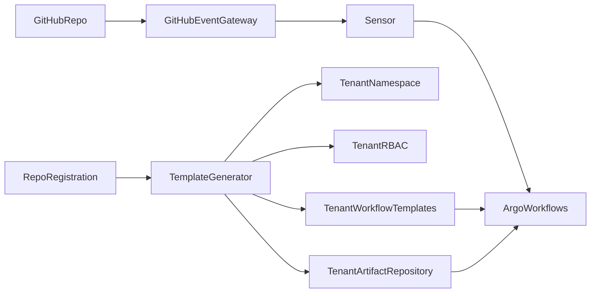
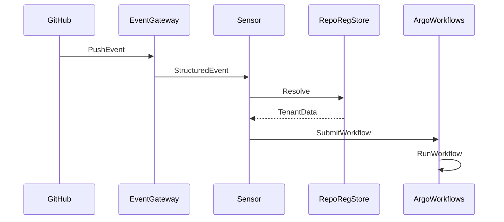

# Argo Stack User Guide
Multi Tenant Workflows via RepoRegistration

## Architecture Overview


## Event Flow


## RepoRegistration
A RepoRegistration defines the tenant namespace, workflow templates, and artifact repository.

```yaml
apiVersion: calypr.io/v1alpha1
kind: RepoRegistration
metadata:
  name: nextflow-hello
spec:
  repo: calypr/nextflow-hello
  namespace: wf-nextflow-hello
  artifactRepositoryRef:
    name: nextflow-hello
  workflowTemplates:
    - name: nextflow-repo-runner
      sourceRef:
        path: workflows/nextflow-repo-runner.yaml
```

## Workflow Execution
Workflows are triggered by GitHub push events or manually.

## Artifact Repositories
Priority of resolution:
1. Tenant specific
2. Per app
3. Global fallback

## Multi Tenant RBAC
Each tenant gets:
- Namespace
- Submitter service account
- Role and role binding
- Optional secrets
