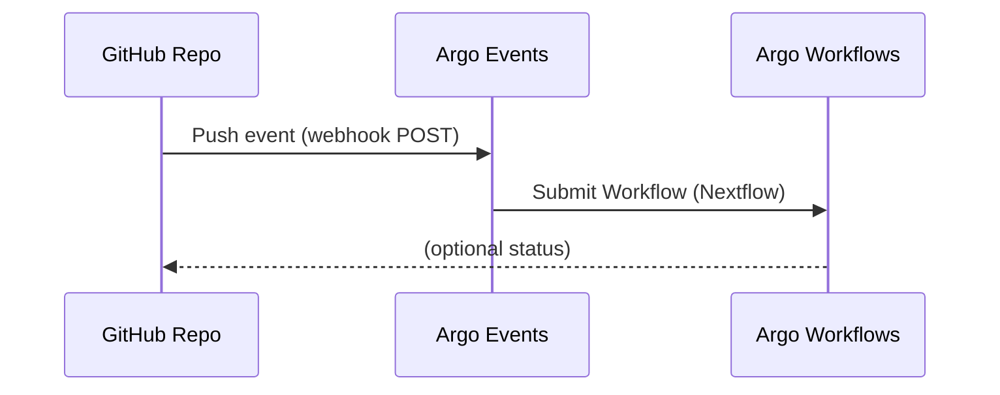

# 👩‍🔬 User Guide — Running Nextflow Workflows from GitHub

This guide explains how to connect your **GitHub repository** to the Argo environment so that every **push** automatically runs a **Nextflow workflow** on the compute cluster.

---

## 🧠 What Happens

1. You push code to GitHub.
2. A GitHub **webhook** notifies the Argo platform.
3. Argo launches a **Nextflow workflow**.
4. You view logs, results, and history through the **Argo Workflows UI**.



## 1. Prepare Your GitHub Repository

Ensure your repository contains:
- A `main.nf` or equivalent Nextflow script.
- Any configuration files (`nextflow.config`, `params.json`, etc.).
- (Optional) a small test dataset.

## 2. Create a Personal Access Token (PAT)

Argo uses this token to create a webhook automatically.

1. Go to **GitHub → Settings → Developer settings → Personal access tokens**
2. Choose **Fine-grained token** (recommended).
3. Select your repository and grant:
   - **Webhooks: Read/Write**
   - **Contents: Read**
   - **Metadata: Read**
4. Copy the generated token (it starts with `github_pat_...`).

Send this token to your Argo admin (securely), or store it locally if you’ll register the webhook manually.


### 🔐 GitHub Personal Access Token Setup

For Argo Events to automatically create and manage webhooks in your GitHub repositories, you need a Personal Access Token (PAT) with the appropriate permissions.

#### Single Repository (Fine-Grained Token)

If you only need to monitor **one repository**, you can use a fine-grained token:

1. Go to [GitHub → Settings → Developer Settings → Personal Access Tokens → Fine-grained tokens](https://github.com/settings/tokens?type=beta)
2. Click **Generate new token**
3. Configure the token:
   - **Token name:** `argo-events-webhook`
   - **Expiration:** Choose appropriate expiration
   - **Repository access:** Select "Only select repositories" and choose your repository
4. Under **Repository permissions**, enable:
   - **Contents:** Read-only (to access repository metadata)
   - **Metadata:** Read-only (required)
   - **Webhooks:** Read and write (to create/manage webhooks)
5. Click **Generate token** and **copy the token immediately** (you won't be able to see it again)

#### Multiple Repositories (Classic Token - Recommended)

If you need to monitor **multiple repositories** (e.g., both `nextflow-hello-project` and `nextflow-hello-project-2`), you should use a **classic Personal Access Token** because fine-grained tokens are limited to specific repositories:

1. Go to [GitHub → Settings → Developer Settings → Personal Access Tokens → Tokens (classic)](https://github.com/settings/tokens)
2. Click **Generate new token (classic)**
3. Configure the token:
   - **Note:** `argo-events-multi-repo`
   - **Expiration:** Choose appropriate expiration (e.g., 90 days, 1 year, or no expiration)
4. Select the following scopes:
   - ✅ **`repo`** (Full control of private repositories) - This includes:
     - `repo:status` - Access commit status
     - `repo_deployment` - Access deployment status
     - `public_repo` - Access public repositories
     - `repo:invite` - Access repository invitations
   - ✅ **`admin:repo_hook`** (Full control of repository hooks) - This includes:
     - `write:repo_hook` - Write repository hooks
     - `read:repo_hook` - Read repository hooks
5. Click **Generate token** and **copy the token immediately**

#### Important Notes

- **Never commit your PAT to Git** - Always pass it at deployment time using `--set-string`
- **Store it securely** - Use a password manager or secrets management system
- **Rotate regularly** - Set an expiration date and rotate your token periodically
- **Minimal permissions** - Only grant the scopes necessary for your use case
- **Organization repositories** - If your repositories are in an organization:
  1. After creating the token, click **Configure SSO** next to the token
  2. Authorize the token for your organization
  3. Ensure the organization settings allow PAT access

#### Common Permission Issues

If you see errors like:
```
403 Resource not accessible by personal access token
```

This means:
- The PAT doesn't have access to the repository
- The PAT doesn't have the required scopes (`admin:repo_hook` or `repo`)
- The repository is in an organization and the token isn't authorized for that organization
- The organization has restricted PAT access

**Solution:** Regenerate the token with the correct scopes and organization authorization.

---

## 3. Connect Your Repo to the Argo Platform

If your admin has automated onboarding, they’ll request:
- Your **GitHub repo URL**
- Your **GitHub username or org name**
- Your **token**

They will register the webhook endpoint (for example `https://argo-events.example.com/events`).

If manual setup is needed, go to your **GitHub repo → Settings → Webhooks → Add webhook** and enter:

| Field | Value |
|-------|--------|
| **Payload URL** | `https://<argo-hostname>/events` |
| **Content type** | `application/json` |
| **Secret** | *(value provided by admin, if used)* |
| **Events** | Just the **push** event |

Click **Add webhook** and verify you see a green ✅ next to it.

## 4. Push to Trigger a Workflow

Make a commit in your repo and push it:

```bash
git commit --allow-empty -m "Trigger Nextflow workflow"
git push
```

Argo will automatically start a new run using your latest commit.

## 5. Viewing Your Workflow

### Web UI

Visit: http://<argo-workflows-host>:2746

You’ll see your workflow under the **Workflows** list.

Click the workflow name to view its DAG and live logs.

### Command Line

```bash
argo -n argo list
argo -n argo get @latest
```

To stream logs:
```bash
argo -n argo logs @latest
```

## 6. Retrieving Results

Each workflow runs inside the cluster and writes outputs to object storage.

Typical outputs:
- `s3://<your-bucket>/<workflow-name>/results/`
- or a project-specific bucket managed by your admin.

You can find the bucket path in the workflow metadata:
```bash
argo -n argo get @latest -o yaml | grep -A2 artifactRepositoryRef
```

If your workflow includes a results collection step, it will post a summary to the Workflows UI under **Artifacts**.

## 7. Inspecting Logs and History

- **Argo Workflows UI → Workflow → Logs tab**  
  View stdout/stderr for each task.

- **CLI:**
  ```bash
  argo -n argo logs @latest --follow
  ```

- **Audit history:**  
  ```bash
  argo -n argo list
  ```

Each workflow corresponds to one Git commit (shown as `git_revision` in parameters).

## 8. Disconnect or Pause Automation

If you want to stop automatic triggering:
1. Delete the webhook from your GitHub repo (**Settings → Webhooks → Delete**)
2. Notify your admin if you want to disable event listening for your repo.
