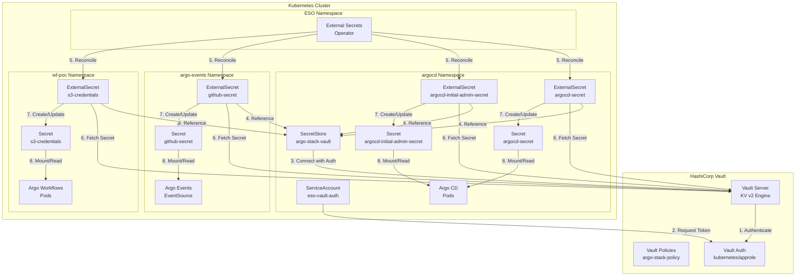
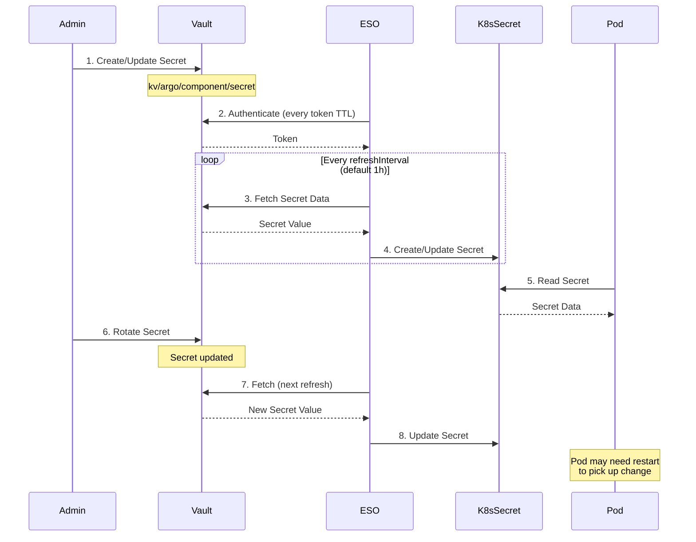
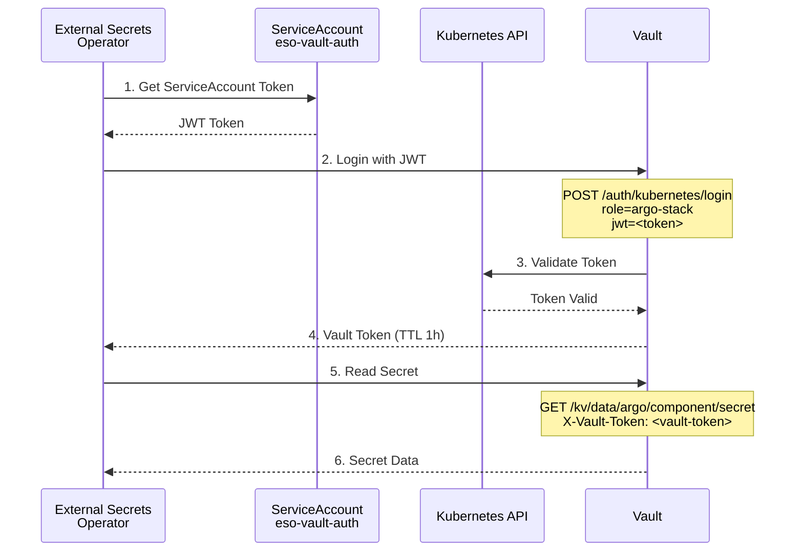
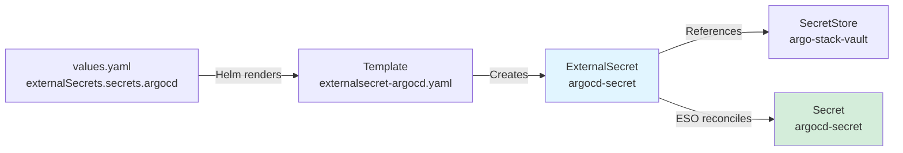
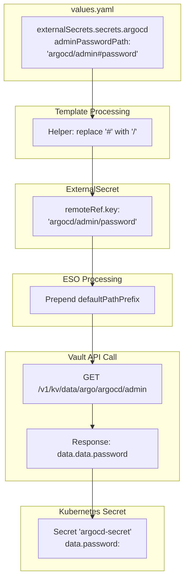
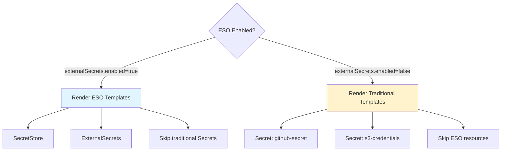
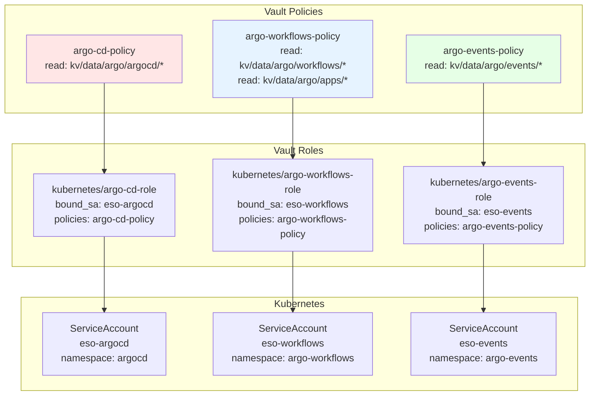
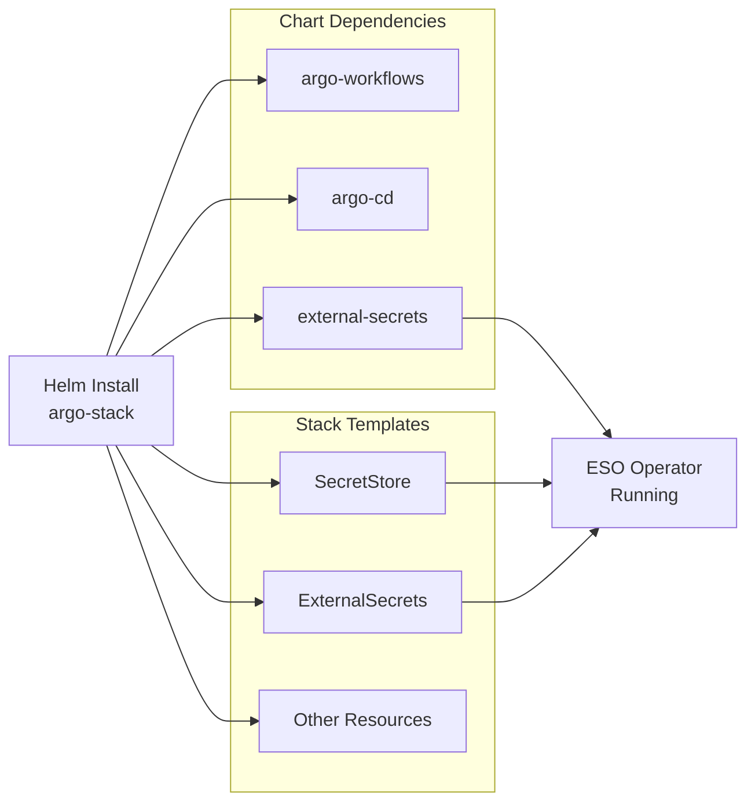
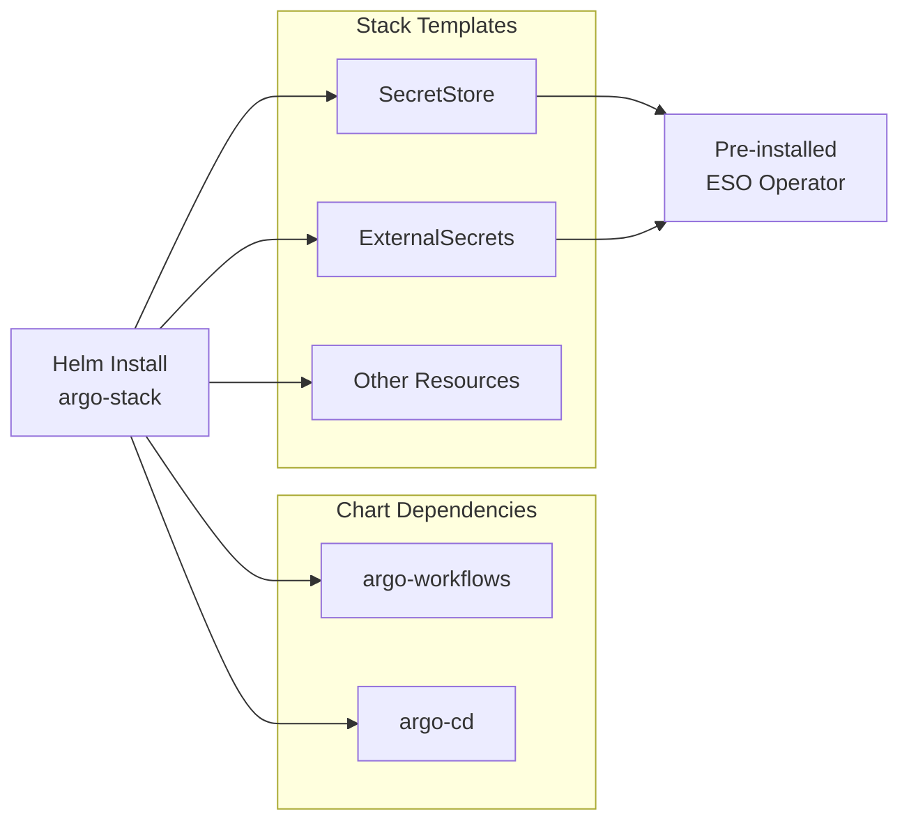
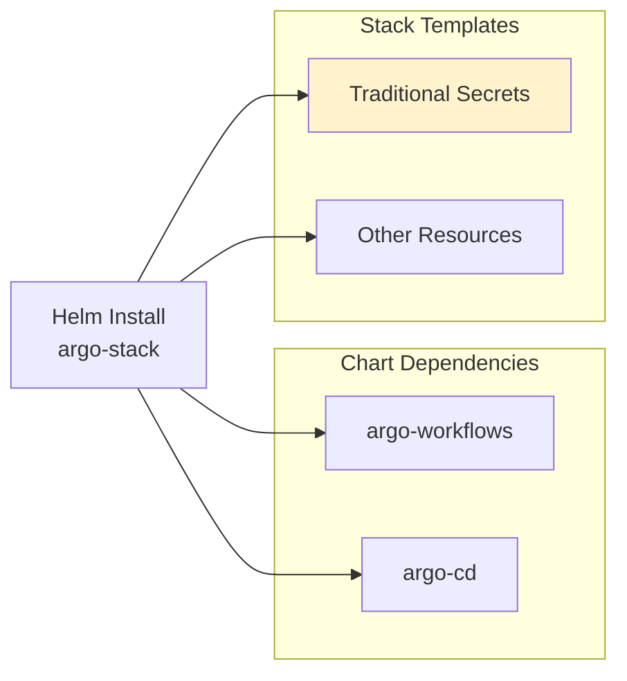

# Vault Integration Architecture Diagrams

This document contains architecture diagrams for the Vault + ESO integration.

## Overall Architecture



## Secret Synchronization Flow



## Authentication Flow: Kubernetes Auth



## Vault Path Structure

```
vault
└── kv/                          (KV v2 secrets engine)
    └── argo/                     (defaultPathPrefix)
        ├── argocd/
        │   ├── admin             (password, bcryptHash)
        │   ├── oidc              (clientSecret)
        │   └── server            (secretKey)
        ├── workflows/
        │   ├── artifacts         (accessKey, secretKey)
        │   └── oidc              (clientSecret)
        ├── authz/                (clientSecret)
        ├── events/
        │   └── github            (token)
        └── apps/
            ├── nextflow-hello/
            │   └── s3            (accessKey, secretKey)
            └── nextflow-hello-2/
                └── s3            (accessKey, secretKey)
```

## ExternalSecret Resource Flow



## Helm Values to Vault Path Mapping



## Conditional Template Rendering



## Multi-Tenancy with Vault Policies



## Deployment Modes

### Mode 1: ESO Bundled (installOperator=true)



### Mode 2: ESO Pre-installed (installOperator=false)



### Mode 3: ESO Disabled (enabled=false)


