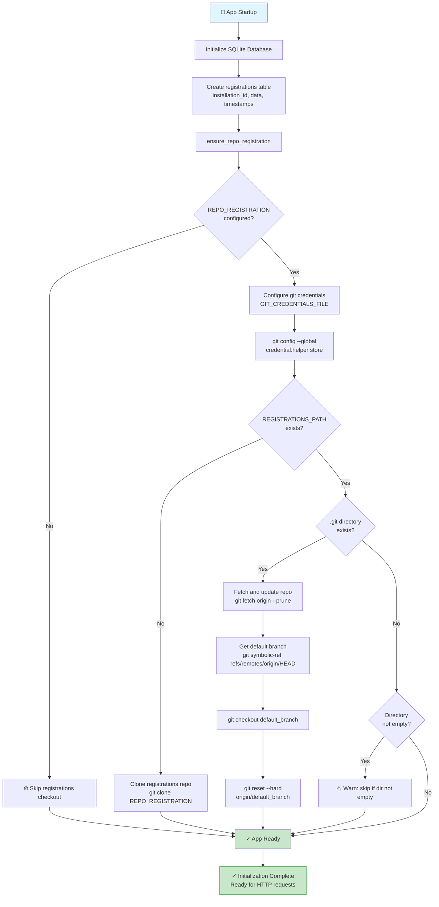
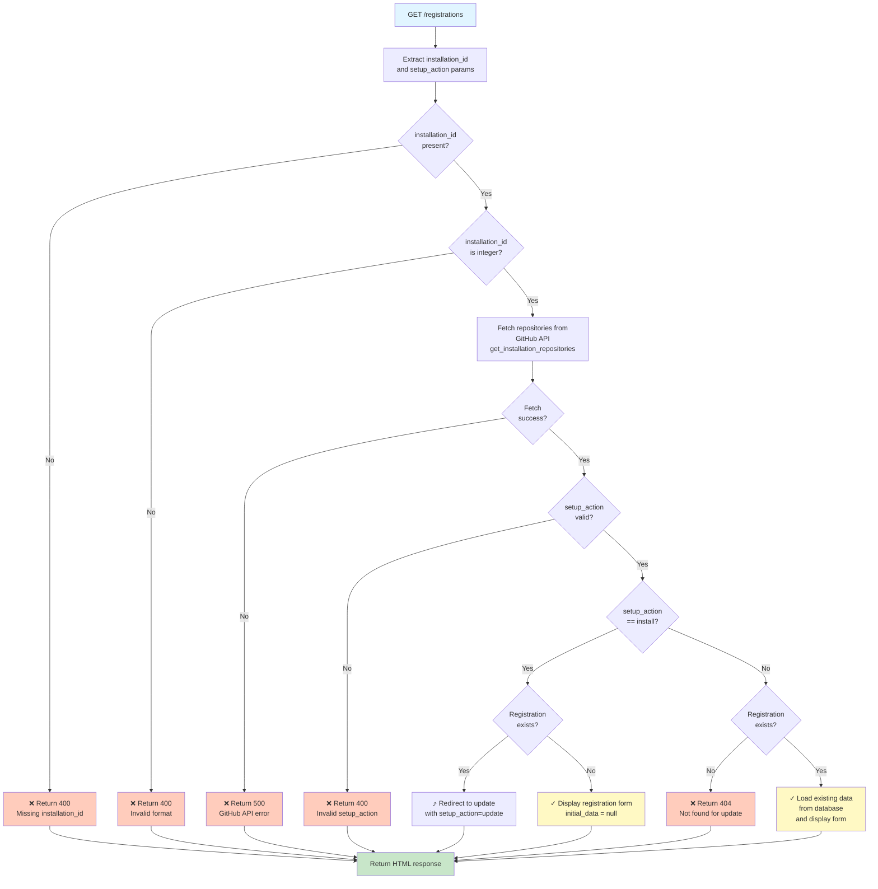
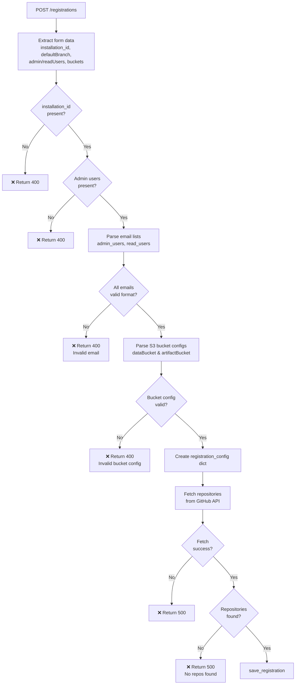
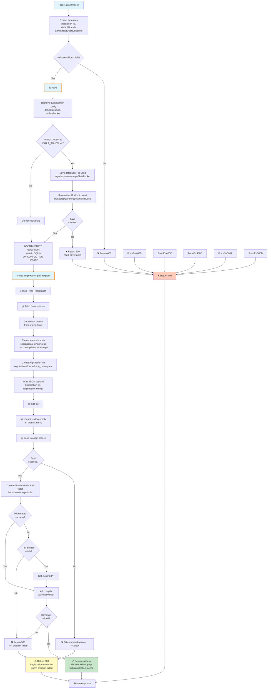

# GitHub App Callback Service

A Flask-based web service that handles post-installation callbacks from GitHub Apps, providing a user-friendly form for repository registration configuration.

## Overview

When a user installs a GitHub App, GitHub redirects them to a configured "Post-installation redirect URL". This service receives that callback and guides users through configuring their repository settings for Argo Workflows.

## Features

- **GitHub App Integration**: Handles post-installation callbacks with `installation_id` parameter
- **User-Friendly Form**: Clean, modern UI following calypr-public.ohsu.edu design patterns
- **Repository Configuration**: Collects all required RepoRegistration fields:
  - Default branch (defaults to `main`)
  - Data bucket (optional)
  - Artifact bucket (optional)
  - Admin users (required, comma-separated emails)
  - Read-only users (optional, comma-separated emails)
  - Installation ID (from GitHub callback)
- **Validation**: Email validation and required field checks
- **Modern UI**: Left navigation, rounded cards, slate-gray text, blue primary buttons

## Quick Start

### Local Development

1. **Install dependencies:**
   ```bash
   make install-dev
   ```

2. **Run the development server:**
   ```bash
   make run
   ```

3. **Access the service:**
   - Health check: http://localhost:8080/healthz
   - Registration form: http://localhost:8080/registrations?installation_id=12345678

### Docker

1. **Build the image:**
   ```bash
   make docker-build
   ```

2. **Run the container:**
   ```bash
   make docker-run
   ```

## Configuration

### Environment Variables

| Variable | Description | Default |
|----------|-------------|---------|
| `SECRET_KEY` | Flask secret key for session management | `dev-secret-key-change-in-production` |
| `GITHUB_APP_NAME` | Name of your GitHub App | `calypr-workflows` |

## API Endpoints

### `GET /healthz`

Health check endpoint.

**Response:**
- `200 OK`: Service is healthy

### `GET /registrations`

Display registration form.

**Query Parameters:**
- `installation_id` (required): GitHub installation ID
- `setup_action` (optional): `install` or `update`

**Response:**
- `200 OK`: Registration form HTML
- `400 Bad Request`: Missing installation_id

### `POST /registrations`

Submit registration configuration.

**Form Data:**
- `installation_id` (required): GitHub installation ID
- `defaultBranch` (optional): Default branch name (default: `main`)
- `dataBucket` (optional): S3 bucket for data
- `artifactBucket` (optional): S3 bucket for artifacts
- `adminUsers` (required): Comma-separated admin email addresses
- `readUsers` (optional): Comma-separated read-only email addresses

**Response:**
- `200 OK`: Success page or JSON response
- `400 Bad Request`: Validation errors

## User Flow

1. User installs GitHub App or updates repository access
2. GitHub redirects to: `https://your-domain.com/registrations?installation_id=12345678&setup_action=install`
3. User sees registration form with installation ID pre-filled
4. User fills in:
   - Default branch (pre-filled with "main")
   - Storage buckets (optional)
   - Admin users (required)
   - Read-only users (optional)
5. User submits form
6. Service validates input
7. Success page displays configuration summary

## Design

The UI follows the calypr-public.ohsu.edu visual theme:

- **Left Navigation**: Fixed sidebar with dark background (#1e293b)
- **Main Content**: Light background (#f5f7fa) with centered container
- **Cards**: White rounded cards with subtle shadow
- **Typography**: Slate-gray text (#475569) for body, dark text for headings
- **Buttons**: Blue primary buttons (#3b82f6), gray secondary buttons
- **Form Elements**: Clean inputs with blue focus states

## Development

### Project Structure

```
gitapp-callback/
├── app.py                 # Flask application
├── templates/
│   ├── registration_form.html  # Main registration form
│   ├── success.html           # Success page
│   └── error.html             # Error page
├── static/                # Static assets (empty for now)
├── requirements.txt       # Production dependencies
├── requirements-dev.txt   # Development dependencies
├── Dockerfile            # Container image definition
├── Makefile              # Build and development tasks
└── README.md             # This file
```

### Testing

Run tests with:
```bash
make test
```

### Linting

Check code style:
```bash
make lint
```

Format code:
```bash
make format
```

## Deployment

### Docker

The service is containerized and can be deployed to any Docker-compatible environment:

```bash
docker build -t gitapp-callback:latest .
docker run -p 8080:8080 \
  -e SECRET_KEY=your-secret-key \
  -e GITHUB_APP_NAME=your-app-name \
  gitapp-callback:latest
```

### Kubernetes

Create a Deployment and Service in your cluster. Example:

```yaml
apiVersion: apps/v1
kind: Deployment
metadata:
  name: gitapp-callback
spec:
  replicas: 2
  template:
    spec:
      containers:
      - name: gitapp-callback
        image: gitapp-callback:latest
        ports:
        - containerPort: 8080
        env:
        - name: SECRET_KEY
          valueFrom:
            secretKeyRef:
              name: gitapp-callback-secrets
              key: secret-key
---
apiVersion: v1
kind: Service
metadata:
  name: gitapp-callback
spec:
  ports:
  - port: 80
    targetPort: 8080
  selector:
    app: gitapp-callback
```

## References
https://docs.github.com/en/apps/creating-github-apps/registering-a-github-app/about-the-user-authorization-callback-url


### GitHub App Configuration

1. Go to your GitHub App settings
2. Set "Post-installation redirect URL" to: `https://your-domain.com/registrations`
3. GitHub will append `?installation_id=XXX&setup_action=install` automatically

## Overview
### initialize app


### Get registration flow


### Validate registration



### Upsert registration flow



## Future Enhancements

- [ ] refactor tests to use pytest fixtures/mocks
- [ ] Persist configuration to Kubernetes CRD (RepoRegistration)
- [ ] Integrate with GitHub API to fetch repository details
- [ ] Validate installation_id with GitHub API
- [ ] Add authentication/authorization
- [ ] Support for updating existing registrations
- [ ] Webhook configuration interface
- [ ] Repository list view

## License

Apache 2.0
