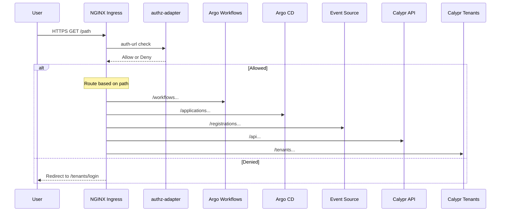
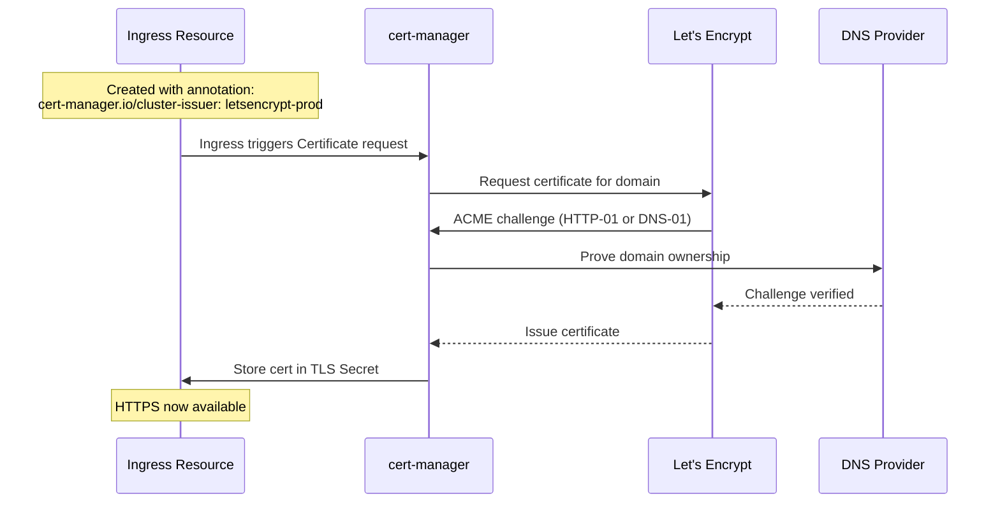

# Authz-Aware Ingress Overlay User Guide

## Overview

The `ingress-authz-overlay` is a Helm overlay chart that provides a unified, path-based ingress layer for all major UIs and APIs in the Argo Stack. It centralizes authorization through the `authz-adapter` service, ensuring consistent access control across all endpoints.

## Features

- **Single Host**: All services exposed on one HTTPS hostname
- **Path-Based Routing**: Clean URL structure (`/workflows`, `/applications`, `/api`, etc.)
- **Centralized Authorization**: All routes protected by `authz-adapter` via NGINX external auth
- **TLS via cert-manager**: Automatic Let's Encrypt certificate management
- **Multi-Tenant Support**: User, email, and group headers passed to backend services
- **Drop-In Deployment**: Simple Helm overlay that can be enabled or disabled per environment

## Architecture



## Routes

| Path | Service | Port | Namespace | Description |
|------|---------|------|-----------|-------------|
| `/workflows` | `argo-stack-argo-workflows-server` | 2746 | `argo-stack` | Argo Workflows UI |
| `/applications` | `argo-stack-argocd-server` | 8080 | `argo-stack` | Argo CD Applications UI |
| `/registrations` | `github-repo-registrations-eventsource-svc` | 12000 | `argo-stack` | GitHub Repo Registration Events |
| `/api` | `calypr-api` | 3000 | `calypr-api` | Calypr API Service |
| `/tenants` | `calypr-tenants` | 3001 | `calypr-tenants` | Calypr Tenant Portal |

## TLS with Let's Encrypt and cert-manager

This overlay uses [cert-manager](https://cert-manager.io/) to automatically provision and renew TLS certificates from [Let's Encrypt](https://letsencrypt.org/).

### Installing cert-manager

**cert-manager must be installed before creating ClusterIssuers or deploying this overlay.**

If you see an error like:
```
no matches for kind "ClusterIssuer" in version "cert-manager.io/v1"
```
This means cert-manager is not installed. Install it first:

```bash
# Add the Jetstack Helm repository
helm repo add jetstack https://charts.jetstack.io
helm repo update

# Install cert-manager with CRDs
helm install cert-manager jetstack/cert-manager \
  --namespace cert-manager \
  --create-namespace \
  --set crds.enabled=true

# Verify cert-manager is running
kubectl get pods -n cert-manager
```

Wait for all cert-manager pods to be `Running` before proceeding:
```bash
kubectl wait --for=condition=Ready pods --all -n cert-manager --timeout=120s
```

### How It Works



### ClusterIssuer: letsencrypt-prod

The `letsencrypt-prod` ClusterIssuer is a cluster-wide cert-manager resource that defines how to obtain certificates from Let's Encrypt's production API.

**Prerequisites**: You must create the ClusterIssuer before deploying this overlay:

```yaml
apiVersion: cert-manager.io/v1
kind: ClusterIssuer
metadata:
  name: letsencrypt-prod
spec:
  acme:
    # Let's Encrypt production API endpoint
    server: https://acme-v02.api.letsencrypt.org/directory
    
    # Email for certificate expiration notifications
    email: your-email@example.com
    
    # Secret to store the ACME account private key
    privateKeySecretRef:
      name: letsencrypt-prod-account-key
    
    # HTTP-01 challenge solver using ingress
    solvers:
      - http01:
          ingress:
            class: nginx
```

**Apply the ClusterIssuer**:

```bash
kubectl apply -f cluster-issuer.yaml
```

### Understanding the ACME Account Key Secret

The `privateKeySecretRef` (e.g., `letsencrypt-prod-account-key` or `letsencrypt-staging-account-key`) specifies where cert-manager stores the ACME account private key. **You do NOT need to create this secret manually** — cert-manager handles it automatically.

#### How It Works

1. **First-Time Setup**: When you create the ClusterIssuer, cert-manager:
   - Generates a new RSA private key
   - Registers a new account with Let's Encrypt using your email
   - Stores the private key in the specified secret (in the `cert-manager` namespace)

2. **Secret Location**: The secret is created in the same namespace as cert-manager (typically `cert-manager`):
   ```bash
   # View the account key secret
   kubectl get secret letsencrypt-prod-account-key -n cert-manager
   
   # Describe to see metadata
   kubectl describe secret letsencrypt-prod-account-key -n cert-manager
   ```

3. **Account Persistence**: The account key persists across cert-manager restarts. As long as the secret exists, cert-manager will reuse the same Let's Encrypt account.

#### Backing Up the ACME Account Key

For disaster recovery, you may want to back up the account key:

```bash
# Export the account key secret
kubectl get secret letsencrypt-prod-account-key -n cert-manager -o yaml > letsencrypt-account-backup.yaml

# To restore in a new cluster (before creating ClusterIssuer)
kubectl apply -f letsencrypt-account-backup.yaml
```

> **Note**: Keep the backup secure — this key provides access to your Let's Encrypt account and all its certificates.

#### Troubleshooting Account Key Issues

If the account key secret is not being created:

```bash
# Check cert-manager controller logs
kubectl logs -n cert-manager -l app.kubernetes.io/component=controller

# Check ClusterIssuer status
kubectl describe clusterissuer letsencrypt-prod
```

Common issues:
- **ACME Registration Failed**: Check your email address is valid and you can reach Let's Encrypt's API
- **Secret Not Found in Expected Namespace**: The secret is created in the cert-manager namespace, not your application namespace

### Configuration Options

| Setting | Description | Default |
|---------|-------------|---------|
| `tls.enabled` | Enable TLS for ingress | `true` |
| `tls.secretName` | Name of the TLS Secret (auto-created by cert-manager) | `calypr-demo-tls` |
| `tls.clusterIssuer` | Name of the ClusterIssuer to use | `letsencrypt-prod` |

### Using letsencrypt-staging (for Testing)

For testing, use the staging issuer to avoid Let's Encrypt rate limits:

```yaml
apiVersion: cert-manager.io/v1
kind: ClusterIssuer
metadata:
  name: letsencrypt-staging
spec:
  acme:
    server: https://acme-staging-v02.api.letsencrypt.org/directory
    email: your-email@example.com
    privateKeySecretRef:
      name: letsencrypt-staging-account-key
    solvers:
      - http01:
          ingress:
            class: nginx
```

> **Note**: The `letsencrypt-staging-account-key` secret is also auto-generated by cert-manager, just like the production key. Staging and production use separate accounts and secrets.

Then configure the overlay to use it:

```yaml
ingressAuthzOverlay:
  tls:
    clusterIssuer: letsencrypt-staging
```

### Verifying Certificate Status

Check if the certificate was issued successfully:

```bash
# Check Certificate resource
kubectl get certificate -n argo-stack

# Check certificate details
kubectl describe certificate -n argo-stack

# Check the TLS secret
kubectl get secret calypr-demo-tls -n argo-stack
```

### Troubleshooting Certificates

If the certificate is not being issued:

```bash
# Check cert-manager logs
kubectl logs -n cert-manager -l app=cert-manager

# Check Certificate status
kubectl describe certificate <cert-name> -n argo-stack

# Check CertificateRequest
kubectl get certificaterequest -n argo-stack

# Check ACME challenges
kubectl get challenges -A
```

Common issues:
- **cert-manager not installed**: If you see `no matches for kind "ClusterIssuer"`, install cert-manager first (see [Installing cert-manager](#installing-cert-manager))
- **Helm ownership conflict**: If you see `invalid ownership metadata; label validation error`, the ClusterIssuer was created outside of Helm. See [Helm Ownership Conflict](#helm-ownership-conflict) below.
- **Domain not reachable**: Ensure your domain's DNS points to the ingress controller's external IP
- **Rate limited**: Use `letsencrypt-staging` for testing to avoid production rate limits
- **Challenge failed**: Check that port 80 is accessible for HTTP-01 challenges

### Helm Ownership Conflict

If you get an error like:
```
Error: UPGRADE FAILED: Unable to continue with update: ClusterIssuer "letsencrypt-prod" in namespace "" exists and cannot be imported into the current release: invalid ownership metadata; label validation error: missing key "app.kubernetes.io/managed-by"
```

This happens when:
1. The ClusterIssuer was created manually with `kubectl apply`
2. A Helm chart template tries to create/manage the same ClusterIssuer

**Solution**: ClusterIssuers should be managed **outside** of this Helm chart:

```bash
# Option 1: Keep the manually created ClusterIssuer (recommended)
# Simply don't include cluster-issuer templates in the chart
# This overlay already follows this pattern - it references the ClusterIssuer
# via annotation but doesn't create it

# Option 2: If you have a local cluster-issuer template file, remove it
rm helm/argo-stack/overlays/ingress-authz-overlay/templates/cluster-issuer*.yaml

# Option 3: To adopt an existing resource into Helm (advanced)
# Add Helm labels and annotations to the existing ClusterIssuer:
kubectl annotate clusterissuer letsencrypt-prod \
  meta.helm.sh/release-name=ingress-authz-overlay \
  meta.helm.sh/release-namespace=argo-stack
kubectl label clusterissuer letsencrypt-prod \
  app.kubernetes.io/managed-by=Helm
```

**Why ClusterIssuers are managed separately**: ClusterIssuers are cluster-scoped resources that affect the entire cluster, not just one namespace. Including them in application-specific Helm charts causes conflicts when:
- Multiple applications need the same ClusterIssuer
- The ClusterIssuer already exists (created by a previous deployment or another chart)
- Different teams deploy applications that reference the same issuer

This chart references the ClusterIssuer via annotation (`cert-manager.io/cluster-issuer`) but leaves its lifecycle management to cluster administrators.

## Installation

### Prerequisites

Before installing this overlay, ensure you have:

1. **Kubernetes cluster** (1.19+) with NGINX Ingress Controller installed
2. **cert-manager installed** (see [Installing cert-manager](#installing-cert-manager) above)
3. **ClusterIssuer created** (see [ClusterIssuer: letsencrypt-prod](#clusterissuer-letsencrypt-prod))
4. **Helm 3.x** installed locally

**Installation Order**:
1. Install cert-manager
2. Create ClusterIssuer
3. Install this overlay

### Install the Overlay

```bash
# Install with default values
helm upgrade --install ingress-authz-overlay \
  helm/argo-stack/overlays/ingress-authz-overlay \
  --namespace argo-stack \
  --create-namespace

# Install with custom host
helm upgrade --install ingress-authz-overlay \
  helm/argo-stack/overlays/ingress-authz-overlay \
  --namespace argo-stack \
  --set ingressAuthzOverlay.host=my-domain.example.com \
  --set ingressAuthzOverlay.tls.secretName=my-domain-tls
```

### Integrate with Parent Chart

Alternatively, add the values to your main `argo-stack` deployment:

```bash
helm upgrade --install argo-stack \
  helm/argo-stack \
  --values helm/argo-stack/values.yaml \
  --set ingressAuthzOverlay.enabled=true
```

## Configuration

### Basic Configuration

```yaml
ingressAuthzOverlay:
  enabled: true
  host: calypr-demo.ddns.net
  tls:
    enabled: true
    secretName: calypr-demo-tls
    clusterIssuer: letsencrypt-prod
```

### AuthZ Adapter Configuration

```yaml
ingressAuthzOverlay:
  authzAdapter:
    # Disable if authz-adapter is deployed separately
    deploy: true
    
    # Service location
    serviceName: authz-adapter
    namespace: argo-stack
    port: 8080
    path: /check
    
    # Sign-in redirect URL
    signinUrl: https://calypr-demo.ddns.net/tenants/login
    
    # Headers passed from auth response to backends
    responseHeaders: "X-User,X-Email,X-Groups"
    
    # Environment configuration
    env:
      fenceBase: "https://calypr-dev.ohsu.edu/user"
```

### Custom Routes

Add or modify routes as needed:

```yaml
ingressAuthzOverlay:
  routes:
    # Custom route example
    myservice:
      enabled: true
      namespace: my-namespace
      service: my-service
      port: 8000
      pathPrefix: /myservice
      useRegex: true
      rewriteTarget: /$2
```

### Disabling a Route

```yaml
ingressAuthzOverlay:
  routes:
    registrations:
      enabled: false
```

## Authorization Flow

1. **User Request**: Client sends HTTPS request to the ingress host
2. **External Auth**: NGINX Ingress calls the `authz-adapter` `/check` endpoint
3. **Token Validation**: `authz-adapter` validates the Authorization header against Fence/OIDC
4. **Group Assignment**: User is assigned groups based on their permissions (e.g., `argo-runner`, `argo-viewer`)
5. **Response Headers**: On success, user info headers are added to the request
6. **Routing**: Request is forwarded to the appropriate backend service
7. **Denial**: On failure, user is redirected to the sign-in URL

### Auth Response Headers

The following headers are passed to backend services on successful authentication:

| Header | Description |
|--------|-------------|
| `X-Auth-Request-User` | Username or email of the authenticated user |
| `X-Auth-Request-Email` | Email address of the user |
| `X-Auth-Request-Groups` | Comma-separated list of groups |
| `X-User` | Alias for X-Auth-Request-User |
| `X-Email` | Alias for X-Auth-Request-Email |
| `X-Groups` | Alias for X-Auth-Request-Groups |

## Troubleshooting

### Check Ingress Status

```bash
kubectl get ingress -A -l app.kubernetes.io/name=ingress-authz-overlay
```

### Check AuthZ Adapter

```bash
# Logs
kubectl logs -n argo-stack -l app=authz-adapter

# Test health endpoint
kubectl port-forward -n argo-stack svc/authz-adapter 8080:8080 &
curl http://localhost:8080/healthz
```

### Test Authentication

```bash
# Should redirect to login
curl -I https://calypr-demo.ddns.net/workflows

# With valid token (should return 200)
curl -I -H "Authorization: Bearer $TOKEN" https://calypr-demo.ddns.net/workflows
```

### Common Issues

1. **502 Bad Gateway**: AuthZ adapter not reachable
   - Check authz-adapter deployment is running
   - Verify service selector matches pod labels

2. **503 Service Unavailable**: Backend service not available
   - Check target service exists in the specified namespace
   - Verify service port matches configuration

3. **Redirect Loop**: Auth signin URL misconfigured
   - Ensure `/tenants/login` path is accessible
   - Check signinUrl matches actual login endpoint

## Uninstall

```bash
helm uninstall ingress-authz-overlay -n argo-stack
```

## Related Documentation

- [Argo Stack User Guide](../../docs/user-guide.md)
- [Tenant Onboarding Guide](../../docs/tenant-onboarding.md)
- [Repo Registration Guide](../../docs/repo-registration-guide.md)
