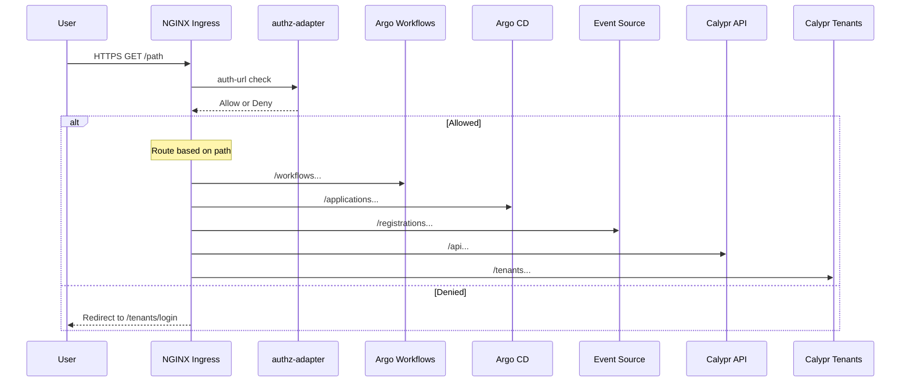

# Authz-Aware Ingress Overlay User Guide

## Overview

The `ingress-authz-overlay` is a Helm overlay chart that provides a unified, path-based ingress layer for all major UIs and APIs in the Argo Stack. It centralizes authorization through the `authz-adapter` service, ensuring consistent access control across all endpoints.

## Features

- **Single Host**: All services exposed on one HTTPS hostname
- **Path-Based Routing**: Clean URL structure (`/workflows`, `/applications`, `/api`, etc.)
- **Centralized Authorization**: All routes protected by `authz-adapter` via NGINX external auth
- **TLS via cert-manager**: Automatic Let's Encrypt certificate management
- **Multi-Tenant Support**: User, email, and group headers passed to backend services
- **Drop-In Deployment**: Simple Helm overlay that can be enabled or disabled per environment

## Architecture



## Routes

| Path | Service | Port | Namespace | Description |
|------|---------|------|-----------|-------------|
| `/workflows` | `argo-stack-argo-workflows-server` | 2746 | `argo-stack` | Argo Workflows UI |
| `/applications` | `argo-stack-argocd-server` | 8080 | `argo-stack` | Argo CD Applications UI |
| `/registrations` | `github-repo-registrations-eventsource-svc` | 12000 | `argo-stack` | GitHub Repo Registration Events |
| `/api` | `calypr-api` | 3000 | `calypr-api` | Calypr API Service |
| `/tenants` | `calypr-tenants` | 3001 | `calypr-tenants` | Calypr Tenant Portal |

## Installation

### Prerequisites

- Kubernetes cluster with NGINX Ingress Controller
- cert-manager installed and configured with a ClusterIssuer (e.g., `letsencrypt-prod`)
- Helm 3.x

### Install the Overlay

```bash
# Install with default values
helm upgrade --install ingress-authz-overlay \
  helm/argo-stack/overlays/ingress-authz-overlay \
  --namespace argo-stack \
  --create-namespace

# Install with custom host
helm upgrade --install ingress-authz-overlay \
  helm/argo-stack/overlays/ingress-authz-overlay \
  --namespace argo-stack \
  --set ingressAuthzOverlay.host=my-domain.example.com \
  --set ingressAuthzOverlay.tls.secretName=my-domain-tls
```

### Integrate with Parent Chart

Alternatively, add the values to your main `argo-stack` deployment:

```bash
helm upgrade --install argo-stack \
  helm/argo-stack \
  --values helm/argo-stack/values.yaml \
  --set ingressAuthzOverlay.enabled=true
```

## Configuration

### Basic Configuration

```yaml
ingressAuthzOverlay:
  enabled: true
  host: calypr-demo.ddns.net
  tls:
    enabled: true
    secretName: calypr-demo-tls
    clusterIssuer: letsencrypt-prod
```

### AuthZ Adapter Configuration

```yaml
ingressAuthzOverlay:
  authzAdapter:
    # Disable if authz-adapter is deployed separately
    deploy: true
    
    # Service location
    serviceName: authz-adapter
    namespace: argo-stack
    port: 8080
    path: /check
    
    # Sign-in redirect URL
    signinUrl: https://calypr-demo.ddns.net/tenants/login
    
    # Headers passed from auth response to backends
    responseHeaders: "X-User,X-Email,X-Groups"
    
    # Environment configuration
    env:
      fenceBase: "https://calypr-dev.ohsu.edu/user"
```

### Custom Routes

Add or modify routes as needed:

```yaml
ingressAuthzOverlay:
  routes:
    # Custom route example
    myservice:
      enabled: true
      namespace: my-namespace
      service: my-service
      port: 8000
      pathPrefix: /myservice
      useRegex: true
      rewriteTarget: /$2
```

### Disabling a Route

```yaml
ingressAuthzOverlay:
  routes:
    registrations:
      enabled: false
```

## Authorization Flow

1. **User Request**: Client sends HTTPS request to the ingress host
2. **External Auth**: NGINX Ingress calls the `authz-adapter` `/check` endpoint
3. **Token Validation**: `authz-adapter` validates the Authorization header against Fence/OIDC
4. **Group Assignment**: User is assigned groups based on their permissions (e.g., `argo-runner`, `argo-viewer`)
5. **Response Headers**: On success, user info headers are added to the request
6. **Routing**: Request is forwarded to the appropriate backend service
7. **Denial**: On failure, user is redirected to the sign-in URL

### Auth Response Headers

The following headers are passed to backend services on successful authentication:

| Header | Description |
|--------|-------------|
| `X-Auth-Request-User` | Username or email of the authenticated user |
| `X-Auth-Request-Email` | Email address of the user |
| `X-Auth-Request-Groups` | Comma-separated list of groups |
| `X-User` | Alias for X-Auth-Request-User |
| `X-Email` | Alias for X-Auth-Request-Email |
| `X-Groups` | Alias for X-Auth-Request-Groups |

## Troubleshooting

### Check Ingress Status

```bash
kubectl get ingress -A -l app.kubernetes.io/name=ingress-authz-overlay
```

### Check AuthZ Adapter

```bash
# Logs
kubectl logs -n argo-stack -l app=authz-adapter

# Test health endpoint
kubectl port-forward -n argo-stack svc/authz-adapter 8080:8080 &
curl http://localhost:8080/healthz
```

### Test Authentication

```bash
# Should redirect to login
curl -I https://calypr-demo.ddns.net/workflows

# With valid token (should return 200)
curl -I -H "Authorization: Bearer $TOKEN" https://calypr-demo.ddns.net/workflows
```

### Common Issues

1. **502 Bad Gateway**: AuthZ adapter not reachable
   - Check authz-adapter deployment is running
   - Verify service selector matches pod labels

2. **503 Service Unavailable**: Backend service not available
   - Check target service exists in the specified namespace
   - Verify service port matches configuration

3. **Redirect Loop**: Auth signin URL misconfigured
   - Ensure `/tenants/login` path is accessible
   - Check signinUrl matches actual login endpoint

## Uninstall

```bash
helm uninstall ingress-authz-overlay -n argo-stack
```

## Related Documentation

- [Argo Stack User Guide](../../docs/user-guide.md)
- [Tenant Onboarding Guide](../../docs/tenant-onboarding.md)
- [Repo Registration Guide](../../docs/repo-registration-guide.md)
