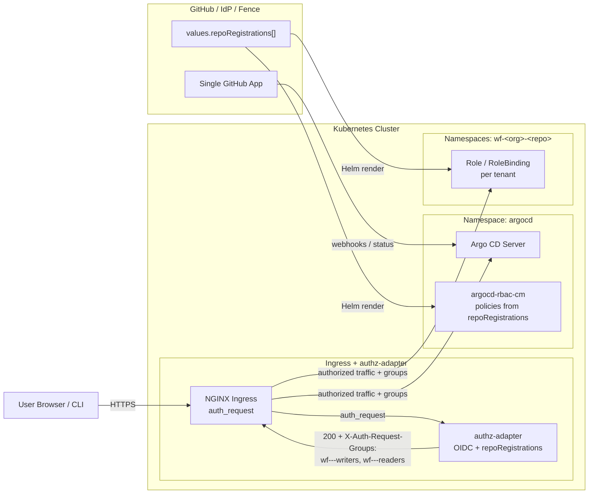

# repo-registration-roles

`repo-registration-roles` is a small **RBAC overlay chart** that derives Argo CD and
Kubernetes permissions from the existing `values.repoRegistrations` configuration
in your Argo stack.

It assumes:

- A single **GitHub App** is installed on multiple GitHub repositories.
- For each repository `https://github.com/<org>/<repo>.git`:
  - There is an Argo CD **Application** named `<org>-<repo>`.
  - There is an Argo CD **Project** named `<org>-<repo>`.
  - There is a workflow namespace named: `wf-<org>-<repo>`.
- Authentication is handled via OIDC → `authz-adapter` → NGINX → Argo CD / Argo Workflows.
- The `authz-adapter` emits `X-Auth-Request-Groups` including group names:
  - `wf-<org>-<repo>-writers`
  - `wf-<org>-<repo>-readers`
  - plus a global admin group, e.g. `wf-admins`.

This chart does **not** create Applications, Projects, Namespaces or Workflows.
It only creates:

- An Argo CD RBAC ConfigMap (`argocd-rbac-cm`) with policies derived from `repoRegistrations`.
- Per-repo `Role` and `RoleBinding` objects in the workflow namespaces `wf-<org>-<repo>`.

---

## Architecture



---

## Access control model

For each `repoRegistrations[]` entry with `repoUrl: https://github.com/<org>/<repo>.git`:

- Derived names:
  - `appName`      = `<org>-<repo>` (Argo CD Application name)
  - `projectName`  = `<org>-<repo>` (Argo CD Project name)
  - `workflow ns`  = `wf-<org>-<repo>`
- Groups:
  - `writer group` = `wf-<org>-<repo>-writers`
  - `reader group` = `wf-<org>-<repo>-readers`
- Global admin group:
  - `adminGroup`   = configurable (`wf-admins` by default)

### Argo CD RBAC

- `adminGroup` → `role:wf-admin` → `*,*,*,allow` (full admin).
- `wf-<org>-<repo>-writers`:
  - `get/sync/action` on Application `<projectName>/<appName>`.
  - `get` on Project `<projectName>`.
- `wf-<org>-<repo>-readers`:
  - `get` on Application `<projectName>/<appName>`.
  - `get` on Project `<projectName>`.

### Workflow namespace RBAC

Namespace: `wf-<org>-<repo>`

- `wf-<org>-<repo>-writers` (+ `adminGroup`):
  - Full CRUD on `Workflows`, `WorkflowTemplates`, `CronWorkflows`.
  - `get/list/watch` on `pods`, `pods/log`, `configmaps`, `secrets`.
- `wf-<org>-<repo>-readers`:
  - `get/list/watch` on the same resources (read-only).

---

## Usage

1. Ensure your main Argo stack already defines `values.repoRegistrations` and
   creates the appropriate Applications and workflow namespaces.
2. Install this chart in the same cluster:

```bash
helm upgrade --install repo-registration-roles \
  ./helm/repo-registration-roles \
  -n argocd \
  -f my-values.yaml
```

> `my-values.yaml` should include the same `repoRegistrations:` block you use
> elsewhere; this overlay does not change that schema.

---

## Files in this chart

- `Chart.yaml` – Helm chart metadata.
- `values.yaml` – Default values with comments; you typically override this.
- `templates/argocd-rbac-cm.yaml` – Generates `argocd-rbac-cm.policy.csv`.
- `templates/workflow-rbac.yaml` – Generates Roles/RoleBindings in `wf-<org>-<repo>`.

See `troubleshooting.md` for step-by-step debugging instructions for group headers
and RBAC.
