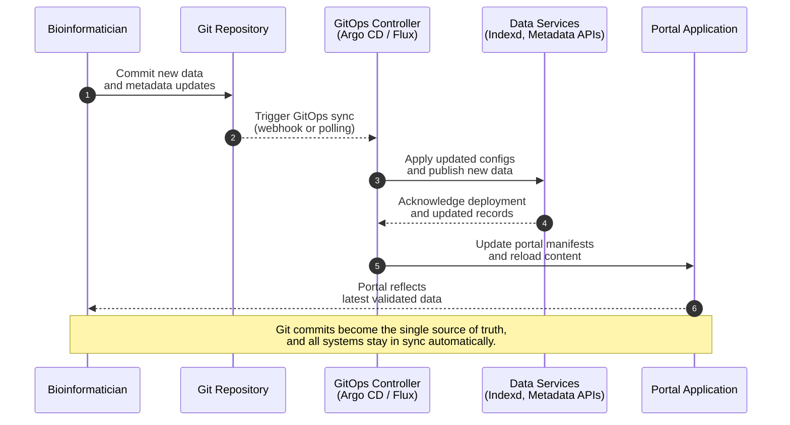

# 🌟 Using the Calypr GitHub App

**Use Case — Publishing Research Data with GitOps**

**As a bioinformatician**, I want to publish my analysis outputs and dataset updates through a Git-based workflow, so that every change to my research data automatically updates downstream portal applications, ensuring that collaborators always see the latest validated results.

**Story**

When I push new analysis files or metadata updates to the repository, GitOps detects the commit and applies the corresponding updates to the data services and portal layers. This gives me a clear, auditable history of every modification, eliminates manual synchronization steps, and guarantees that the public or internal portal always reflects the current state of my work. By relying on version-controlled automation, I can focus on scientific analysis rather than operational glue, while maintaining reproducibility, traceability, and consistency across environments.




This guide covers:

* **What the Calypr GitHub App does**
* **Why a user would install it**
* **How to integrate it into their GitHub account**
* **How it affects their project workflows**

### How to Connect Your GitHub Repository to the Calypr Server

## Overview

The **Calypr GitHub App** allows your project repository on GitHub to stay in sync with the Calypr platform.

By installing this app on your GitHub repository:

* Your **data**, **metadata**, and **workflow configuration files** will be automatically available to the Calypr system.
* Calypr can **detect updates** in your repository and ensure your project environment reflects your latest work.
* You no longer need to manage tokens, SSH keys, or manual permissions—GitHub handles it securely.

This makes collaboration easier, keeps your project reproducible, and ensures the Calypr server always has the most up-to-date version of your files.

---

# 🔧 What the Calypr GitHub App Does

After you install it:

### ✔ 1. **Securely connects your GitHub repository to Calypr**

The app grants Calypr read-only access to your repository. Calypr can download the files it needs, but **cannot modify your code or data**.

### ✔ 2. **Keeps your Calypr environment automatically updated**

Whenever you push new:

* data files
* metadata
* workflow definitions (Nextflow, Argo, CWL, etc.)
* configuration settings

…the Calypr server can see the latest version and use it in your workspace and pipelines.

### ✔ 3. **Simplifies onboarding**

No personal GitHub tokens.
No SSH keys.
No security complexity.
Just a simple installation and you’re done.

### ✔ 4. **Works with private repositories**

Your private data stays private. Only the Calypr system (and only specific components) can access it.

---

# 🧠 Why You Might Need This

You should install the Calypr GitHub App if:

* Your workflow, metadata, or analysis files live in GitHub.
* You want Calypr to run workflows based on the files in your repo.
* You want collaborators or pipelines to always use the current version.
* You want a secure, low-maintenance way to connect GitHub and Calypr.

If you’re using Calypr for **multi-omics**, **analysis pipelines**, or **any project with multiple collaborators**, the GitHub App is the easiest way to keep everything synchronized.

---

# 🛠 How to Install the Calypr GitHub App

Installing takes less than one minute.

### **Step 1 — Open the Installation Page**

Visit:

```
https://github.com/apps/calypr
```

(or the URL provided by your administrator)

### **Step 2 — Select Your Account or Organization**

You will see options such as:

* **Install for my personal GitHub account**
* **Install for an organization**

Choose where your repository lives.

### **Step 3 — Select Repositories**

You have two choices:

### **Option A — Only give access to selected repositories (recommended)**

Choose specific repositories that contain Calypr projects.

### **Option B — Give access to all repositories**

Only use this if:

* Your GitHub account is dedicated to Calypr work
  — or —
* You prefer not to manage per-repo permissions.

### **Step 4 — Confirm Permissions**

The Calypr GitHub App typically requests:

* **Read-only access to code and files**
* **Read-only access to repo metadata (branch names, permissions)**
* (Optional) permission to mark CI/check results, if Calypr is configured to do so

The app **cannot** modify your repository.

### **Step 5 — Finish Installation**

Click **Install**.
That’s it—your repository is now linked.

---

# 🔁 What Happens After Installation?

Once your repository is connected:

### ✔ Calypr immediately gains access

Your project will appear in the Calypr interface (or become available for registration, depending on your setup).

### ✔ Any updates you push to GitHub are seen by Calypr

Examples:

* upload new FASTQ files → they appear in Calypr’s data browser
* update metadata → validators update automatically
* change workflow config → workflow UI shows new settings
* add or edit sample sheets → pipelines re-index as needed

### ✔ No further authentication is required

You don’t need to manage passwords, tokens, or machine access.

---

# 🧪 Verifying the Connection

You can check the connection by:

* Opening the Calypr UI → Projects → *Your Repository*
* Clicking **Refresh**
* Verifying that your latest branch, files, and metadata are shown

If you push a change to GitHub and see it reflected in Calypr within a minute or two, everything is working.

---

# ❓ Troubleshooting

### **I don’t see my repository listed in Calypr.**

Make sure the GitHub App was installed for that specific repository.

### **I installed the app, but Calypr says it cannot access the repo.**

Two common causes:

1. The app was installed in your personal account, but the repo is in an organization.
2. The repo was not selected during installation.

### **I want to remove access.**

You can uninstall the app or change the permitted repositories anytime from:

```
https://github.com/settings/installations
```

---

# 📬 Need Help?

If you run into issues:

* Contact your Calypr platform administrator
* Or open a support ticket through the Calypr help portal

---

